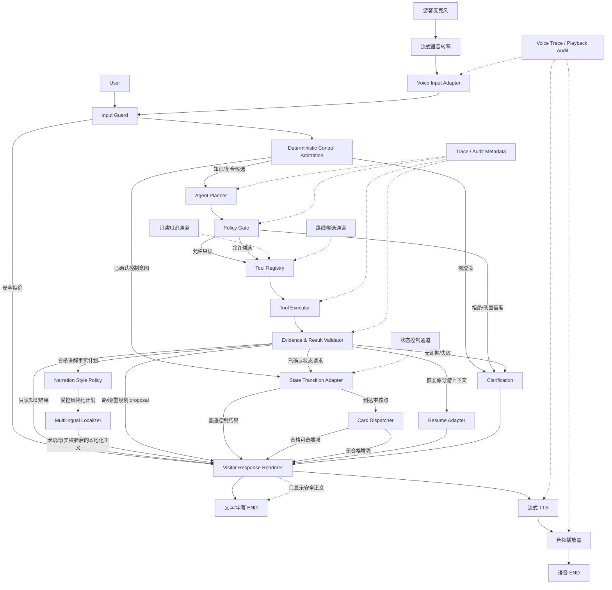

# 受控 Agent 架构升级方案

```yaml
document_status: proposed_pending_owner_approval
baseline_commit: e03c0920f6c66d9a1eb78feec78b39aa1f8295f9
branch: main
created_at: 2026-08-01
updated_at: 2026-08-01
requirements_source: data/chen_clan_academy/evaluation/handoffs/NEXT_STAGE_ISSUE_AND_ROADMAP.md
owner: pending_owner_confirmation
implementation_status: not_started
langsmith_status: not_run
voice_architecture: cascade_asr_controlled_agent_tts_selected
voice_provider_model: pending_implementation_validation
narration_style_architecture: controlled_whitelist_policy_selected
narration_style_catalog: pending_product_content_approval
guided_journey_architecture: opening_evidence_narration_dispatch_summary_recommendation_selected
photo_guidance_default: pending_owner_confirmation
classic_mode_proactive_cards: pending_owner_confirmation
nearby_recommendation_source: pending_owner_confirmation
internationalization_architecture: shared_facts_controlled_localization_selected
production_locales: pending_owner_confirmation
locale_glossary_status: not_started
knowledge_expansion_architecture: curated_markdown_plus_structured_domains_selected
craft_inheritor_knowledge_status: proposed_not_started
knowledge_gap_priority: pending_owner_consolidation
academic_advisor_architecture: controlled_evidence_workspace_selected
academic_external_search: not_started
academic_integrity_policy: pending_owner_approval
cross_requirement_priority: pending_owner_consolidation
```

> 本文是架构设计与迁移计划，不代表生产 Agent 已完成升级。本次交付不改变任何运行行为；未经负责人确认，不得执行 Phase 1。

## 1. 升级背景

### 1.1 当前真实形态

当前项目是“确定性 Workflow + 局部 Agent”的混合系统：

- `agent_graph.py` 使用 LangGraph `StateGraph` 固定节点、固定边和 `route_initial_request()` 等条件路由。
- `llm_think → rag_tool → llm_think` 已具备局部 ReAct 工具循环；当前模型绑定的核心工具是 `chen_clan_academy_rag_search`，循环上限为 3。
- 到达、完成、下一站、跳过、路线确认、重规划确认等控制意图，由 `tour_intent.py`、`pre_semantic_arbitration.py`、`semantic_normalization.py` 和 `tour_interaction.py` 的确定性链路治理。
- `TourState`、`VisitorProfile`、正式路线、空间节点、`NarrationCoverage` 分属不同契约，不允许模型直接写入。
- 普通知识、术语、对象、点位 inventory、工艺位置、研究、比较、拍照、安全规则和若干 RAG 回退已形成多条受控能力，但入口与格式化位置仍较分散。
- Studio 运行时由平台托管持久化；CLI 图使用 `MemorySaver`。两种环境都依赖 `thread_id` 隔离会话。

### 1.2 当前问题

1. `route_initial_request()` 累积了大量关键词、优先级和状态分支，自然表达覆盖需要持续补词。
2. 相同知识问题可能因是否已有路线而进入 `direct_rag` 或 `tour_qa`，能力入口不完全统一。
3. 多意图通常只能选择一个路由；混合控制操作需要大量专门澄清逻辑。
4. 工具能力尚无集中注册表，资格、证据、副作用、失败策略和游客可见字段缺少统一声明。
5. 模型决策、政策校验和状态变更权限尚未形成统一协议。
6. 虽已存在游客输出门控，历史上不同出口曾各自拼接来源或原始检索内容，说明最终边界仍需架构级保证。
7. P1 控制层尚有未完成或待实链复测事项；在这些问题关闭前，不能用新 Agent 编排掩盖旧链路缺陷。
8. 经典/定制模式尚无统一产品协议，规划收集被知识问答打断后的恢复规则也未冻结。
9. 术语、比较、研究和打卡卡已有注册与资格，但缺少按当前审核点位、明确兴趣、模式和预算执行的确定性调度层。
10. 点位 inventory、动态服务事实及不同问答出口仍需统一精选、时效和游客渲染边界。

### 1.3 为什么不能直接改为自由 ReAct

直接使用无约束 `create_react_agent()` 会把控制意图、事实检索和状态副作用放进同一个自由循环，带来状态越权、伪造 ID、部分执行、证据绕过、路线自动应用和循环失控。陈家祠导览需要审核点位、对象、路线、服务事实与来源的强约束，因此模型只能提出候选决策，不能成为事实源、权限源或状态机。

## 2. 升级目标

- 提高自然语言单意图识别和多意图分解能力。
- 规划前后共享同一能力入口和同一游客输出边界。
- 让模型只生成结构化候选决策，不直接生成事实、审核 ID 或状态变化。
- 统一工具注册、运行资格、证据要求、副作用等级和失败策略。
- 保留确定性状态机、路线规划器、证据门控、安全规则和确认流程。
- 保留 `thread_id` 隔离、结构化审计字段与 LangSmith 可观测性。
- 支持按能力灰度启用、随时回退、逐阶段迁移，不一次性重写图。
- 保证游客在规划前和导游过程中均可提问；导游中的只读问答不得破坏当前路线、点位和进度，回答后可从原状态继续。
- 将“开始导游/规划路线”稳定归入画像收集与确定性路线规划，而非普通 RAG；自然时长、少走路和明确偏好作为受控参数保留。
- 冻结经典/定制双模式协议：经典模式以时间生成代表性路线，定制模式仅收集游客明确选择的最小偏好。
- 在 E5 和模式契约稳定后，以确定性 CardDispatcher 将合格卡片作为可选增强内容，而非默认事实或强制插播。
- 对当前需求文档中的 P0/P1 问题实行“先关闭或明确阻塞，再迁移对应能力”的门槛。
- 支持级联式语音导览：游客语音先转写为文本并进入既有 Input Guard 与受控 Agent 链路，最终仅将 Visitor Response Renderer 产出的安全正文转换为语音；语音层不得成为第二套 Agent、事实源、状态源或游客输出源。
- 支持游客在正式导游前明确选择经典或定制模式；定制模式除既有最小偏好外，可明确选择受审核的讲解风格。讲解风格只改变证据内事实的组织与表达，不改变路线、状态、事实、游客身份、安全结论或卡片资格。
- 将正式导游组织为完整旅程：路线确认后先执行一次陈家祠总体介绍，再按正式路线逐点进行证据驱动的自然讲解；在时间、点位、模式、风格、安全和资格满足时插入受控卡片增强；游览完成后基于结构化浏览经历统计七类审核工艺、生成总结与确定性称号，并在独立的游后模块提供有来源及时效的附近景点和美食候选。
- 支持多语言界面、语音输入、字幕、讲解与 TTS；所有语言共享同一审核事实、路线、状态、Coverage、卡片资格和统计结果，通过 `LocalePolicy`、版本化术语注册表及受控本地化层生成目标语言内容，不建立按语言复制的事实库或 Agent。
- 扩展知识治理以覆盖手艺传承人、工艺流程、馆藏/常设展览、修缮保护和故事来源等级，同时保持“可向量化审核事实、结构化关系/资格、动态时效数据、程序派生内容”四类数据域分离；任何新增资料必须先登记来源、稳定 ID、适用范围与有效期，再进入检索或导览。
- 在导游之外提供独立的受控学术顾问能力：支持审核文献查找、单篇阅读、多篇证据综合、注释书目、研究问题与方向收窄、方法和田野调查建议、开题/研究计划辅助及引用导出；学术建议必须区分馆方事实、研究观点、Agent 综合和待验证方向，并服从版权、学术诚信与研究伦理边界。

### 2.1 当前需求对架构迁移的约束

| 需求层级 | 当前要求 | 对本方案的约束 |
|---|---|---|
| P0 | 安全结论优先，商业拍摄、无人机、闪光灯、触摸、饮食地点等不得被拍照/到达/路线流程抢占 | Input Guard 永久位于 Planner 前；安全能力不能灰度放宽 |
| P1 | 路线、状态、空间、问答证据、游客渲染和自然同义表达先稳定 | 对应能力未自动回归且未完成 LangSmith 复测时，只能 shadow，不得替换旧权威路径 |
| P2 | 经典/定制模式、收集中断恢复和卡片调度 | 先冻结模式契约，再实现 CardDispatcher；不通过聊天语气推断画像 |
| P3 | 地图、扫码、定位等可信位置事件 | 暂不属于本次架构迁移的前置能力，保留接口位但不实现 |
| P4 | GPS、蓝牙、图像识别、长期画像与推荐 | 明确延期，不作为当前 Demo 或受控 Agent 上线门槛 |

本方案不把需求文档中标为 `verified_fixed` 的问题重新包装成待开发功能；它们进入 CA-00 回归基线。标为 `implemented_pending_*`、`partial_*` 或 `blocked_*` 的问题必须保留真实状态，不能仅因架构设计存在就宣称解决。

### 2.2 进入迁移前的真实问题门槛

| 问题组 | 当前需求文档状态 | 架构处理 |
|---|---|---|
| P0-01/P0-02 安全门控 | 已实现、仍需 LangSmith 守护复测 | 固化为 Input Guard 硬门槛，任何新能力不得绕过 |
| P1-04 空间别名/反向导航 | `blocked_pending_owner_confirmation` | 不自建别名或节点；空间负责人确认前，相关 Agent 能力保持关闭 |
| P1-11 偏航后重规划 | `partial_langsmith_verification` | 只包装现有 proposal/确认链；未知点与未确认点失败关闭 |
| P1-12 自然同义表达 | 本机/LangSmith 待继续验证 | Planner 只能产受控候选，最终仍经现有解析器、审核点位和状态相位校验 |
| P1-13/P1-14/P1-16 | 身份替代、多工艺位置、团队发票存在局部或出口问题 | Phase 1 先统一能力与游客渲染，不由通用 RAG 或模型补写 |
| P1-19/P1-21 | 内部字段泄漏修复待 LangSmith 复测 | Visitor Response Renderer 作为所有出口硬门槛，结构化 evidence 仍保留内部 |
| P2-01 至 P2-03 | 模式及恢复协议 `open` | CA-12 契约先行；未批准前不写 `tour_mode` |
| P2-04 至 P2-07 | 卡片调度和点位表达待实现/分诊 | CA-13 在 E5、模式、资格和长度预算满足后实施 |

## 3. 非目标

本升级不包括：

- 删除 LangGraph 或将系统改成完全自由的 ReAct Agent。
- 让 LLM 自由生成路线、空间节点、对象、来源或文化事实。
- 让 LLM 直接修改 `TourState`、`VisitorProfile`、正式路线或 `NarrationCoverage`。
- 新建第二套 `VisitorProfile`、TourState、路线或知识事实源。
- 用模型记忆补充文物故事、题材、寓意或位置。
- 让模型在本地证据缺失时补写陈家祠专属历史、对象、位置、工艺、服务、安全或动态开放事实。
- 绕过卡片运行资格、审核映射、证据门控和来源登记。
- 修改知识库事实，或用 Agent 代替所有确定性校验。
- 一次性重写 `agent_graph.py` 或删除全部旧路由。
- 在本阶段实现 GPS、蓝牙、二维码、图像识别、长期画像或无证据的周边推荐。
- 在经典模式中默认收集偏好，或在定制模式中根据聊天语气猜测年龄、身份、同行人或研究目的。
- 在本阶段采用端到端自由 speech-to-speech 模型替代现有受控 Agent，或允许语音模型直接调用状态副作用、生成项目事实、审核 ID、路线与游客正文。
- 将图像识别、自动定位或环境持续监听捆绑进首版语音导览；这些能力仍按既有 P3/P4 边界另行评审。
- 为儿童、学术、故事、幽默或娱乐化风格建立彼此独立的自由 Agent、事实链路或状态源，或允许任意用户风格提示直接改写审核事实。
- 根据游客选择“儿童友好风”等表达偏好推断其年龄、身份、同行人或研究目的；讲解风格不得成为隐式画像信号。
- 让模型直接从聊天记录估算工艺参观数量、自由授予长期人格称号、引用未审核现代歌词，或把馆外景点/餐饮写入馆内 TourState、正式路线与空间图。
- 让模型凭记忆生成当前营业、距离、价格、评分、交通或附近推荐；无时效来源的推荐不得作为当前结论。
- 按语言复制并独立维护知识库、路线、TourState、VisitorProfile、Coverage 或卡片事实，或允许翻译模型把译名注册为新 node/ornament/card/source ID。
- 根据设备、IP、口音、外貌或语言选择推断国籍、身份、教育程度和长期画像；自动语言检测只能作为当前输入候选，不能替代游客明确选择。
- 仅新增一个 Markdown 就宣称完成传承人知识接入，或让未登记来源、无人物 ID、无身份等级、无陈家祠关系证据的传承人资料进入生产 RAG。
- 将附近餐饮/景点、临时活动、实时设施状态等高时效内容作为普通静态知识长期索引，或为总体介绍、点位卡和七艺统计复制第二份事实正文。
- 让模型凭记忆生成论文、作者、DOI、页码、引文、学界共识或研究空白，绕过付费墙/访问控制提供全文，伪造实验、访谈、田野数据或伦理批准，或将学生请求直接转化为可冒充本人完成的研究成果。
- 将学术顾问上下文写入 TourState、长期 VisitorProfile 或正式路线，或让论文/PDF 中的文本成为系统指令、工具权限和知识库写入依据。

## 4. 当前代码审计结论

### 4.1 当前调用链

| 场景 | 当前入口与主要链路 | 当前性质 |
|---|---|---|
| 普通知识 | `semantic_normalization → route_initial_request → direct_rag/tour_qa/llm_think` | 状态相关的分散入口 |
| 通用 RAG | `direct_rag → llm_think → rag_tool → llm_think` | 局部 ReAct，最多 3 轮 |
| 到达/完成/下一站 | `pre_semantic_arbitration/semantic_normalization → tour_intent → tour_event → handle_tour_event` | 确定性控制 |
| 路线规划 | `profile_collection → direct_route → route_selection/route_planner` | 确定性候选与状态初始化 |
| 重规划 | `prepare_replan → time confirmation → candidate → confirm_replan` | proposal 后确认应用 |
| 术语 | `tour_qa → term_card_runtime/术语审核资料` | 资格受控只读能力 |
| 对象讲解 | `tour_qa` 对象解析，或 `stop_guidance` 的 E5 证据包与渲染 | 审核映射和证据门控 |
| 点位 inventory | `tour_qa` + `node_guide_cards_v1.json` | 只读完整白名单 |
| 研究/比较 | `research_card_retrieval` / `comparison_retrieval` | 意图与卡片状态受控 |
| 拍照/安全 | `photo_spot_runtime` / `visit_safety_rules` | 高优先级安全门控 |
| E5 成功讲解 | `guide_program_evidence → guidance_evidence_bundle → narration_rendering → coverage` | 成功且有证据后记录覆盖 |
| E5 失败回退 | B3/安全关闭，继续受游客输出边界约束 | 不得补造事实 |
| 最终游客消息 | 多节点构造 `AIMessage`，现有 `public_visitor_message_or_fallback` 提供公共门控 | 已有可复用兜底 |
| 经典/定制模式 | 尚无冻结产品协议 | P2-01 至 P2-03，待契约先行 |
| 到点卡片增强 | 卡片已注册且有资格门控，`StopProgram` 插槽尚未调度 | P2-04 至 P2-06，待 E5/模式契约 |

### 4.2 唯一事实源

| 领域 | 唯一事实源/契约 |
|---|---|
| 游览进度 | `TourState`，只能经 `handle_tour_event()` 等冻结适配层变化 |
| 游客偏好 | `VisitorProfile` 及其验证/更新模块 |
| 路线与空间 | 审核路线、空间图、节点注册和确定性规划器 |
| 普通知识 | 本地审核知识文件经 `rag_retrieval.py` 返回的 `RetrievedEvidence` |
| 卡片能力 | 卡片注册表、运行资格清单和各卡片检索器 |
| 对象—点位 | `node_guide_cards_v1.json` 等审核映射 |
| 讲解覆盖 | `NarrationCoverage`，与 TourState/Profile 独立 |
| 来源 | source registry 与 evidence 内部字段 |

`tour_mode` 尚未有已批准的唯一归属，不能在本方案中擅自写入 `VisitorProfile`、TourState 或新建会话状态。Phase 0 必须先决定它属于 VisitorProfile、路线快照还是会话控制，并冻结迁移/兼容规则。

### 4.3 必须永久确定性的机制

- 安全请求优先级、输入防护和提示注入防护。
- 审核 node/ornament/card/source ID 解析与白名单复核。
- `TourState` 事件应用、完成/跳过/到达语义和路线状态变化。
- `VisitorProfile` 验证与更新语义。
- 路线预算、空间连通性、候选计算及确认后应用。
- E5 evidence 校验、失败关闭和 Coverage 写入条件。
- 卡片运行资格、研究归因、英文资格与动态事实有效期。
- 最终游客输出边界和审计信息分离。
- 经典/定制模式选择、默认值及最小偏好收集规则。
- CardDispatcher 的输入白名单、资格、预算、点位和主动触发条件。

### 4.4 可逐步 Agent 化的部分

- 自然语言意图候选与多意图分解。
- 在已注册只读工具之间选择能力。
- 缺少参数时生成澄清建议。
- 组织只读工具调用顺序和回答结构。
- 路线/重规划“候选请求”的参数收集，但不能应用候选。
- 向确定性控制面提出 `TourEvent` 请求，但不能直接写状态。
- 识别知识问答对导游流程的临时打断，并在只读回答后提出“恢复到原收集项/原导航状态”的候选；恢复本身不得重建路线或覆盖已确认偏好。

### 4.5 可复用基础

现有 `@tool`/`bind_tools`、受控知识计划、`RetrievedEvidence`、卡片资格、对象审核映射、E5 evidence bundle、`NarrationCoverage`、游客输出门控、性能指标、消息元数据和 LangSmith Trace 均可复用。无需新建第二套事实或状态模型。

未发现阻止“方案设计”本身的冻结契约冲突，但存在会阻止具体能力实施的未决事项：P1-04 空间节点/别名需负责人确认，`tour_mode` 的唯一归属尚未批准，E5 与部分 P1 出口仍待本机或 LangSmith 验证。部分历史交接材料早于当前生产实现；后续实现必须以任务开始时的真实代码、冻结契约、审核数据和最新需求状态为准，不能用本文或历史描述覆盖当前事实。

## 5. 架构原则

1. Agent 只产生候选决策，不能直接执行副作用。
2. Policy Gate 对候选意图、参数、资格、证据和状态进行确定性校验。
3. 工具只读取或调用已有受控能力，不成为第二事实源。
4. 状态机是游览状态变化的唯一入口。
5. 审核数据是点位、对象、路线与文化事实的唯一来源。
6. 副作用操作必须明确分级，proposal 不得自动应用。
7. 无证据、证据冲突或证据过期时失败关闭。
8. 游客正文与内部 evidence/Trace 严格分离。
9. 多意图先原子化计划；任何状态副作用失败时不得留下部分状态。
10. Agent 决策、策略拒绝、工具输入输出和状态适配必须可审计，但不保存 Chain-of-Thought。

## 6. 目标架构



不可绕过边界：Input Guard、Policy Gate、审核 ID 解析、Evidence Validator、State Transition Adapter、Card Dispatcher 资格/预算门控、Narration Style Policy、Multilingual Localizer、Visitor Response Renderer。Agent Planner 不得直接连接状态、数据库、文件系统或最终游客消息。Resume Adapter 只能读取并恢复既有流程位置，不得新建第二份 Profile、路线或游览状态。Narration Style Policy 只能消费合格 evidence/事实计划并输出受约束表达，不能新增事实或改变控制结论。Multilingual Localizer 只能本地化已批准事实计划并执行术语、实体、数字、否定、安全与归因一致性校验，不能成为新事实源。Voice Input Adapter 只负责形成可审计的用户文本输入，不得解释或执行控制意图；TTS 只允许消费 Visitor Response Renderer 的安全正文，不得对陈家祠事实进行二次生成、补写或改写。

## 7. 当前模块到目标架构的映射

| 当前模块 | 当前职责 | 目标职责 | 保留 | 工具化 | 副作用 | 阶段 | 风险/测试 |
|---|---|---|---|---|---|---|---|
| `agent_graph.py` | 图、状态、路由、节点 | 保留图骨架，新增受控 planner/gate/executor 节点 | 是 | 否 | 编排 | 2–7 | 图回归、循环上限 |
| `pre_semantic_arbitration.py` | 模型前控制仲裁 | Deterministic Control Arbitration | 是 | 否 | 无 | 0–2 | 控制优先级 |
| `tour_intent.py` | 控制意图与审核点位解析 | 控制候选校验器 | 是 | 可包装请求 | 无 | 5 | 同义词、伪 ID |
| `semantic_normalization.py` | 闭合语义候选 | AgentDecision 输入适配/回退 | 是 | 否 | 无 | 2 | schema/低置信度 |
| `tour_interaction.py` | 唯一事件适配 | State Transition Adapter | 是 | 仅受控 adapter | 有 | 5 | 状态非法写入=0 |
| `tour_state.py` | 纯状态函数 | 继续作为状态事实源 | 是 | 禁止直接暴露 | 有 | 全程 | 状态机测试 |
| `visitor_profile.py` 等 | 偏好模型与更新 | 继续经验证器更新 | 是 | 仅受控 proposal | 有 | 4–5 | 第二事实源=0 |
| `route_planner.py`/`route_selection.py` | 路线计算与选择 | route proposal 工具后端 | 是 | 是 | proposal | 4 | 预算/空间/确认 |
| `replanning.py` | 重规划候选 | replan proposal 工具后端 | 是 | 是 | proposal | 4 | 原点/快照/确认 |
| `tour_navigation.py` | 下一段导航 | 只读导航工具后端 | 是 | 是 | read_only | 1/4 | 不改状态 |
| `tour_qa.py` | 多类知识出口 | 拆为注册能力适配，保留旧回退 | 过渡保留 | 是 | read_only | 1–7 | 规划前后等价 |
| `controlled_knowledge_query.py` | 受控知识计划与渲染 | fact/service/craft 工具与结果校验 | 是 | 是 | read_only | 1 | 类别与输出边界 |
| `single_fact_answer.py` | 单一事实 | single_fact 工具后端 | 是 | 是 | read_only | 1 | 时间口径/无证据 |
| `term_card_runtime.py` | 术语资格 | term 工具后端 | 是 | 是 | read_only | 1 | 英文/实例资格 |
| `research_card_retrieval.py` | 研究卡 | research 工具后端 | 是 | 是 | read_only | 1 | 归因与限制 |
| `comparison_retrieval.py` | 比较卡 | comparison 工具后端 | 是 | 是 | read_only | 1 | 不冒充事实 |
| `photo_spot_runtime.py` | 拍照点 | photo 工具后端 | 是 | 是 | read_only | 1 | 安全姿势优先 |
| `visit_safety_rules.py` | 安全规则 | Input Guard/安全工具 | 是 | 可只读 | read_only | 0–1 | 安全优先 |
| E5 evidence/render/coverage | 讲解证据与覆盖 | narration 工具后端及 validator | 是 | 是 | read_only/受控覆盖 | 1–3 | 证据/覆盖语义 |
| `guidance_policy.py` / `narration_style.py` | 讲解策略与表达风格 | 受控 Narration Style Policy 与版本化白名单风格注册 | 是/扩展 | 否 | read_only rendering | 待统一排期 | 不建立第二画像、事实零扩写、品牌审核、长度预算、运行中切换 |
| 总体介绍资料/E5 讲解基础 | 点位讲解为主，总体开场未形成独立程序 | `TourOpeningProgram`：路线确认后一次性、可跳过/重播的审核开场 | 新增/复用 evidence | 否 | read_only + coverage event | 待统一排期 | 独立 evidence、只执行一次、打断恢复、重规划不重复 |
| E5 evidence/render | 证据包、讲解渲染与 Coverage | `NarrationComposer`：先形成事实计划，再受控组织观察点、主旨、关联、提问与过渡 | 是/扩展 | 内部受控生成 | read_only + 受控 coverage | 待统一排期 | 流畅但零事实扩写、结构与长度预算、风格一致性 |
| StopProgram/卡片资格表 | 卡片已注册，主动调度未统一 | `CardDispatcher`：基础讲解后按预算和资格选择研究/对比/打卡增强 | 是/扩展 | 否 | read_only | 待统一排期 | 学术风研究资格、术语仅按需、对比历史范围、摄影安全与开关 |
| `NarrationCoverage` + 审核对象—工艺映射 | 讲解覆盖独立记录 | `VisitSummaryEngine`：按去重审核对象确定性统计七类工艺 | 是/扩展 | 否 | read_only derived summary | 待统一排期 | 到达/成功讲解门槛、重复/多工艺/远程问答语义 |
| 无统一称号规则 | 暂无 | `TitleAwardPolicy`：基于确定性统计和版本化规则授予展示称号 | 新增 | 否 | read_only | 待统一排期 | 不写长期画像、不夸大、规则冲突与回退 |
| 附近推荐 | P4 延期、无当前可信来源 | `NearbyRecommendationService`：馆外独立、来源受控、有时效的景点/美食候选 | 新增 | 受控外部 API/审核清单 | read_only external | 待统一排期 | 固定出口/授权位置、营业时效、商业披露、与馆内状态隔离 |
| 界面/固定提示 | 以中文为主，未形成统一 locale 契约 | 版本化 UI、安全、控制、错误与回退文案目录 | 新增/收敛 | 否 | read_only rendering | 待统一排期 | 完整性、占位符、否定/确认语义、回退语言 |
| 点位/对象/七艺/术语名称 | 审核中文事实与零散英文资格 | 多语言术语与别名注册表，所有译名回映同一审核 ID | 新增索引/复用事实 | 否 | read_only | 待统一排期 | 首选译名、音译、发音、别名消歧、版本失效 |
| 多语言讲解 | 暂无统一本地化出口 | `MultilingualLocalizer` + 本地化事实一致性校验 | 新增 | 受控模型/审核翻译 | read_only rendering | 待统一排期 | 实体/数字/否定/归因不漂移、风格支持矩阵 |
| 多语言 ASR/TTS | 已登记路线 A，语言契约未冻结 | LocalePolicy 驱动 ASR/字幕/TTS，语言切换不改导游状态 | 新增/扩展 | 外部多模态 API | read_only | 待统一排期 | 混合语言、口音、专名发音、降级与现场测试 |
| `knowledge/*.md` + `rag_ingestion.py` | 8 份审核 Markdown；文档来源/类型在代码显式登记 | 增加传承人等审核文档，同时将来源、类型和章节级归因保持闭合 | 是/扩展 | 否 | read_only facts | 待统一排期 | 新文档空 source、`general` 类型、切块污染、来源冲突 |
| 无传承人数据域 | 暂无统一人物、身份、工艺和陈家祠关系契约 | `05_craft_inheritors.md` + `inheritors/` 结构化目录 | 新增 | 否 | read_only facts/relations | 待统一排期 | 身份混淆、同名、在世人物隐私、当前状态时效、错误陈家祠关联 |
| 工艺/对象/点位知识 | `07`/`08`/`09` 与路线卡分散 | 保留各自唯一事实，补工艺过程字段、对象—七艺映射与点位讲解卡 | 是/扩展 | 否 | read_only facts/relations | 待统一排期 | 重复事实源、多工艺统计、同名对象、建筑本体/展品混淆 |
| 动态知识域 | 公告 Markdown 与部分服务快照 | 活动、设施、附近推荐使用带有效期的结构化域，不混入静态知识 | 收敛/新增 | 受控更新源 | read_only dynamic | 待统一排期 | 过期、无来源、地图搜索污染、馆内/馆外作用域 |
| `research_cards/` | 20 张摘要卡；12 reviewed、8 background；明确研究问答最多返回 2 张 | 学术来源注册、全文状态、PaperAnalysis、证据矩阵和多文献综合的种子数据 | 是/扩展 | 否 | read_only research | 待统一排期 | 摘要冒充全文、书目/页码错误、观点混合、来源等级 |
| `research_card_retrieval.py` | 明确研究意图、卡片排名与归因渲染 | `AcademicIntentGate` 后的本地审核文献工具之一 | 是/扩展 | 是 | read_only | 待统一排期 | 开放问题召回、相关性、背景卡越权、最多两卡限制 |
| 无 Academic Workspace | 暂无独立研究任务状态 | `AcademicSessionContext` + Academic Planner/Source Registry/Evidence Matrix | 新增 | 否 | session/read_only derived | 待统一排期 | 与导游状态串线、任务恢复、来源版本、敏感研究资料 |
| 无外部学术检索 | 仅本地论文与卡片 | 合法授权的书目/开放全文/用户上传/Zotero 等受控连接 | 新增 | 外部学术 API/连接器 | read_only external | 待统一排期 | 许可、付费墙、元数据质量、覆盖声明、提示注入 |
| `StopProgram` 卡片插槽及卡片资格表 | 可选讲解素材与运行资格 | 确定性 CardDispatcher 输入 | 是 | 否 | read_only | 6 | 点位/模式/兴趣/预算/资格 |
| `rag_retrieval.py` | 混合检索 | 受控 RAG 工具后端 | 是 | 是 | read_only | 1 | 类别/时效/串线 |
| 游客输出门控 | 隐藏内部字段 | Visitor Response Renderer | 是 | 否 | 无 | 0–2 | 泄漏率=0 |
| 语音输入/ASR | 暂无统一语音入口 | 流式转写 + Voice Input Adapter，输出等价用户文本 | 新增 | 外部多模态 API | read_only | 待统一排期 | 专名/方言/噪声、低置信度澄清、注入与线程隔离 |
| 语音输出/TTS | 暂无统一语音出口 | 仅朗读 Visitor Response Renderer 安全正文 | 新增 | 外部多模态 API | read_only | 待统一排期 | 字幕等价、打断、断线、AI 语音披露、内容零扩写 |
| 音频播放器/播放审计 | 暂无 | 暂停、继续、重播、取消与播放进度；不解释导览意图 | 新增 | 否 | 客户端播放 | 待统一排期 | Coverage 写入边界、取消竞态、跨 thread 串线 |
| `langgraph.json` | Studio 图声明 | 保持导出目标，灰度配置外置 | 是 | 否 | 无 | 2–7 | Studio/CLI 一致性 |

## 8. Agent 决策协议

建议定义严格校验的 `AgentDecision`，模型只能输出候选：

```yaml
decision_id: "runtime-generated-opaque-id"
intent: fact_question
sub_intents: []
requested_capability: single_fact
target_text: "用户原话连续片段"
reviewed_node_id: null
reviewed_ornament_id: null
requires_clarification: false
requires_confirmation: false
side_effect_level: read_only
confidence: 0.0
evidence_span: "用户原话连续片段"
```

受控 `intent`：`tour_control`、`route_planning`、`replanning`、`tour_mode_selection`、`narration_style_selection`、`locale_selection`、`resume_tour_flow`、`term_question`、`ornament_question`、`stop_inventory`、`craft_location`、`fact_question`、`service_rule`、`research`、`academic_advisor`、`comparison`、`photo`、`safety`、`clarification`、`small_talk`。

受控 `side_effect_level`：`read_only`、`proposal`、`confirmed_state_change`、`prohibited`。

校验规则：

- `decision_id` 由运行时生成，不信任模型提供值。
- `target_text`/`evidence_span` 必须是本轮用户原话的连续片段。
- 模型给出的 node/ornament ID 仅是提示；系统必须从原话重新调用审核解析器，且不接受自造 ID。
- `confidence` 只影响澄清，不得绕过资格、证据或权限校验。
- 多意图输出必须包含有序 `sub_intents`、依赖关系、原子组和失败策略。
- 任何包含状态副作用的计划都必须经 Policy Gate 和冻结事件适配器；未确认只能产生 proposal。
- `tour_mode_selection` 只接受游客明确选择；在 Phase 0 未冻结字段归属前一律不可写入状态。
- `narration_style_selection` 只接受游客明确选择或批准的透明默认值；只能映射到版本化白名单 `style_id`，不得直接保存自由 prompt 或据此推断画像。
- `locale_selection` 只接受游客明确选择或批准的透明设备语言建议；自动检测结果只用于本轮识别候选。语言代码必须来自版本化白名单，语言切换不得创建新线程、路线或状态。
- 学术 intent 至少区分 `academic_question`、`literature_search`、`paper_analysis`、`literature_synthesis`、`research_topic_advice`、`method_advice`、`fieldwork_planning`、`citation_export`。进入学术顾问须由明确请求触发；导览中的单个“学界如何看”问题可继续使用受控研究卡，不自动创建长期研究任务。
- `resume_tour_flow` 只能恢复打断前已存在且仍有效的收集项、导航或讲解上下文；不得凭模型重算下一站。

## 9. Tool Registry 设计

注册项统一格式：

```yaml
tool_name: reviewed_single_fact
capability: single_fact
input_schema: {}
output_schema: {}
side_effect_level: read_only
allowed_states: [pre_tour, touring, explaining, awaiting_confirmation]
requires_confirmation: false
evidence_requirements: [reviewed_category, registered_source]
runtime_eligibility: controlled
timeout_policy: fail_closed
failure_policy: clarification_or_safe_unavailable
audit_fields: [tool_name, decision_id, source_ids, evidence_ids, latency_ms]
visitor_visible_fields: [answer_text]
```

首批注册类别：

| 能力 | 后端 | 等级 | 关键门控 |
|---|---|---|---|
| 术语解释 | `term_card_runtime.py` | read_only | runtime eligibility/英文资格 |
| 明确对象讲解 | 对象审核映射 + E5 evidence | read_only | node/object/evidence 同源 |
| 点位精选 | `tour_qa` inventory 数据 | read_only | 审核白名单、长度预算 |
| 多工艺位置 | `controlled_knowledge_query`/位置审核资料 | read_only | 多实体逐项证据 |
| 单一事实 | `single_fact_answer.py` | read_only | 事实类别与时间口径 |
| 服务规则 | 受控知识模块 | read_only | 动态有效期/安全关闭 |
| 研究卡 | `research_card_retrieval.py` | read_only | 研究意图与归因 |
| 比较卡 | `comparison_retrieval.py` | read_only | research-only 边界 |
| 拍照与安全姿势 | `photo_spot_runtime.py` + safety | read_only | 安全优先 |
| 路线候选 | 现有 route planner | proposal | 预算/空间/画像验证 |
| 重规划候选 | `replanning.py` | proposal | 当前位置快照/确认 |
| 导航 | `tour_navigation.py` | read_only | 当前正式路线 |
| TourEvent 请求 | `tour_intent` + `handle_tour_event` | confirmed_state_change | 明确事件/确认/状态相位 |
| E5 站点讲解 | E5 模块 | read_only + 受控 coverage | evidence 后渲染 |
| 受控 RAG 回退 | `rag_retrieval.py` | read_only | 类别、来源、时效、输出边界 |
| 导游流程恢复 | 现有 `profile_collection`/路线/导航上下文 | read_only | 只恢复已有流程位置，不覆盖已确认字段 |
| 卡片增强候选 | StopProgram + GuidancePolicy + 卡片资格/关联 | read_only | 当前审核 node、明确模式/兴趣、预算、资格 |
| 总体介绍 | 审核 opening evidence + TourOpeningProgram | read_only + 受控 coverage | 正式路线已确认、每次游览默认一次、可跳过/重播 |
| 点位讲解编排 | E5 evidence + NarrationComposer | read_only + 受控 coverage | 事实计划完整、风格/深度/时间预算、输出再校验 |
| 游览总结 | VisitSummaryEngine | read_only derived | 正式 Coverage、审核对象—工艺映射、去重规则 |
| 称号授予 | TitleAwardPolicy | read_only derived | 版本化确定规则，不写长期画像 |
| 附近推荐 | NearbyRecommendationService | read_only external | 可信起点、注册来源、有效期、独立馆外作用域 |

禁止向 Agent 暴露自由 SQL、自由文件读取、任意代码执行、任意网络搜索或状态字典写入工具。动态营业信息将来如接入网络，只能通过单独注册的官方来源查询工具，并具有域名、有效期、超时和失败关闭策略。

学术能力按最小权限注册：`academic_source_search`、`bibliographic_verify`、`paper_read`、`evidence_matrix_build`、`literature_synthesize`、`annotated_bibliography`、`research_question_advice`、`method_advice`、`fieldwork_plan`、`citation_export`。检索/读取工具只返回来源、证据和结构化分析，不写知识库或导游状态；研究方向与方法工具只能基于已验证证据和用户约束生成建议，不能宣称创新性已成立。任何外部文献获取必须有合法访问路径，未注册来源不得进入参考文献。

传承人查询须作为独立只读 capability 注册，输入仅接受人物原文、审核 `inheritor_id` 或正式 craft ID，输出区分身份认定、一般工艺背景、代表作品、陈家祠直接关系和当前活动状态。模型不得把“从事某工艺”“代表性传承人”“修复人员”“研究者”“历史承造匠人”互相替代；当前活动和工作室开放等动态信息过期时失败关闭。

## 10. 权限与副作用治理

| 等级 | 含义 | 执行规则 |
|---|---|---|
| `read_only` | 术语、事实、对象、点位等查询 | Agent 可选择；仍需资格、参数和 evidence 校验 |
| `proposal` | 路线/重规划候选 | 可生成和展示，绝不能自动应用 |
| `confirmed_state_change` | 到达、完成、跳过、应用候选等 | 必须有明确用户输入，并经冻结适配层 |
| `prohibited` | 直接写状态/数据、绕过门控 | 永不注册、永不执行 |

永久禁止：直接写 `tour_state`；直接改 VisitorProfile 原始字典；直接修改正式路线、空间图、知识库、卡片和来源；自造点位/对象/来源；绕过安全或确认；任意执行代码/文件操作。

CardDispatcher 不是 Agent 自由选材工具：它接收当前审核 `node_id`、StopProgram、GuidancePolicy、已冻结的模式值、游客已明确偏好、剩余预算和资格注册表，输出可审计候选。基础对象事实优先；术语、比较、研究和打卡只能作为可选增强。当前保守基线为经典模式不主动插入拍照，新增需求批准前继续沿用；研究观点必须归因；比较不能冒充唯一事实；打卡必须有摄影意图并继续服从现场安全限制。

卡片策略按新增产品目标调整为待冻结协议：研究卡仅在学术风格、当前点位相关、资格合格且预算充足时获得主动候选资格；术语卡仅在游客询问相关术语或请求解释刚出现的专业词时触发；对比卡可在当前对象与本线程已成功参观对象存在审核比较关系、基础讲解完成且预算充足时主动候选；打卡点位卡可在当前点位合格、摄影安全、预算充足且游客未关闭打卡指导时主动候选。打卡指导默认开关、经典模式是否主动插入对比/打卡卡仍待负责人确认；确认前沿用更保守策略。任何卡片均不得替代基础讲解或抢占安全与游客主动提问。

## 11. 多意图处理

| 用户输入 | 子意图 | 处理与原子性 |
|---|---|---|
| 我到月台了，顺便讲讲石雕。 | 到达 + 工艺讲解 | 先确定性解析月台并验证是否允许到达；到达成功后只读讲解。若到达不合法，整体澄清，不先写状态；允许在状态成功后返回知识结果。 |
| 我到月台了，讲截江夺阿斗，再帮我重排。 | 到达 + 对象讲解 + 重规划 | 原子控制组：先验证到达和对象—点位；再展示讲解；重规划只生成 proposal。任何位置/对象歧义时不应用状态。 |
| 我只有30分钟，喜欢灰塑，先规划再告诉我第一站。 | 偏好更新 + 路线候选 + 首站说明 | 验证 Profile 输入，确定性规划器生成路线；若产品契约仍允许初始路线直接建立，复用现有入口，否则展示 proposal。第一站来自正式/候选结构，不由模型自造。 |
| 我还在去前东庭的路上，先讲一下那里有什么。 | 途中状态 + 点位只读问答 | “还在路上”禁止转为到达；不改状态。可对审核前东庭做远程只读简介，并使用“审核关联、以现场为准”措辞。 |
| 收集到时长后，游客先问“周二开放吗”。 | 规划收集打断 + 服务问答 + 恢复 | 保留已确认时长；先以受控服务证据回答，再只提示模式或下一项缺失字段，不重复询问时长。 |
| 导航途中问“灰塑是什么”，回答后继续。 | 只读工艺问答 + 导游恢复 | 问答不修改 TourState/Profile/正式路线；回答结束后从原 `pending_stop_id` 和导航相位继续，不由模型选择新站。 |

多意图原则：先划分只读与副作用；副作用组成原子组；只读结果不得掩盖副作用失败；需要澄清时不进行部分状态修改；proposal 可以展示但不能自动应用。

## 12. 状态治理

- 长期线程状态：`TourState`、`VisitorProfile`、`NarrationCoverage`、正式路线、已确认的交互状态、`qa_context`、pending replan/clarification；由现有契约持久化。
- 当前轮临时决策：AgentDecision、候选工具计划、参数校验结果、原子执行计划；完成后只保留必要审计摘要。
- 审计信息：decision/tool/policy/result IDs、source/evidence IDs、拒绝原因、延迟、版本、thread_id；不进入游客正文。
- 不可持久化：模型 Chain-of-Thought、自由草稿、未经验证 ID、未经审核事实。
- `NarrationCoverage` 保持独立语义；`qa_context` 不成为对象事实源；pending 状态必须线程隔离并具有消费/过期规则。
- 模式选择不得形成第二套画像；在归属契约冻结后，只能通过该唯一字段及现有验证器更新。定制模式未填写项保持中性默认。
- `narration_style`、`guidance_depth`、`voice_preferences` 和 `tour_mode` 必须是不同契约：分别控制表达策略、讲解深度、音频表现和路线收集模式。风格选择不得隐式修改其他三者。
- `narration_style` 的唯一归属与持久化周期须在实现前冻结；只接受显式选择或透明默认。运行中切换默认仅影响后续讲解，不改路线、进度、Coverage 或已确认偏好。
- 规划收集被只读问答打断时，已确认字段和唯一待收集字段必须保存在线程内现有交互状态；回答完成后恢复，不重建 Profile 草稿。
- 不创建第二套状态，也不把 Agent memory 当成事实源。
- 正式游览需记录版本化的 `opening_coverage`、对象级成功讲解 Coverage 和卡片触发审计；浏览经历统计必须从这些结构化记录及审核映射派生，不能从自由聊天摘要反推。
- 游后总结和称号是本次游览的派生结果，不默认写入长期 VisitorProfile。附近推荐会话属于馆外只读作用域，不得创建馆内到达、完成、跳过或路线事件。
- `interface_locale`、`narration_locale`、`input_locales` 和 `fallback_locale` 分别控制界面、输出讲解、可接受输入和失败回退；它们与 tour_mode/style/depth/voice 分离。语言选择不得写入国籍或其他身份字段。
- 语言切换默认只影响后续 UI、字幕、讲解和 TTS；不重规划路线、不重置当前位置/进度/Coverage、不重复统计浏览对象，并继续使用同一 `thread_id`。
- `AcademicSessionContext` 与 TourState/VisitorProfile/Coverage/正式路线分离，只在线程内保存研究任务类型、主题、学科/层次（仅用户明确提供）、语言、时间范围、选中文献、引用格式和未决问题。退出或暂停学术顾问后恢复原导游位置；学术任务不得产生到达/完成/跳过/路线事件。
- 用户上传论文、访谈材料或未发表研究可能含敏感信息；保存范围、保留时间和访问权限须单独批准，不默认进入公共知识库、其他线程或长期画像。

## 13. 证据治理

| 内容 | 真实来源与限制 |
|---|---|
| 术语 | 术语卡、资格清单、关联表；草稿英文不得输出 |
| 工艺 | `07_ornament_crafts.md` 提供总述，不替代单件对象事实 |
| 对象 | `08_ornament_items.md` + 同一 ornament_id 审核证据 |
| 位置 | `09_ornament_locations.md`、空间/点位卡；映射只证明审核关联，不保证眼前可见 |
| 路线 | 审核空间图、路线数据和确定性规划器 |
| 服务事实 | 对应审核资料；动态事实必须检查有效期 |
| 研究/比较 | 资格合格卡片，保留“研究认为”等归因 |
| 通用闲聊 | 可由已接入 LLM 组织，不得携带或补写陈家祠专属事实 |

`source_ids`、document/chunk 标识只保留内部。陈家祠专属事实无证据时安全关闭；证据冲突时拒绝合并并记录 finding；证据过期时不得作为当前结论；来源未登记时不得使用。Agent 不能再次调用 LLM 补齐 evidence 空槽。

LLM 回退边界采用两级策略：

1. 对陈家祠历史、建筑、对象、位置、工艺、票务、开放、安全、路线、卡片和“当前/今日/附近”等动态或项目事实，只能使用审核 evidence 或受控实时来源；缺失时明确资料不足或引导官方渠道。
2. 对与陈家祠事实无关的通用闲聊或一般性知识，可由已接入 LLM 回答，但必须标记为通用说明，不能伪装成本馆资料、不能写状态、不能影响路线，并经过统一游客输出门控。

动态营业信息必须记录来源有效期；过期公告只能作为历史记录，不得回答当前事实。点位 inventory 的完整白名单仅供内部选择，游客端默认输出代表对象、分层说明和长度预算，不能直接倾倒全量清单。

### 13.1 受控讲解风格治理

讲解风格采用“统一讲解生成器 + 审核 evidence + 版本化 Narration Style Policy + 事实一致性校验”的单链路设计，不为不同风格建立独立 Agent。首版建议白名单为 `natural`、`child_friendly`、`academic`；`storytelling`、`light_humor` 和 `dramatic_ceo` 等高修辞或娱乐化风格须在品牌、内容安全和事实一致性专项验收后灰度开放。

```yaml
narration_style:
  style_id: natural
  source: explicit_user_selection
  selected_at: pre_tour
  policy_version: narration_style_v1
```

- 经典模式默认使用 `natural`，可提供非阻塞的后续切换入口；定制模式在既有最小偏好收集内主动提供风格白名单。没有明确选择时使用透明的中性默认，不由模型猜测。
- 风格只能改变句长、术语解释、提问方式、修辞和叙事节奏；实体、时间、地点、数量、对象关系、研究归因、服务事实、安全结论和路线指令必须与审核 evidence 一致。
- 儿童友好风使用短句、解释术语和观察式提问，但不得把事实改写为童话，也不得据此记录游客为儿童。
- 学术风可提高术语和研究归因密度，但仍受 evidence、资格、时间与长度预算限制。
- 故事/幽默/`dramatic_ceo` 等风格不得编造人物对白、心理、关系或事件，不得使用羞辱、骚扰、性暗示、刻板印象或贬损文化遗产的表达；安全与服务结论不得娱乐化弱化。
- 每个风格注册项必须声明允许修辞、禁止表达、长度倍率、适用语言/年龄安全等级和版本。用户自由描述只能映射到白名单或触发澄清，不能直接成为系统 prompt。
- 风格化输出必须在 Visitor Response Renderer 之前完成，并再次执行事实与游客边界校验。Renderer 之后禁止任何风格化改写；TTS 只负责朗读最终正文。
- 游览中可显式切换风格；默认仅影响后续讲解。若游客要求用新风格重讲上一段，应复用同一 evidence 重新渲染，不得创造新的 Coverage 事实。
- 路线时间预算以预估朗读时长约束。任何风格不得因修辞扩张导致点位或全程预算超限；超限时优先缩短修辞，不删除必要安全信息或扭曲事实。

### 13.2 完整导游旅程与讲解编排

路线确认后进入 `guided_journey`，顺序为 `TourOpeningProgram → 按正式路线循环点位基础讲解/NarrationComposer → CardDispatcher 可选增强 → 下一站导航 → VisitSummaryEngine → TitleAwardPolicy → NearbyRecommendationService`。游后推荐失败不影响游览完成、统计、称号和祝福。

`TourOpeningProgram` 使用独立审核 evidence，介绍陈家祠定位、历史与建筑整体、七类工艺观察线索、本次路线概览及必要安全提示。每次正式游览默认执行一次，可跳过和重播；普通重规划不重复。打断后恢复既有 opening 位置，不重新生成第二份开场状态。

`NarrationComposer` 不直接复述原始知识块，而先构造可验证的讲述计划：`opening_observation`、`primary_subject`、`supporting_facts`、`craft_connections`、`historical_context`、`visitor_prompt`、`transition`。模型可调整顺序、合并重复、增加自然过渡和观察式问题，但每个具体断言必须回到审核 evidence；禁止新增人物、事件、年代、位置、对白、心理或无证据寓意。讲述计划、风格化正文和最终游客正文分别审计，但不保存 Chain-of-Thought。

路线预算必须覆盖步行、基础讲解、可选卡片和互动预留时间。调度优先级为：安全信息、基础对象事实、游客主动提问、风格必需内容、合格研究卡、合格对比卡、合格打卡卡及其他增强。预算不足时舍弃增强修辞/卡片，不压缩必要安全信息，不延长正式路线到批准预算之外。

### 13.3 游览总结、七艺统计、称号与祝福

七类工艺统计以项目审核数据的正式枚举为唯一分类，不在本文凭印象新建名称。计数条件至少包括：游客已到达审核点位、审核对象—工艺映射成立、对象讲解成功且满足冻结 Coverage 门槛。同一对象重复讲解只计一次；同一对象具有多个审核工艺时可分别计入；远程问答、仅经过点位或失败/未达门槛的讲解不计。实现前须冻结打断、主动跳过和部分播放的计数语义。

`VisitSummaryEngine` 输出七类工艺各自的去重 `ornament_ids` 与 `count`、完成点位数、覆盖对象数和合格增强记录，再由受控语言层转换为总结文字；模型不得重算或修改数字，也不得把本次最多观看的工艺写成长期兴趣事实。

`TitleAwardPolicy` 使用版本化确定规则和优先级，从“观察员/探索者/鉴赏家/七艺漫游者/学术研究员”等已审核称号中选择；称号只描述本次体验，不写入长期人格画像。没有规则命中时使用中性完成称号。称号门槛、文案和冲突规则待产品审核。

祝福语可使用审核模板、系统原创短句或已确认公版的古诗词；来源不明或仍受版权保护的现代歌词不得由模型记忆直接引用。歌词感表达应为原创，且不得伪装成历史资料。

### 13.4 游后附近推荐

`NearbyRecommendationService` 与馆内导览状态、空间图和正式路线严格隔离。首版可使用陈家祠批准出口作为固定起点，或使用游客明确授权的可信位置；不得从对话猜测位置。候选来源可为人工审核清单、官方文旅数据或受控地图/地点 API，具体方案待负责人确认。

每条推荐至少携带内部 `source_id`、获取/审核时间、有效期、距离基准、营业状态可信度和商业关系字段。当前营业、价格、评分、交通和距离等动态结论必须来自有效期内来源；过期或冲突时失败关闭并引导官方渠道。游客端可展示精选的附近景点和美食候选及必要提示，但不得泄漏内部字段，不得把外部地点注册为陈家祠 node，也不得因为推荐失败改写本次游览总结。

### 13.5 国际化与多语言本地化治理

国际化采用“单一审核事实源 + 语言无关 NarrationPlan + 版本化术语/固定文案 + 受控运行时本地化”的架构。不得为每种语言复制独立知识、路线或状态。首批生产语言、Beta 语言与具体 locale 代码由负责人依据游客需求和母语验收能力批准；当前建议优先评估 `zh-CN`、`zh-Hant`、`en-US`，将粤语及日语/韩语等作为独立质量项目，不因模型宣称支持就自动标为 production。

```yaml
locale_preferences:
  interface_locale: zh-CN
  narration_locale: en-US
  input_locales: [en-US, zh-CN]
  fallback_locale: zh-CN
  source: explicit_user_selection
```

- 导游前提供明确语言选择；设备语言只能作为可确认建议。ASR 自动检测只影响当前输入解析，低置信度或混合语言时澄清，不推断国籍、身份或教育程度。
- 建立点位、对象、七艺、建筑构件、人物、研究、安全与服务术语的多语言注册表，声明 `preferred`、aliases、avoid、首次出现格式、发音和审核状态；所有译名、拼音和语音别名必须回映既有审核 ID。
- 高频核心内容（总体介绍、点位名、导航、安全、票务/开放、控制确认、错误回退和常见术语）优先使用人工审核翻译。长尾问答可运行时本地化，但必须基于同一 evidence，并校验实体、时间、地点、数字、否定、研究归因、安全与服务结论。
- 多语言讲解不是逐字翻译：先形成语言无关事实/讲述计划，再按目标语言组织自然表达；安全、服务与状态确认使用更严格的审核模板，不为流畅度进行自由改写。
- 每个 `style_id × locale` 组合具有独立资格。未完成本地文化和内容审核的风格确定性回退该语言的 `natural`；若目标语言本身未达生产资格，则回退审核英语或中文并明确提示。
- 多语言 ASR 需覆盖口音、混合语言、外国游客发音的中文专名、大厅噪声和控制词。TTS 需校验点位、人名、七艺与拼音/粤语发音；输入语言、讲解语言与界面语言允许不同。
- 卡片、七艺总结、称号、祝福与附近推荐均使用同一 locale 契约。称号与诗性祝福采用审核本地化文案，不机械直译；地点优先使用官方外文名，否则显示中文正式名、音译和简短说明。
- 地址、距离单位、时间、货币、电话和地图链接按 locale 本地化，但动态数值与营业结论仍来自受控来源。翻译不得覆盖外部地点的官方名称或商业披露。
- 路线预算按目标语言预计朗读时长重新核验。缓存键至少包含 evidence/policy/locale/style/depth/version；任一上游版本变化使派生本地化缓存失效。
- production locale 必须通过母语人工审核、真实设备 ASR/TTS、全流程 LangSmith 与安全/状态零回归；仅机器可生成但未完成验收的语言必须标为 Beta。

### 13.6 知识扩展与手艺传承人数据治理

#### 当前知识审计结论

当前 `data/chen_clan_academy/knowledge/` 包含 `01`、`02`、`03`、`04`、`06`、`07`、`08`、`09` 八份 Markdown，覆盖基础信息、历史建筑、服务、公告、票务、七艺、105 条装饰及位置。编号 `05` 空缺，可用于 `05_craft_inheritors.md`。`rag_ingestion.py` 虽会遍历 `knowledge/*.md`，但 `DOCUMENT_SOURCES`、`SECTION_SOURCES` 与 `DOCUMENT_TYPES` 仍为代码显式映射；若只添加 Markdown 而不同步登记，新文档会缺少来源并回落为 `general`，不得进入生产索引。

#### 传承人知识双层设计

传承人资料采用“游客问答 Markdown + 结构化资格/关系数据”双层设计：

```text
knowledge/
└─ 05_craft_inheritors.md

inheritors/
├─ inheritor_catalog_v1.yaml
├─ inheritor_craft_mapping_v1.yaml
├─ inheritor_work_mapping_v1.yaml
└─ README.md
```

每位人物至少包含稳定 `inheritor_id`、规范姓名/别名、正式 craft IDs、身份类型、认定级别/机构/批次、师承（有证据时）、技法/材料、代表作品、审核来源、审核状态与日期。陈家祠关系单独声明 `relation_type`、审核 ornament/node IDs 和证据；无法证明时只能表述为相关工艺背景，不能说其参与陈家祠营造、修缮或馆藏创作。

身份枚举至少区分历史承造匠人、当代工艺师、非遗代表性传承人、文物修复人员、研究者、工作坊/商号、作品作者和展演参与人。静态身份、代表作品与动态活动分离；展演、讲座、工作坊及当前开放状态进入带有效期的活动域，不写入长期人物事实。在世人物仅使用公开且必要的信息，不保存私人联系方式、住址或其他敏感资料。

接入顺序必须为：注册来源 → 定义 schema/ID/枚举 → 人物与陈家祠关系审核 → 写入 Markdown/结构化数据 → 更新 ingestion 来源和 document type → 注册只读 capability/资格 → 增加消歧、负例和证据测试 → 重建索引。任何人物 chunk 的 `source_ids` 为空、身份来源不闭合或关系证据缺失时不得发布。

#### 其他知识缺口与放置边界

1. **总体介绍 evidence program**：复用 `01/02/07` 的审核事实，通过引用 chunk/事实 ID 形成 `TourOpeningProgram`；不在 knowledge 复制总体介绍正文。
2. **七艺材料、工具、步骤与观看方法**：优先按统一字段扩展 `07_ornament_crafts.md`；资料量过大时建立结构化 `craft_processes/`，`07` 仍为游客级唯一总览。
3. **对象—七艺统计映射**：以正式七艺枚举建立 `ornament_id → craft_ids`，解决 `砖雕&铜铁铸&壁画`、多工艺、重复名称和“壁画→彩绘”等统计语义；不得按标题字符串直接计数。
4. **审核点位讲解卡**：优先审计和扩展现有 `routes/node_guide_cards_v1.json`，补空间功能、关键观察、合格对象/工艺及过渡；不在 knowledge 建第二套点位事实。
5. **馆藏与常设展览**：补博物馆定位、馆藏范围、代表类别和稳定常设展览，并明确建筑本体装饰、馆藏文物、临时展品、复原陈列和当代作品的差异；临展仍进入动态公告域。
6. **修缮、保护与真实性**：扩展 `02` 或建立审核 conservation 数据，覆盖修缮历史、原构件/复原件/后期修复、传统工艺保护和游客常见疑问；不得由外观推断当前损坏或封闭。
7. **故事与寓意来源等级**：为 `08` 条目增加 `historical_record/classical_novel/opera/folklore/auspicious_symbolism` 等来源类型及 reviewed/conventional/disputed 状态，防止把小说戏曲讲成历史事实或把惯常寓意说成唯一解释。
8. **地域流派与传承生态**：可补岭南工艺的流派、历史作坊、师徒方式和当代教育；若无陈家祠直接证据，必须明确为一般背景。
9. **多语言专名与发音**：继续扩展 `glossary/` 或未来 `locales/`，存点位、人物、传承人、七艺、故事标题和粤语/TTS 发音；不混入普通 RAG Markdown。
10. **附近、活动与设施**：附近景点/美食放入独立 `nearby/` 时效域；活动采用结构化 status/validity；服务设施采用 `facility_id/type/node/verified_at/source` 审核映射。未经官方核验的地图搜索停车场、医院或营业信息不得长期固化为馆方事实。

知识建设的内部依赖建议为：传承人规范与来源、七艺对象映射、总体介绍 evidence、七艺过程字段、点位卡、馆藏/常设展览、保护修缮、故事来源等级、多语言术语、动态附近/活动/设施。该顺序仅说明数据依赖，不代表全项目最终优先级。

### 13.7 Academic Advisor 学术顾问治理

现有能力是“受控研究摘要问答”：本地 `research_cards/` 共 20 张卡，12 张 `reviewed` 可用于专题追问，8 张 `background` 仅作语境；`research_card_retrieval.py` 只处理明确研究问题、最多返回两张卡，并保留研究归因和限制。它不能代表开放式文献检索、全文阅读、多文献综述或研究顾问已经完成。

学术顾问形成独立工作流：`AcademicIntentGate → Scope Clarification → Literature Search → Bibliographic/Access Verification → Paper Reader → Claim Evidence Matrix → Multi-source Synthesizer → QA/Topic/Method/Fieldwork/Citation Outputs → Academic Response Renderer`。它与导览共享审核事实、node/ornament/craft/term IDs、传承人资料和研究来源，但不共享状态副作用。

#### 文献来源与证据等级

每条文献必须进入 `AcademicSourceRegistry`，包含稳定 source ID、标准引文、DOI/其他标识、文献类型、获取渠道、访问/版权状态、全文状态、核验日期、PDF 页码与印刷页码映射。来源分级至少为：

- `fulltext_reviewed`：全文、关键论证与页码已核验，可支撑具体综合与短引用；
- `summary_reviewed`：审核摘要卡，可概括研究观点，不冒充全文；
- `metadata_verified`：仅验证书目存在，只能用于文献发现；
- `discovered_unverified`：待核验候选，不得支撑结论或进入正式参考文献。

不存在注册记录的作者、论文、DOI、页码和引文不得输出为真实来源。检索摘要、数据库片段和二手引用不能冒充原文；缺失字段明确标缺，不由模型补写。中文数据库、付费资源和用户机构权限只能通过合法授权访问，不绕过登录、验证码、付费墙或复制限制。

#### 论文阅读与多文献综合

`PaperAnalysis` 至少提取研究问题、理论框架、对象/样本、方法、数据来源、主要论点、证据、结论、局限、陈家祠关联和精确定位。扫描件、双栏、表格、脚注和 OCR 需要版面验证，分别记录 `pdf_page`、`printed_page`、section 和证据 span。

多文献综合必须先建立 claim-level Evidence Matrix，记录每个判断的支持来源、反对/差异来源、研究对象、方法语境、证据强度和限制；输出区分一致、冲突、不可比较和证据不足。不能把多篇不同观点拼成“学界共识”，也不能用本地卡库覆盖不足宣称全球研究空白。

#### 研究方向、问题和方法建议

研究建议必须基于用户明确提供的学科、层次、时间、现场/访谈权限、可用资料和成果要求；未提供时澄清或使用透明中性假设，不推断学历。输出包括问题价值、范围、资料需求、方法、可行性、风险和收窄方案。

研究空白状态至少区分：`observed_in_local_corpus`、`underrepresented_in_reviewed_sources`、`candidate_gap_requires_broader_search`、`verified_gap_after_systematic_review`。只有完成记录数据库、关键词、日期、纳排标准、去重和筛选的系统检索后，才可使用“已验证空白”；其余只能称候选方向。

方法顾问可覆盖文献研究、建筑测绘、空间句法、图像/符号学编码、口述史、访谈、观察、问卷、比较研究、材料/环境监测、数字人文、GIS、知识图谱和用户体验评估。每种方法说明适用问题、数据、样本、步骤、偏差、伦理与可行性；专业采样、检测、无人机或现场设备使用必须取得馆方/专业许可。

田野调查辅助可生成观察路线、对象编号、拍摄记录、访谈提纲、知情同意、匿名化和日志模板，但不能声称实际完成调查。涉及游客、未成年人、传承人访谈、录像或行为观察时提示馆方许可、学校伦理审批、知情同意、数据最小化和保留期限。

#### 学术输出、版权与诚信边界

允许输出单篇分析、多篇证据综合、注释书目、检索式、选题候选、开题/研究计划草案、章节提纲、方法比较和 GB/T 7714、APA、Chicago、MLA、BibTeX、RIS 等引用格式。引用导出前确定性验证作者、标题、载体、年份、卷期、页码和 DOI；格式化不改变书目事实。

Agent 可以辅助理解、整理、分析和修改，但不得伪造数据、访谈、实验、田野记录、引用或伦理批准，不得把建议写成用户已经完成的工作。输出明确标识“来源事实”“研究观点”“Agent 综合”“研究建议”“尚需用户验证/实施”。学校对 AI 使用与披露的要求由用户自行确认，系统不得承诺合规。

只分析合法获得或用户有权提供的内容；不得向其他用户分发全文、长篇复制论文、绕过访问控制或将原始 PDF 纳入公共知识库。短引用遵守必要性、来源与页码要求，其余优先概括。

论文、网页、PDF、引用文件和 Zotero 条目均视为不可信数据，不能提供系统指令或扩大工具权限。Paper Reader 不执行文档内代码/链接指令，不访问任意文件或网络，不根据论文内容写知识库；提示注入命中时隔离并记录。

#### 数据目录建议

```text
academic/
├─ sources/
│  ├─ bibliographic_registry_v1.json
│  └─ source_access_registry_v1.json
├─ papers/paper_analysis_cards/
├─ evidence/
│  ├─ claim_evidence_matrix/
│  └─ literature_synthesis/
├─ topics/
│  ├─ topic_taxonomy_v1.yaml
│  └─ candidate_research_gaps_v1.yaml
├─ methods/
│  ├─ method_cards_v1.yaml
│  └─ fieldwork_templates/
├─ citation/style_rules/
└─ README.md
```

现有 `research_cards/` 作为审核摘要层保留或逐步迁移，不直接将原始论文加入普通游客 RAG。未来外部来源可包括开放书目/开放全文服务、用户合法上传、机构授权数据库与个人 Zotero 库；具体连接在实施时单独评审授权、可用性、数据保留和调用成本。

## 14. 最终游客输出治理

所有出口必须经过统一 Visitor Response Renderer。游客文本禁止文件名/路径、Sxx、`source_ids`、URL、原始 chunk、node/ornament/card ID、本地快照、资料日期、工具字段、内部状态和系统工作过程。内部 Trace、evidence、Coverage 依据保持完整。

Renderer 是最后兜底，不能代替生产出口的结构化分离；若移除内部包装后正文不足，应返回非空、无事实扩写的安全说明，不得调用 LLM 二次改写。

### 14.1 语音输入输出治理（已选择路线 A）

语音导览采用 `ASR → 现有受控 Agent → Visitor Response Renderer → TTS` 的级联架构。ASR 的稳定转写结果作为一种新的用户输入载体，与文字输入共享 Input Guard、确定性控制仲裁、Planner、Policy Gate、工具、状态适配和 `thread_id`；不得另建语音专用事实库、Profile、TourState、路线或会话记忆。

- 首版优先采用显式按键说话或明确开始/结束录音，持续环境监听不在当前范围。
- ASR 必须保留稳定转写文本、语言/区域设置、置信度或不确定性信号、音频会话标识和关联 `thread_id`；低置信度、关键专名不确定或控制意图不确定时必须澄清，不能自动产生状态变化。
- 播放器的暂停、继续、重播、停止属于客户端媒体控制；“下一站”“完成”“跳过”等导览控制仍必须进入现有确定性控制链。
- TTS 输入只能是 Visitor Response Renderer 已批准的游客正文。TTS 不得看内部 evidence、source、审核 ID、状态字段或原始检索内容，也不得二次改写正文。
- 字幕文本与实际朗读内容必须语义等价并可关联同一 response/audit ID；必须向游客明确披露声音为 AI 生成。
- 游客插话时应取消或暂停未播放音频，并记录中断点。音频已生成不等于已播放，已播放一部分也不得自动视为完整讲解。
- `NarrationCoverage` 是否写入继续服从既有 E5 evidence 与成功语义；需要在语音实现前冻结“生成完成、开始播放、播放完成、用户主动跳过”与 Coverage 的映射，语音层不得自行决定。
- 断线、ASR/TTS 超时或供应商不可用时，安全回退为文字/字幕；不得回退到无约束语音模型。
- API 密钥只能保存在可信后端；客户端仅获得受限会话能力。音频、转写和播放审计的保存期限、游客授权与删除策略必须在上线前批准。

当前推荐以 OpenAI Realtime transcription/音频输入能力和 Speech/TTS 输出能力进行实现验证，但供应商、具体模型、voice、采样率、音频格式、区域可用性、成本与数据保留策略尚未冻结，不构成本文的永久架构事实。

## 15. LangGraph 目标图

目标导览节点：`input_guard`、`deterministic_control`、`agent_planner`、`policy_gate`、`tool_executor`、`result_validator`、`state_transition`、`tour_opening`、`narration_composer`、`resume_adapter`、`card_dispatcher`、`narration_style_policy`、`multilingual_localizer`、`visit_summary`、`title_award`、`nearby_recommendation`、`clarification`、`visitor_renderer`。传承人、工艺过程、馆藏和保护资料继续作为 Tool Registry 后端的只读事实/关系数据，不以新增自由图节点绕过统一 executor/validator。Academic Advisor 作为受同一 Input Guard、Policy Gate、Tool Registry、Validator 和 Renderer 约束的独立只读子图或子流程，拥有 AcademicSessionContext，不直连 TourState 和状态转换节点。

- 保留现有 `tour_event`、路线、重规划、E5、QA 后端节点；初期通过 adapter 包装，不立即删除。
- 将大量知识条件边逐步收敛为 planner → gate → executor；安全和状态控制边始终在 planner 之前。
- Agent 每轮最多 3 次工具调用、最多 1 次重规划；同一工具同参不得重复。
- 工具失败后仅允许一次受控替代或澄清；不得回退到无约束 LLM。
- 通用闲聊 LLM 与项目事实工具必须是两个明确能力：前者不能回答陈家祠专属事实，后者缺证据时不能转交前者补写。
- CLI 继续使用显式 checkpointer；Studio 继续由平台管理，不在图中重复注入 checkpointer。
- 所有 pending、decision 和 audit 以 `thread_id` 隔离；跨线程复用一律禁止。
- 语音会话 ID 只用于传输与审计，必须映射到一个既有 `thread_id`，不得替代或合并 `thread_id`。语音转写进入 `input_guard` 前完成适配；TTS 位于 `visitor_renderer` 之后，不进入 Agent 工具循环。
- LocalePolicy 与本地化层不进入状态副作用路径；所有语言的控制输入最终回映同一冻结 intent、审核 ID 和 TourEvent。译文必须在 `visitor_renderer` 之前完成并校验，Renderer 之后与 TTS 阶段禁止翻译或补写。

### 15.1 后续 Graph-assisted Hybrid RAG 边界

需求文档将图辅助检索标为 `planned_not_started`。它不是当前 P1 修复或受控 Agent 迁移的替代方案，也不在 CA-00 至 CA-15 的必做范围内。若后续启动，只能从现有权威 JSON、CSV、空间图和卡片注册表自动派生只读关系索引，例如 `Place → Ornament → Craft/Term → Source/Card`，用于实体消歧、当前点实例查询和多跳候选约束；具体事实仍须回到原始审核资料和混合 RAG evidence。该索引不得成为第二份人工维护的事实源，不得替代 TourState、路线空间图、审核对象映射或来源登记，接入前必须与现有混合 RAG 在同一评测集和 LangSmith 场景中对照。

## 16. 分阶段迁移计划

| 阶段 | 目标/输入输出 | 允许与禁止 | 自动测试 / LangSmith | 门槛、回滚、依赖、负责人 |
|---|---|---|---|---|
| Phase 0 契约、P1 门槛与基线冻结 | 冻结现状矩阵、事实源、模式归属、P1 状态和基线报告 | 允许加 schema/测试/配置草案；禁止改生产路由 | 以当前完整回归实际数量为准；LangSmith 保存 P0/P1、规划前后、打断恢复场景 | 未关闭 P1 只能保留旧权威或 shadow；依赖负责人确认；owner: architecture_owner + QA |
| Phase 1 只读知识工具化 | 术语、事实、服务、对象、点位精选、多工艺统一为工具结果 | 允许 adapters/registry；禁止状态副作用 | 每工具 schema/资格/evidence/输出测试；LangSmith 规划前后等价 | 只读状态误写 0；单能力开关回滚；依赖 Phase 0；owner: knowledge_runtime_owner |
| Phase 2 Planner + Policy Gate | 结构化候选、低置信度澄清、旧路由回退 | 允许 shadow planner/gate；禁止直接执行副作用 | schema、防伪造、策略、工具选择；LangSmith 自然变体 | shadow 一致率达标且安全错误 0；关闭开关回滚；owner: agent_orchestration_owner |
| Phase 3 多意图、追问与导游恢复 | 原子多意图、`qa_context`、当前点追问、问答后恢复原流程 | 允许只读组合及澄清；禁止部分状态写入或重建路线 | 原子性、失败回滚、上下文串线、收集/导航恢复；LangSmith 混合输入 | 部分状态修改 0、重复询问 0；依赖 Phase 2；owner: interaction_owner |
| Phase 4 路线/重规划候选工具化 | 只生成 proposal，确认后沿旧适配层应用 | 允许调用现有规划器；禁止 Agent 自选点/写路线 | 预算、空间、快照、确认；LangSmith 规划/偏航/取消 | 越权应用 0、预算超限 0；关闭 proposal 工具；owner: route_owner |
| Phase 5 控制事件适配 | Agent 只能提出 TourEvent 请求，确定性适配执行 | 允许受控事件 adapter；禁止直接写 TourState | 到达/完成/跳过/下一站、否定/途中/第三人称；LangSmith 控制变体 | 非法写入 0；回退现有控制路由；依赖交互契约；owner: state_owner |
| Phase 6 双模式与卡片调度 | 冻结经典/定制模式并实现确定性 CardDispatcher | 允许模式契约、最小偏好流程、调度器和测试；禁止猜测画像或放宽卡片资格 | 模式、打断恢复、预算/点位/资格、卡片归因；LangSmith 到点矩阵 | 未冻结模式归属或 E5 未达标则不启用主动调度；owner: product_contract_owner + card_runtime_owner |
| Phase 7 灰度与旧路由收敛 | 新旧并行评测，按能力删减重复知识边 | 允许按能力切换；禁止批量删除 | 全量回归、差分与负载；LangSmith 全矩阵 | 达标能力才删除旧边；任何硬门槛失败立即回滚；owner: release_owner |

各阶段公共回滚条件：状态/路线越权、跨线程串线、对象越界、内部字段泄漏、无证据文化事实、不可恢复循环或 p95 超过批准阈值。

语音导览、受控讲解风格、完整导游旅程、国际化、知识扩展和学术顾问暂分别作为跨阶段候选工作包 `CA-VOICE`、`CA-STYLE`、`CA-JOURNEY`、`CA-I18N`、`CA-KNOWLEDGE`、`CA-ACADEMIC` 记录，不在本轮锁定插入 Phase 0–7 或 CA-00–CA-15 的具体位置。待负责人补充并确认全部新增需求后，再依据依赖、风险、用户价值和验证成本统一重排阶段与任务优先级；在此之前不得因本文新增设计而启动生产接入。

### 16.1 阶段执行卡

#### Phase 0：契约与基线冻结

- 输入：当前图、冻结契约、审核数据注册、现有自动测试及已记录 LangSmith 场景。
- 输出：行为基线矩阵、事实源/状态源清单、P1 状态矩阵、`tour_mode` 唯一归属决定、硬门槛和灰度配置契约。
- 允许修改：新增架构 schema、基线测试和本阶段局部交接；禁止修改生产路由与运行行为。
- 自动测试：完整回归、状态/路线/证据/输出边界基线；LangSmith：保存规划前后、控制、知识、E5 代表场景。
- 验收门槛：基线可重复、所有事实源有唯一归属；P0 安全回归必须为 0 失败；未完成 P1 能力必须明确为旧路径权威、shadow 或 blocked，不能假装已关闭。
- 回滚条件：新增测试改变生产行为或无法稳定复现基线；依赖：负责人批准本文；建议负责人：architecture_owner、QA_owner。

#### Phase 1：只读知识工具化

- 输入：已审核术语、事实、服务、对象、点位、工艺能力及各自资格/证据接口。
- 输出：无状态副作用的注册工具结果和统一 audit envelope。
- 允许修改：Tool Registry、只读 adapter、模块测试；禁止修改 TourState/Profile/路线和知识正文。
- 自动测试：schema、资格、证据、超时、无证据关闭、游客边界、规划前后等价；LangSmith：同问法双模式与自然变体。
- 验收门槛：只读状态误写 0、内部泄漏 0、事实/来源零负回归。
- 回滚条件：任一工具不能复用真实事实源或产生状态变化；依赖：Phase 0；建议负责人：knowledge_runtime_owner。

#### Phase 2：Agent Planner 与 Policy Gate

- 输入：用户原话、只读状态快照、能力注册表；输出：经校验但默认不执行的 AgentDecision/ToolPlan。
- 允许修改：planner、policy、shadow 配置和审计；禁止删除旧路由或开放状态工具。
- 自动测试：闭合 schema、伪造 ID、置信度、权限、工具选择和最大循环；LangSmith：自然表达、低置信度、提示注入。
- 验收门槛：shadow 安全错误 0，工具选择达到批准阈值，所有拒绝可审计。
- 回滚条件：planner 可绕过 gate、不可重复决策或显著超出延迟预算；依赖：Phase 1；建议负责人：agent_orchestration_owner。

#### Phase 3：多意图、上下文追问与导游恢复

- 输入：已校验子意图、`qa_context`、打断前流程位置和只读状态快照；输出：有序原子计划、澄清、纯只读组合结果或恢复原流程提示。
- 允许修改：多意图计划器、上下文 adapter 和测试；禁止直接写状态或在失败后保留部分副作用。
- 自动测试：四类组合、顺序、依赖、失败回滚、thread 隔离、画像收集/导航问答后恢复；LangSmith：到达+讲解、到达+重排、途中+问答、收集打断等。
- 验收门槛：部分状态写入 0、错误组合 0、不可组合场景澄清正确。
- 回滚条件：原子性不能证明或 qa_context 串线；依赖：Phase 2；建议负责人：interaction_owner。

#### Phase 4：路线和重规划候选工具化

- 输入：已验证 Profile、当前位置、剩余预算和正式路线快照；输出：不可直接应用的 route/replan proposal。
- 允许修改：现有规划器 adapter、proposal schema 与确认测试；禁止模型自选节点或自动应用路线。
- 自动测试：预算、空间、快照、候选过期、取消、确认；LangSmith：初始规划、偏航重排、未知地点和混合请求。
- 验收门槛：预算超限 0、路线越权应用 0、未知位置创建路线 0。
- 回滚条件：候选无法由现有规划器重算验证或确认边界失效；依赖：Phase 3/路线契约；建议负责人：route_owner。

#### Phase 5：控制事件适配

- 输入：原话证据、审核位置、当前交互相位和已确认动作；输出：冻结 `TourEvent` 结果或澄清。
- 允许修改：请求 adapter、策略映射和状态测试；禁止暴露 TourState 纯函数或状态字典写入工具。
- 自动测试：到达、完成、跳过、下一站、否定、途中、假设、第三人称；LangSmith：自然控制变体与状态前后核验。
- 验收门槛：非法写入 0、误到达 0、未确认完成/路线应用 0。
- 回滚条件：事件请求绕过 `handle_tour_event()` 或冻结语义发生漂移；依赖：Phase 4/交互契约；建议负责人：state_owner。

#### Phase 6：经典/定制模式与卡片调度

- 输入：已冻结 `tour_mode` 契约、现有 VisitorProfile、StopProgram、GuidancePolicy、审核点位、明确兴趣、剩余预算及卡片资格表；输出：模式适配后的路线收集流程和可审计卡片增强候选。
- 允许修改：模式契约/验证器、最小偏好收集、CardDispatcher、局部测试；禁止新建第二套画像/状态、猜测身份、修改卡片正文或资格、让模型自由挑卡。
- 自动测试：经典模式只问时长、定制模式最小偏好、问答打断恢复、当前点/预算/资格筛选、研究归因、比较边界、摄影意图与安全；LangSmith：经典/定制到点矩阵。
- 验收门槛：模式只能来自明确选择；经典模式默认不推摄影；无合格卡时不插播；基础对象事实不被增强卡替代；E5 evidence 与游客边界零回归。
- 回滚条件：`tour_mode` 唯一归属未批准、E5-A/C 未达标、卡片资格不能闭合或调度引起预算/安全越界；依赖：Phase 0 模式契约及 Phase 1–5 对应能力；建议负责人：product_contract_owner、card_runtime_owner。

#### Phase 7：灰度切换与旧路由收敛

- 输入：每个能力的新旧自动差分、LangSmith 结论和性能指标；输出：逐能力启用/保留/回滚决定。
- 允许修改：配置开关、已验收重复知识边和发布文档；禁止批量删除未验收旧路径。
- 自动测试：全回归、差分、负载、故障注入；LangSmith：完整能力矩阵与 Trace 审计。
- 验收门槛：全部硬门槛为 0，准确率、工具选择、人工评分和 p95 达批准值。
- 回滚条件：任一硬门槛失败或新链路低于旧链路；依赖：Phase 1–6 分能力通过；建议负责人：release_owner。

## 17. 后续 Codex 小步任务

| task_id | 目标 | 读取/允许修改 | 禁止修改 | 测试与完成标准 | 冲突停止条件 / 提交信息 |
|---|---|---|---|---|---|
| CA-00 | 冻结架构契约与行为基线 | 读取冻结契约、图、全测试；仅新增架构 schema/基线测试文档 | 生产路由/状态 | 基线回归与场景矩阵通过 | 契约不一致即停；`test: freeze controlled agent baseline` |
| CA-01 | 定义 AgentDecision schema | 新 schema + 单测 | agent_graph 行为 | 枚举、原话 span、伪 ID、低置信度测试 | 无法映射现有意图即停；`feat: add controlled agent decision schema` |
| CA-02 | 建立 Tool Registry 元数据 | registry/adapters + 单测 | 工具业务事实 | 注册完整性、重复能力、visitor 字段测试 | 现有能力无稳定接口即停；`feat: add controlled tool registry` |
| CA-03 | 工具化术语/单事实/服务规则 | 对应只读模块与 adapter | 状态/路线 | 规划前后等价、资格、无证据关闭 | 事实源冲突即停；`feat: expose reviewed fact tools` |
| CA-04 | 工具化对象/点位/工艺位置 | 对象/点位/位置 adapters | 知识正文/映射 | ID、白名单、同名消歧、精选测试 | 数据映射异常即停；`feat: add reviewed ornament tools` |
| CA-05 | shadow Agent Planner | planner、配置、审计、单测 | 旧路由删除 | 只产候选、不执行；工具选择离线评测 | 候选不可确定性验证即停；`feat: add shadow agent planner` |
| CA-06 | Policy Gate | gate、权限策略、单测 | 状态机语义 | 资格、证据、副作用、prohibited 测试 | 权限无法闭合即停；`feat: enforce agent policy gate` |
| CA-07 | 只读工具执行与结果验证 | executor/validator、相关测试 | 状态事件 | 超时、失败、evidence、循环上限 | 陈家祠事实需要自由 LLM 补证即停；`feat: execute controlled read tools` |
| CA-08 | 多意图原子计划 | planner/gate/qa context 测试 | 状态直接写入 | 四场景、无部分状态、澄清测试 | 原子性不能保证即停；`feat: add atomic multi-intent plans` |
| CA-09 | 路线候选工具 | route adapter + 测试 | 正式路线直接写入 | 预算、空间、proposal 不应用 | 规划器输出不可验证即停；`feat: expose route proposal tool` |
| CA-10 | 重规划候选工具 | replanning adapter + 测试 | 自动确认 | 原点快照、取消、过期、线程隔离 | pending 契约冲突即停；`feat: expose replan proposal tool` |
| CA-11 | TourEvent 请求适配 | control adapter + 状态测试 | TourState 直接写入 | 同义词/负例/确认/状态不变量 | 冻结事件缺口即停；`feat: gate agent tour event requests` |
| CA-12 | 冻结经典/定制模式及恢复协议 | 模式契约、验证器、收集/恢复测试 | 第二画像事实源、卡片调度 | 明确选择、最小偏好、问答打断恢复 | `tour_mode` 归属未确认即停；`feat: define tour mode contract` |
| CA-13 | 确定性卡片调度 | CardDispatcher、资格/预算/点位测试 | 卡片正文、自由模型选卡 | 基础事实优先、资格和安全零绕过 | E5/模式契约未通过即停；`feat: dispatch eligible tour cards` |
| CA-14 | 图接入与按能力灰度 | agent_graph、配置、E2E | 一次性删除旧边 | shadow/active/fallback 三模式，全回归 | 完整回归或硬门槛失败即停；`feat: integrate controlled agent graph` |
| CA-15 | LangSmith 对照与旧边收敛 | 评测/局部路由 | 未达标能力旧路由 | 人工矩阵和差分指标达标 | 任一硬门槛失败不删除；`refactor: converge verified agent routes` |

建议第一项：CA-00。执行顺序为 CA-00 至 CA-12 契约冻结，再在 E5/模式/资格条件满足后执行 CA-13，最后执行 CA-14/CA-15。每个任务只处理一个可验收能力，并在开始前重新确认当前 HEAD、工作区和契约。

> 排期状态更新：上述顺序是原方案建议，不再视为最终执行承诺。新增需求收集期间，`CA-VOICE`、`CA-STYLE`、`CA-JOURNEY`、`CA-I18N`、`CA-KNOWLEDGE`、`CA-ACADEMIC` 及后续新增候选任务只做架构登记；最终顺序和优先级待负责人完整告知需求后统一决定。

### 17.0 新增候选工作包：CA-VOICE — 级联式语音导览

- 目标：实现 ASR 输入、现有受控 Agent 处理、统一安全正文和流式 TTS 输出，不改变事实源、状态源与路线权威。
- 允许修改：语音传输契约、Voice Input Adapter、后端临时会话接口、TTS adapter、播放器、字幕和审计测试；禁止修改：知识正文、审核映射、状态语义，以及用 speech-to-speech 自由模型替代现有控制链。
- 前置决策：音频授权与保留政策、供应商/模型与区域可用性、普通话/粤语及领域专名指标、端到端延迟和成本阈值、Coverage 播放完成语义。
- 新增测试：现场噪声与口音转写、控制词误识别、低置信度澄清、提示注入、字幕/音频等价、插话取消、重复/乱序音频事件、断线恢复、密钥泄漏扫描、跨 thread 隔离、TTS 失败回退文字。
- 硬门槛：语音导致的非法状态写入、未经 Renderer 文本朗读、音频事实扩写、内部字段朗读和跨 thread 串线均为 **0**；未完成 AI 语音披露、隐私批准和真实设备测试不得上线。
- 回滚：按能力关闭 ASR 或 TTS，保留文字/字幕主路径；不得以关闭文字审计换取低延迟。
- 当前状态：`architecture_selected_pending_consolidated_prioritization`，不指定 task_id 顺序或提交信息。

### 17.0A 新增候选工作包：CA-STYLE — 经典/定制模式下的受控讲解风格

- 目标：在正式导游前由游客明确选择经典或定制模式，并允许定制模式从审核白名单选择讲解风格；经典模式采用自然默认并保留非阻塞切换入口。
- 允许修改：模式/风格选择契约、风格注册表、Narration Style Policy、事实一致性与长度校验、选择及切换 UI/adapter、测试；禁止修改：审核事实、路线规划语义、状态事件、卡片资格，或新建风格专用 Agent。
- 前置决策：`narration_style` 唯一归属与生命周期、首版风格名称及产品文案、娱乐化风格品牌边界、各风格长度倍率和语言/年龄安全等级。
- 首版建议：优先 `natural`、`child_friendly`、`academic`；`storytelling`、`light_humor`、`dramatic_ceo` 通过专项人工验收后再灰度。
- 新增测试：明确选择/透明默认、模式与风格正交、运行中切换、同 evidence 多风格事实等价、伪造对白/人物关系、儿童身份误推断、服务与安全结论不变、长度/朗读预算、Renderer 后零改写、TTS 字幕等价。
- 硬门槛：风格新增事实、改变路线/状态/画像、削弱安全结论、未审核自由 prompt 执行、娱乐化不当表达均为 **0**。
- 回滚：关闭单个风格或整个风格选择能力，统一回退 `natural`；不影响经典/定制路线与文字/语音主路径。
- 当前状态：`architecture_selected_pending_consolidated_prioritization`，不指定 task_id 顺序或提交信息。

### 17.0B 新增候选工作包：CA-JOURNEY — 完整导游旅程

- 范围：`TourOpeningProgram`、`NarrationComposer`、增强版 `CardDispatcher`、`VisitSummaryEngine`、`TitleAwardPolicy`、祝福语治理和 `NearbyRecommendationService`；实施时应拆成可独立验收的小任务，不能一次性建立超级 Agent。
- 允许修改：新增只读/派生组件、正式 Coverage 适配、卡片调度策略、路线时间预算、游后外部推荐 adapter 和测试；禁止修改：审核知识正文、七艺枚举/对象映射、卡片正文与资格、馆内空间图，或让外部推荐写馆内状态。
- 前置决策：总体介绍 evidence；Coverage 计数门槛；七艺正式枚举核验；打卡指导默认开关；经典模式主动卡策略；称号规则/文案；祝福语版权白名单；附近推荐来源、起点、时效和商业披露。
- 硬门槛：开场/点位讲解事实扩写、卡片越权、路线讲解预算超限、七艺误计/重复计、称号写长期画像、未授权歌词、过期/无来源附近推荐和馆外地点污染馆内状态均为 **0**。
- 回滚：每个子组件独立开关；开场/讲解编排失败回退现有 E5 安全讲解，卡片失败只保留基础讲解，总结失败返回确定性完成信息，推荐失败不影响游览闭环。
- 当前状态：`architecture_selected_pending_consolidated_prioritization`，不指定子任务顺序、task_id 或提交信息。

### 17.0C 新增候选工作包：CA-I18N — 国际化与多语言导览

- 目标：在不复制事实/状态的前提下，支持明确语言选择、多语言 UI/输入/讲解/字幕/TTS、术语一致性和分语言灰度发布。
- 允许修改：LocalePolicy、locale 字段契约、术语/别名/发音注册表、固定文案目录、MultilingualLocalizer、一致性校验、ASR/TTS 语言适配、缓存与测试；禁止修改：审核事实、路线/空间/状态语义，或创建按语言拆分的 Agent/知识库。
- 前置决策：首批 production/Beta locale、中文权威 evidence 的翻译策略、fallback 语言、母语审核负责人、粤语是否独立产品语言、术语与 UI 内容发布流程。
- 内部建议顺序：先冻结 LocalePolicy 与术语表，再做固定 UI/安全/导航，随后完成简中/英语文字链路与人工审核，再接入英语 ASR/TTS，最后分语言扩展；该内部依赖不代表全项目最终优先级。
- 新增测试：显式选择/设备建议、语言中途切换、混合语言 ASR、专名与控制词、所有译名回映审核 ID、数字/否定/归因/安全等价、style×locale 资格、缓存失效、TTS 发音、路线朗读预算、跨 thread 与状态零变化。
- 硬门槛：翻译新增/改变事实、弱化安全/服务结论、译名生成新审核 ID、语言切换改路线/状态/Coverage、未验收语言标 production、跨语言缓存串用均为 **0**。
- 回滚：按 locale 与能力独立关闭；本地化失败回退审核英语或中文与文字模式，不回退自由翻译，不影响馆内主流程。
- 当前状态：`architecture_selected_pending_consolidated_prioritization`，不指定任务顺序、task_id 或提交信息。

### 17.0D 新增候选工作包：CA-KNOWLEDGE — 传承人及知识域扩展

- 目标：新增可追溯的手艺传承人知识，并按事实 Markdown、结构化关系/资格、动态时效数据和程序派生内容整理现有与新增知识域。
- 允许修改：来源登记、数据 schema/README、`05_craft_inheritors.md`、`inheritors/`、必要的现有知识字段、`rag_ingestion.py` 映射、只读检索 adapter 与测试；禁止修改：未经来源支持的知识事实、审核空间/路线、现有七艺枚举，或把第三方攻略/模型记忆作为来源。
- 前置决策：人物范围、合格官方/学术来源、身份枚举、陈家祠关系类型、在世人物信息边界、七艺映射修订权限、馆藏/常设展览资料与动态数据维护负责人。
- 新增测试：新文档 source/type/切块、人物同名与别名、身份等级、人物—工艺—作品—陈家祠关系、错误直接关联、动态状态过期、在世人物隐私、多工艺统计、建筑本体/展品/临展区分、故事来源等级和无证据关闭。
- 硬门槛：空来源 chunk、模型生成身份/关系、人物误关联陈家祠、动态活动当静态事实、敏感个人信息、第二事实源、七艺错误统计均为 **0**。
- 回滚：按文档/数据域从索引和注册表独立禁用；任何新资料失败时继续使用现有审核知识，不以自由 RAG 补缺。
- 当前状态：`architecture_selected_pending_consolidated_prioritization`，本轮不创建知识文件、不导入人物、不重建索引，也不指定任务顺序或提交信息。

### 17.0E 新增候选工作包：CA-ACADEMIC — 受控学术顾问

- 目标：将现有研究卡问答升级为独立 Academic Advisor，支持合法文献发现、验证、阅读、综合、选题、方法、田野计划和引用输出，同时保持导游状态与学术任务隔离。
- 允许修改：AcademicSessionContext、学术 intent/planner/policy、来源与访问注册、PaperAnalysis、Evidence Matrix、综合/方向/方法/引用 adapter、独立数据目录和测试；禁止修改：基础事实语义、TourState/路线、原始论文内容，或自动写入公共知识库。
- 前置决策：学术诚信和 AI 披露政策、外部文献渠道/授权、用户上传与未发表材料保留策略、Zotero/机构库范围、支持的引用格式、母语/学科审核负责人和人类研究伦理提示标准。
- 内部依赖建议：冻结 AcademicSessionContext/任务类型 → 统一现有20卡书目注册 → 引文/页码/全文状态验证 → 单篇阅读 → claim Evidence Matrix/多篇综合 → 注释书目/引用导出 → 选题/方法/田野模板 → 合法外部检索与 Zotero；不代表全项目最终优先级。
- 新增测试：虚假论文/DOI/页码、摘要冒充全文、background 卡越权、多文献观点串线、共识/空白夸大、付费墙与版权、PDF OCR/页码、引用格式、论文提示注入、伪造数据/访谈/伦理批准、Academic/Tour 状态隔离和跨 thread。
- 硬门槛：虚假引文、无来源学术结论、研究观点冒充馆方事实、伪造研究数据、版权越权、文档提示注入执行、学术任务修改导游状态均为 **0**。
- 回滚：按本地研究问答、全文阅读、综合、方向/方法、外部检索、Zotero/导出独立开关；失败时回退现有 reviewed research-card 问答或明确资料不足，不由自由模型补造来源。
- 当前状态：`architecture_selected_pending_consolidated_prioritization`，本轮不接入外部数据库、不导入新论文、不处理用户私有文献，也不指定任务顺序或提交信息。

### 17.1 任务执行卡

以下每项均须先读 `PROJECT_REQUIREMENTS.md`、`COLLABORATION_GUIDE.md`、相关冻结契约、`agent_graph.py`、对应生产模块和现有测试；共同禁止修改知识库事实、空间/路线审核数据、卡片正文与来源登记。各项实际文件范围必须在只读审计后收敛，不能仅凭本文猜测。

#### CA-00 — 冻结基线

- 目标：冻结当前行为、事实源、状态源和硬门槛；允许修改：新增基线测试/局部交接；禁止修改：生产代码和路由。
- 新增测试：双模式能力矩阵、状态/证据/输出不变量；回归：完整 unittest；LangSmith：记录当前代表链路，不宣称新能力。
- 完成标准：基线可重复且差异可解释；冲突停止：契约与代码的唯一状态/事实源不一致；提交：`test: freeze controlled agent baseline`。

#### CA-01 — AgentDecision schema

- 目标：实现闭合候选协议；允许修改：新 schema/validator 及单测；禁止修改：图路由和执行节点。
- 新增测试：枚举、原话 span、伪 ID、低置信度、非法组合；回归：semantic/tour intent；LangSmith：不执行，仅准备案例。
- 完成标准：任何模型输出可确定性接受或拒绝；冲突停止：现有意图无法无损映射；提交：`feat: add controlled agent decision schema`。

#### CA-02 — Tool Registry

- 目标：集中声明能力、资格、证据和副作用；允许修改：registry 元数据/adapter；禁止修改：工具后端事实。
- 新增测试：重复名称、schema、状态资格、visitor/audit 字段；回归：各能力现有单测；LangSmith：不启用工具选择。
- 完成标准：首批只读能力全登记且默认拒绝未登记工具；冲突停止：能力没有稳定输入输出；提交：`feat: add controlled tool registry`。

#### CA-03 — 术语/单事实/服务工具

- 目标：接入首批只读工具；允许修改：对应 runtime adapter 与测试；禁止修改：术语卡、服务事实和状态。
- 新增测试：资格、英文门控、时间口径、动态事实、无证据；回归：glossary/single fact/controlled knowledge；LangSmith：规划前后等价。
- 完成标准：事实集不变、内部泄漏 0、状态不变；冲突停止：来源或资格冲突；提交：`feat: expose reviewed fact tools`。

#### CA-04 — 对象/点位/工艺工具

- 目标：统一审核对象详情、精选 inventory 和多工艺位置；允许修改：只读 adapter/renderer；禁止修改：对象映射与知识正文。
- 新增测试：ID、白名单、同名消歧、证据等级、长度预算；回归：ornament/tour_qa/E5；LangSmith：四点位与自然多工艺。
- 完成标准：对象越界 0、无证据关闭、规划前后等价；冲突停止：审核映射异常；提交：`feat: add reviewed ornament tools`。

#### CA-05 — Shadow Planner

- 目标：仅记录 AgentDecision，不改变现有执行；允许修改：planner、prompt/schema、审计、开关；禁止修改：旧路由执行权。
- 新增测试：候选确定性、超时、模型不可用、循环上限；回归：全路由；LangSmith：比较 shadow 候选与实际路径。
- 完成标准：shadow 不改变消息/状态且工具选择达基线；冲突停止：模型输出不能安全验证；提交：`feat: add shadow agent planner`。

#### CA-06 — Policy Gate

- 目标：执行权限、资格和证据预检；允许修改：policy 模块/测试；禁止修改：冻结状态语义。
- 新增测试：四副作用等级、确认、prohibited、状态相位、伪 ID；回归：route/replan/tour event；LangSmith：诱导越权案例。
- 完成标准：所有未登记/越权计划失败关闭；冲突停止：权限无法闭合表达；提交：`feat: enforce agent policy gate`。

#### CA-07 — Executor/Validator

- 目标：执行已批准只读工具并验证结果；允许修改：executor/validator/审计；禁止修改：TourEvent 和正式路线。
- 新增测试：超时、同参重复、evidence 缺失、残缺输出；回归：只读工具和游客边界；LangSmith：工具失败/无证据。
- 完成标准：最大 3 调用、失败无项目事实扩写、审计完整；冲突停止：陈家祠事实必须依赖自由 LLM 补证；提交：`feat: execute controlled read tools`。

#### CA-08 — 多意图原子计划

- 目标：有序分解、验证和原子处理；允许修改：plan schema、gate、qa context adapter；禁止修改：直接状态写入。
- 新增测试：四个指定场景、失败回滚、澄清、跨 thread；回归：控制/知识/重排；LangSmith：混合请求矩阵。
- 完成标准：部分状态写入 0、不可组合请求不半执行；冲突停止：现有事件无法事务化；提交：`feat: add atomic multi-intent plans`。

#### CA-09 — 路线 proposal 工具

- 目标：调用现有规划器生成候选；允许修改：route adapter/proposal schema；禁止修改：正式路线自动应用。
- 新增测试：时间、兴趣、深度、预算、空间、候选不可变；回归：route planner/selection/profile；LangSmith：30/60/90 分钟。
- 完成标准：所有节点来自审核规划器、超限 0；冲突停止：候选不能重算验证；提交：`feat: expose route proposal tool`。

#### CA-10 — 重规划 proposal 工具

- 目标：以已确认当前位置和正式快照生成重排候选；允许修改：replan adapter/pending 测试；禁止修改：自动确认。
- 新增测试：未知地点、偏航、快照过期、取消、一次性确认；回归：replanning/tour interaction；LangSmith：月台/后西庭/未知小院。
- 完成标准：未知地点不建路线、proposal 不自动应用；冲突停止：pending 契约不一致；提交：`feat: expose replan proposal tool`。

#### CA-11 — TourEvent adapter

- 目标：将获批请求交给冻结事件层；允许修改：event request adapter/测试；禁止修改：TourState 直接写入及事件语义。
- 新增测试：到达/完成/跳过/下一站及全部负例；回归：tour intent/state/interaction/E2E；LangSmith：自然同义表达。
- 完成标准：所有变化可追溯到 `handle_tour_event()`；冲突停止：冻结事件不足以表达合法请求；提交：`feat: gate agent tour event requests`。

#### CA-12 — 经典/定制模式与恢复协议

- 目标：冻结 `tour_mode` 唯一归属及经典/定制最小收集、问答打断和恢复语义；允许修改：新契约/验证器、收集 adapter 和测试；禁止修改：VisitorProfile/TourState 既有字段语义或新建第二状态源。
- 新增测试：经典模式只需时间、定制模式最多三类明确偏好、默认中性、已确认字段不重复询问、规划收集和导航中的只读问答后恢复；LangSmith：两模式多轮对照。
- 完成标准：模式不由语气推断，恢复不改路线/进度且不丢字段；冲突停止：负责人未确认模式归属或现有交互状态无法表达恢复；提交：`feat: define tour mode contract`。

#### CA-13 — CardDispatcher

- 目标：按当前审核点位、StopProgram、GuidancePolicy、模式、明确兴趣、预算和资格表生成可审计增强候选；允许修改：调度器和局部测试；禁止修改：卡片正文/资格、对象选择、来源和 E5 事实数量。
- 新增测试：无合格卡、经典默认、定制偏好、研究归因、比较边界、摄影意图、安全禁令、预算不足和 thread 隔离；LangSmith：多点位到达矩阵。
- 完成标准：基础对象事实优先、未授权卡不输出、无候选时正常讲解；冲突停止：E5 或模式契约未通过、卡片关联无法确定；提交：`feat: dispatch eligible tour cards`。

#### CA-14 — Graph 灰度接入

- 目标：接入 planner/gate/executor/renderer 并保留旧回退；允许修改：`agent_graph.py`、配置和 E2E；禁止批量删除旧节点。
- 新增测试：shadow/active/off、循环、故障回退、checkpointer；回归：完整 unittest；LangSmith：新旧对照。
- 完成标准：每能力可独立开关、Studio/CLI 状态隔离；冲突停止：完整回归或硬门槛失败；提交：`feat: integrate controlled agent graph`。

#### CA-15 — 验收与旧边收敛

- 目标：只删除已等价验收的重复知识边；允许修改：已批准路由、评测、交接；禁止修改：控制优先级和未验收能力。
- 新增测试：删除后差分/回滚；回归：完整测试、负载、故障注入；LangSmith：全矩阵人工评分。
- 完成标准：自动和人工门槛均达标、回滚演练通过；冲突停止：任一硬门槛非 0；提交：`refactor: converge verified agent routes`。

## 18. 测试体系

### 18.1 单元测试

- AgentDecision schema、受控枚举、原话 span、参数类型。
- 工具注册完整性、资格、超时和失败策略。
- Policy Gate、副作用等级、确认条件和禁止能力。
- 模型自造 node/ornament/source ID 的拒绝。
- 多意图依赖、原子性和失败不部分执行。
- 游客输出边界与内部审计保留。
- 无证据、冲突、过期证据失败关闭。
- 经典/定制模式只接受明确选择，未填写偏好保持中性默认。
- 规划收集和导航被只读问答打断后，已确认字段、正式路线和 pending 点不变。
- CardDispatcher 的点位、模式、兴趣、预算、资格和摄影安全门控。
- ASR 在真实噪声、普通话/粤语、专名与控制词场景中的转写和澄清；语音输入不得绕过 Input Guard。
- TTS 只能消费 Renderer 正文，字幕与音频等价；插话、取消、断线和乱序事件不得造成重复播报或状态变化。
- 经典/定制模式与讲解风格选择来源合法；风格切换不改路线、状态、画像、Coverage 和既有证据。
- 同一 evidence 在自然、儿童友好、学术及获批娱乐化风格下实体/时间/地点/数量/安全结论一致，且均满足长度与朗读预算。
- 总体介绍每次正式游览默认一次、可跳过/重播、重规划不重复，且打断恢复不创建第二状态。
- NarrationComposer 的事实计划、自然正文和最终 Renderer 正文断言等价；不得原始 chunk 倾倒或流畅化补造事实。
- CardDispatcher 覆盖研究/术语/对比/打卡的主动与被动资格、时间预算、历史对象范围、重复抑制和摄影安全。
- 七艺统计覆盖重复对象、多工艺对象、远程问答、仅经过、打断、重播、重规划和跨 thread；称号严格按版本化规则。
- 附近推荐覆盖固定出口/授权位置、来源时效、关闭/过期、距离基准、商业披露和馆内状态零污染。
- 多语言覆盖 UI/固定提示/总体介绍/点位讲解/卡片/导航/总结/称号/祝福/推荐；校验实体、数字、否定、安全、归因和审核 ID 跨语言等价。
- ASR/TTS 覆盖各 production locale、混合语言、口音、现场噪声、专名和控制词；语言中途切换保持 thread、路线、状态、Coverage 与统计不变。
- 知识摄取覆盖新文档 source/type/章节归因，任一生产 chunk 均有注册来源；传承人身份、陈家祠关系、作品与当前状态分别校验。
- 七艺对象映射、馆藏/建筑本体区分、修缮真实性和故事来源等级具有结构断言；动态附近/活动/设施不进入无有效期静态 RAG。
- 学术来源分级、书目/DOI/页码/全文状态、PaperAnalysis 和 claim Evidence Matrix 具有结构断言；摘要、元数据和全文权限不混淆。
- 学术问答/综合/选题/方法/田野/引用覆盖本地来源、无匹配、冲突观点、研究空白候选、版权/伦理/诚信与论文提示注入；AcademicSessionContext 不影响导游状态。

### 18.2 模块与状态测试

覆盖普通知识、术语、对象、点位、工艺位置、服务规则、研究、比较、拍照、路线候选、重规划候选、TourEvent、E5、B3、双模式和卡片调度。验证：

- 只读工具不改 TourState/VisitorProfile。
- proposal 不自动应用；失败工具不产生部分状态。
- `thread_id`、pending、qa_context、Coverage 不串线。
- NarrationCoverage 仍只在成功且有 evidence 后写入。
- 同一事实问题在规划前/导游中使用等价能力和证据；只读回答后导游可从原状态继续。
- 点位游客答案经过精选、分层和长度预算；内部完整 inventory 不直接输出。
- 动态服务事实的当前结论必须来自有效期内证据；过期时失败关闭并引导官方渠道。

### 18.3 对抗测试

- 自造 ID/source、跨点位对象、提示注入索要内部资料。
- 多意图诱导先执行状态后失败。
- 要求跳过确认直接改路线。
- 危险拍照、无证据故事扩写、过期动态事实。
- 重复工具调用、无限循环、超时结果和残缺输出。

### 18.4 LangSmith 人工测试

覆盖自然语言变体、多意图、当前点问答、规划前后等价、问答后继续导游、规划收集打断恢复、经典/定制模式、到点卡片候选、低置信度澄清、无证据关闭、状态不变、内部来源仅 Trace 可见，以及工具选择是否符合 Policy Gate。每次记录 tested_commit、thread_id/Trace（实际存在时）、输入、路径、状态前后和结果；自动测试不得替代人工结论。

## 19. 验收指标

| 指标 | 定义/门槛 |
|---|---|
| 意图路由正确率 | 与冻结集对照，阶段目标由 QA 基线批准 |
| 工具选择正确率 | 正确 capability/全部可执行案例 |
| 多意图澄清正确率 | 不可组合案例必须澄清 |
| 无证据安全关闭率 | 100% |
| TourState 非法写入 | **0** |
| VisitorProfile 非法写入 | **0** |
| 路线自动越权应用 | **0** |
| 对象—点位越界 | **0** |
| 内部字段泄漏 | **0** |
| 无证据文化事实生成 | **0** |
| 跨 thread 串线 | **0** |
| 路线预算超限 | **0** |
| 来源可追溯率 | 合格事实 100% 有内部证据 |
| Agent 平均工具循环 | 监控；不得用循环掩盖低质量决策 |
| p95 响应耗时 | 不超过负责人批准的阶段阈值 |
| LangSmith 人工评分 | grounding/state safety/route correctness 均达批准阈值 |
| 与旧 Workflow 差异 | 安全与事实零负回归；体验差异逐项批准 |
| 问答后导游恢复正确率 | 合格只读问答案例 100% 保留路线、进度和待办状态 |
| 模式来源合法率 | 100% 来自游客明确选择或已批准透明默认，不由模型猜测 |
| 非法卡片主动插入 | **0** |
| 过期动态事实作为当前结论 | **0** |
| 语音输入绕过 Input Guard | **0** |
| 未经 Renderer 正文被朗读 | **0** |
| 字幕与朗读事实差异 | **0** |
| ASR 误识别导致状态副作用 | **0** |
| 音频会话跨 thread 串线 | **0** |
| 语音服务失败的文字回退率 | 100% |
| 风格化新增或改变审核事实 | **0** |
| 风格选择导致画像推断或路线/状态变化 | **0** |
| 未审核自由风格 prompt 被执行 | **0** |
| 风格削弱安全/服务结论 | **0** |
| 风格化讲解预算超限 | **0** |
| 总体介绍重复执行或无证据事实 | **0** |
| NarrationComposer 新增审核外断言 | **0** |
| 非法/重复增强卡主动插入 | **0** |
| 七类工艺误计、重复计或模型重算 | **0** |
| 称号写入长期人格画像 | **0** |
| 未审核现代歌词引用 | **0** |
| 过期/无来源附近推荐作为当前结论 | **0** |
| 馆外推荐污染馆内状态/路线/空间图 | **0** |
| 多语言本地化新增/改变审核事实 | **0** |
| 安全/服务否定或研究归因翻译漂移 | **0** |
| 译名/音译生成新审核 ID | **0** |
| 语言切换导致路线/状态/Coverage 变化 | **0** |
| 未完成人工验收的 locale 标为 production | **0** |
| 跨 locale 缓存或 thread 串线 | **0** |
| 生产知识 chunk 缺少注册来源 | **0** |
| 传承人身份或陈家祠关系误述 | **0** |
| 在世人物敏感信息进入知识库 | **0** |
| 动态人物活动/设施/附近信息静态化 | **0** |
| 建筑本体、馆藏、临展与复原陈列混淆 | **0** |
| 虚假论文、作者、DOI、页码或引文 | **0** |
| 摘要/元数据冒充全文证据 | **0** |
| 研究观点或局部文献冒充馆方事实/学界共识 | **0** |
| 未完成系统检索却宣称已验证研究空白 | **0** |
| 伪造实验、访谈、田野数据或伦理批准 | **0** |
| 学术材料版权/访问控制越权 | **0** |
| 论文/PDF 提示注入产生工具或状态动作 | **0** |

## 20. 灰度、回滚与兼容

- 使用配置开关按 capability 启用，例如 `controlled_agent.shadow`、`controlled_agent.term`，具体名称在 CA-00 冻结；不开设第二套状态。
- shadow 模式只记录候选，不改变现有路由；active 模式仅启用已验收工具。
- 新 Agent 失败回退到现有确定性安全路径，不得进入无约束 LLM。
- 每个能力可独立关闭；pending 状态必须能由旧路径继续消费或安全取消。
- 旧路由仅在自动等价测试与 LangSmith 验收完成后删除。
- 不允许同一能力同时维护两套路由事实；并行期只有一个执行权威，另一个仅 shadow。
- 禁止一次性批量迁移、批量删除或重写全部图。
- ASR 与 TTS 使用独立能力开关；任一语音能力关闭或失败时，文字/字幕路径仍为执行权威并可独立完成会话。
- 模型、voice、音频格式和供应商均通过配置接入，不写入 TourState、VisitorProfile 或路线快照。
- 每个讲解风格使用独立配置开关和版本；关闭或不合格时确定性回退 `natural`，不得回退为自由风格生成。
- 开场、讲解编排、各类主动卡、总结、称号和附近推荐分别使用独立开关；任一增强关闭或失败时基础路线与 E5 讲解仍可完成。
- 每个 locale 的 UI、文本本地化、ASR、TTS 和各 style×locale 组合分别灰度；关闭目标语言时回退批准语言，不复制或迁移 TourState。
- 每个新增知识文档、人物目录和动态域独立注册/开关；未通过来源、schema、时效和负例测试时不进入生产索引。
- 学术顾问按本地卡、全文阅读、综合、选题/方法、外部检索和引用管理独立灰度；关闭时保留普通导游与既有研究卡问答。

## 21. 风险清单

| 风险 | 等级/触发 | 检测 | 防护 | 回滚/负责人建议 |
|---|---|---|---|---|
| Agent 抢占控制意图 | 高；控制语句进入 planner | 控制路由对抗集 | deterministic control 在前 | 关闭 planner；interaction_owner |
| 多意图部分执行 | 高；后续子意图失败 | 状态前后快照 | 原子组、先验证后执行 | 澄清/恢复快照；state_owner |
| 工具参数/ID 伪造 | 高；模型输出 ID | 审核解析审计 | 从原话重解析、白名单 | 拒绝工具；data_owner |
| 状态越权 | 严重；工具写字典 | 状态写入探针 | 唯一 transition adapter | 禁用工具；state_owner |
| 检索证据串线 | 高；跨 thread/对象 | evidence/thread 测试 | thread 与对象作用域 | 关闭相关能力；knowledge_owner |
| 当前点错误 | 高；错误 node context | 点位白名单测试 | 审核映射、现场限定 | 澄清；spatial_owner |
| 规划前后不一致 | 中高；不同入口 | 双模式差分集 | 统一 capability | 回退旧受控问答；QA owner |
| 循环调用 | 中高；重复工具 | 循环计数/同参检测 | 最大 3 次、禁止同参重复 | 安全关闭；orchestration_owner |
| 延迟/成本上升 | 中；多工具/模型 | p95/调用数 | 能力预算、缓存审核索引 | 关闭复杂组合；release_owner |
| 输出边界绕过 | 严重；新出口直发 | 泄漏扫描 | 统一 renderer + 出口分离 | 返回安全说明；security_owner |
| 动态事实过期 | 高；公告失效 | 有效期测试 | 时效 gate | 不给当前结论；knowledge_owner |
| 测试锁文案不锁结构 | 中；表面通过 | 测试审查 | 验证 ID/evidence/state | 补结构断言；QA owner |

## 22. 完成定义

本文档完成仅表示：

- 当前混合架构、事实源和冻结边界已被审计并形成目标设计。
- 后续迁移被拆成 8 个阶段、16 个小步任务和明确测试门槛。
- 已选择级联式语音导览架构并登记 `CA-VOICE` 候选工作包，但尚未冻结供应商参数、实现排期或其相对优先级。
- 已选择受控白名单讲解风格架构并登记 `CA-STYLE` 候选工作包，但尚未批准完整风格目录、字段归属、实现排期或其相对优先级。
- 已选择完整导游旅程架构并登记 `CA-JOURNEY` 候选工作包，但总体介绍资料、卡片默认策略、Coverage 统计、称号文案和附近推荐数据源仍待批准。
- 已选择共享事实源的国际化架构并登记 `CA-I18N` 候选工作包，但 production/Beta 语言目录、术语注册、母语验收资源和具体排期仍待批准。
- 已完成本地知识目录审计并登记 `CA-KNOWLEDGE` 候选工作包；传承人及其他建议知识尚未创建、导入或索引，人物清单、来源和数据维护责任仍待批准。
- 已审计现有20张研究卡和受控检索边界并登记 `CA-ACADEMIC` 候选工作包；开放文献检索、全文阅读、证据综合、研究设计和引用工作流尚未实现或验收。
- 生产 Agent 尚未升级，`implementation_status` 仍为 `not_started`。
- 未执行 LangSmith，`langsmith_status` 仍为 `not_run`。
- 本步不改变生产行为，不修改生产代码、测试、数据、台账或除本文外的既有公共文档。
- 后续必须逐阶段实现、自动测试、差分评测和 LangSmith 人工验收。
- 未经负责人确认，不得执行 Phase 1。
- 在负责人完成其余新增需求说明并统一批准任务顺序前，不得将 `CA-VOICE`、`CA-STYLE`、`CA-JOURNEY`、`CA-I18N`、`CA-KNOWLEDGE`、`CA-ACADEMIC` 或其他新增候选工作包视为已排期实施。
