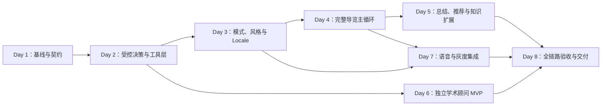

# 陈家祠受控 Agent 八天实施任务计划

```yaml
document_status: execution_plan
source_architecture: CONTROLLED_AGENT_ARCHITECTURE_UPGRADE_PLAN.md
planned_window: 2026-08-01_to_2026-08-08
duration: 8_days
delivery_type: demonstrable_mvp_with_feature_flags
release_strategy: workflow_authority_plus_controlled_agent_shadow_or_read_only_active
production_route_deletion: prohibited_in_this_window
```

> 如果实际开工日期不是 2026-08-01，则将 Day 1 至 Day 8 整体顺延，任务依赖和验收门槛不变。

## 1. 八天实施结论

八天不足以把升级方案中的 Phase 0–7、CA-00–CA-15 以及 `CA-VOICE`、`CA-STYLE`、`CA-JOURNEY`、`CA-I18N`、`CA-KNOWLEDGE`、`CA-ACADEMIC` 全部建设为生产级系统。本轮的正确目标是完成一个**可演示、可测试、可按能力关闭、不会破坏现有导游状态机的受控 Agent MVP**。

本轮采用以下总体策略：

1. 现有确定性 Workflow 继续掌握安全、路线、确认和 `TourState` 修改权。
2. 新 Agent 控制层先完成 schema、工具注册、策略门控、结果验证和审计；Planner 默认运行在 shadow，只有验收通过的只读能力可以 active。
3. 优先打通一条完整的游客旅程：模式选择 → 路线 → 总体介绍 → 逐点讲解 → 卡片增强 → 七艺总结 → 称号与祝福 → 周边推荐或安全降级。
4. 语音采用已选路线 A：`ASR → 文本受控 Agent → Renderer 正文 → TTS`，文字和字幕始终是权威回退路径。
5. 首版国际化只完成简体中文和英语链路；英语在完成母语人工审核前只能标记为 Beta。
6. 学术顾问首版只使用现有 20 张研究卡和已登记本地来源，不在八天内承诺外部数据库、付费全文、Zotero 或任意 PDF 全文研究。
7. 传承人知识优先完成 schema、来源门槛、摄取规则和少量已核实样例；没有合格来源时宁可保持空库，也不补写人物事实。

## 2. 优先级与范围冻结

| 优先级 | 八天内的工作 | 原因 |
|---|---|---|
| P0 必须完成 | 环境与回归基线、安全/状态/Renderer 硬边界、双模式契约、完整中文文字导览闭环、功能开关、自动测试、回滚方案 | 没有这些，其他体验功能都可能破坏现有系统 |
| P1 应完成 | 三种受控风格、中英本地化、路线 A 语音闭环、本地证据型学术顾问、传承人知识 schema | 用户价值高，且可在确定性边界内做成 MVP |
| P1 条件完成 | 主动对比卡/打卡卡、确定性称号、审核祝福、静态周边推荐清单、英语 TTS/ASR | 依赖内容审核、供应商密钥、设备和数据源 |
| P2 明确延期 | 自由 `dramatic_ceo` 上线、粤语 production、任意多语言扩展、外部论文检索、Zotero、通用 PDF 深读、实时地图/餐饮 API、完整传承人数据、旧路由删除 | 八天内无法同时完成资料审核、工程实现和真实场景验收 |

### 2.1 八天交付边界

| 能力 | 第 8 天应达到的状态 | 不得宣称完成的部分 |
|---|---|---|
| 受控 Agent | schema、Registry、Policy Gate、Executor/Validator 可用；Planner 可 shadow；合格只读工具可灰度 | 全面替代 `route_initial_request()` 或自由控制状态 |
| 导览旅程 | 至少一条审核路线可完整走通，含开场、点位、增强、总结和结束 | 所有路线、所有点位都达到生产内容质量 |
| 讲解风格 | `natural`、`child_friendly`、`academic` 可用且事实等价 | `dramatic_ceo` 默认上线；未审核自由风格 prompt |
| 国际化 | `zh-CN` 可演示，`en` 文字与字幕 Beta；语言切换不改状态 | 未经母语审核将英语标记为 production；粤语和更多语言 |
| 语音 | 至少一个 ASR/TTS 供应商适配器、字幕、取消/重播、文字回退 | 未经真实设备、隐私和现场噪声测试直接生产上线 |
| 知识扩展 | 传承人 schema、来源登记、摄取测试；只导入可验证资料 | 以模型记忆、百科搬运或无来源资料填充人物库 |
| 学术顾问 | 本地研究卡检索、来源区分、证据矩阵、学术问答和选题/方法建议 MVP | 系统性文献综述、已验证研究空白、外部全文覆盖声明 |
| 周边推荐 | 有审核及时效清单则展示；否则明确暂不可用 | 凭模型记忆提供当前营业、价格、评分、距离 |

## 3. Day 1 必须冻结的产品决定

这些决定最迟在 Day 1 中午前完成。若负责人未及时确认，按“建议默认值”实施 MVP，但相应功能只能标为 Demo/Beta。

| 决定 | 建议默认值 | 未决定时的处理 |
|---|---|---|
| `tour_mode` 归属 | 放在现有 `AgentState` 的会话级体验配置中，与 `thread_id` 绑定；不写长期 `VisitorProfile`，不写 `TourState` | 双模式仅做 UI/契约，不接生产路线 |
| 风格归属 | 与 `tour_mode` 同属会话级体验配置；经典模式默认 `natural` | 所有讲解回退 `natural` |
| 首版风格 | `natural`、`child_friendly`、`academic` | `dramatic_ceo` 仅保留关闭的 Beta 配置 |
| 首批 locale | `zh-CN` 为默认；`en` 为 Beta；fallback=`zh-CN` | 只发布中文，不做自由翻译回退 |
| 语音供应商 | 选择一个同时满足区域可用、密钥安全、ASR/TTS、流式或准流式能力的供应商，并通过 adapter 接入 | 使用 mock adapter 完成链路；演示保持文字模式 |
| 音频保留 | 默认不长期保存原始音频；只保留必要的时长、语言、错误码和 trace 元数据 | 禁止部署真实语音上传 |
| Coverage 计数 | 只有审核点位成功到达且正文成功生成后，才记录讲解覆盖；播放进度不改变事实计数 | 沿用文字讲解成功语义 |
| 主动卡片 | 比较卡和打卡卡默认受预算/点位/安全门控；研究卡只在学术风；术语卡仅被问及时 | 主动卡片全部关闭，不影响基础讲解 |
| 称号与祝福 | 确定性规则；祝福只用原创或已审核公共领域文案 | 返回普通游览完成祝福 |
| 周边推荐来源 | 负责人审核的结构化清单，必须含来源、更新时间、有效期和位置基准 | 模块关闭并提示查看官方渠道 |
| 传承人来源 | 馆方、政府、正式出版物或可核验学术来源 | 只建 schema，不导入人物 |
| 学术诚信 | 明确 AI 辅助、证据等级、不可伪造引文/数据、不可代写可冒充本人研究成果 | 只保留现有研究卡问答 |

## 4. 八天依赖关系



### 4.1 架构任务映射

| 日期 | 对应原架构任务 | 本轮处理方式 |
|---|---|---|
| Day 1 | Phase 0、CA-00 | 完整执行：恢复环境、冻结基线、状态/事实归属和硬门槛 |
| Day 2 | Phase 1–2、CA-01 至 CA-07 | 只实现支撑 MVP 的最小子集；Planner 保持 shadow，状态工具不开放 |
| Day 3 | CA-12、CA-STYLE、CA-I18N | 冻结双模式；上线三种受控风格；完成中英 Locale 基础 |
| Day 4 | CA-JOURNEY、CA-13 | 完成开场、点位自然讲解、确定性卡片调度和 Coverage 主循环 |
| Day 5 | CA-JOURNEY、CA-KNOWLEDGE | 完成总结/称号/推荐降级和传承人知识治理 MVP |
| Day 6 | CA-ACADEMIC | 只完成本地审核来源型学术顾问，不开放外部检索 |
| Day 7 | CA-VOICE、CA-14 | 完成路线 A 语音闭环和 off/shadow/active_read_only 灰度接图 |
| Day 8 | CA-15 的验收部分 | 做差分、人工验收和回滚；本轮不删除旧路由边 |

## 5. 每日统一操作纪律

每天都按以下顺序执行，不能先开发后补验收：

1. 开工检查：确认当前分支、工作区改动、当日输入契约和前一日验收结果。
2. 先写失败测试：为当日新能力建立正常、边界、失败关闭和跨 thread 测试。
3. 小步实现：每次只接入一个能力，默认功能开关关闭或 shadow。
4. 目标测试：运行当日模块测试，错误必须区分环境、数据、契约和代码问题。
5. 关联回归：运行状态、路线、安全、Visitor Renderer 和当前能力的关联测试。
6. 手工场景：至少完成一个正常场景、一个无证据场景、一个越权/注入场景。
7. 留存证据：记录测试命令、通过数、失败数、失败原因、tested commit、feature flags 和回滚方式。
8. 日终门槛：只有“必须通过项”全部通过，下一天才允许依赖该能力；否则启用当天规定的降级方案。

建议每天在 `data/chen_clan_academy/evaluation/implementation_8d/` 保存当日结果，文件命名为 `day_01_baseline.md` 至 `day_08_release.md`。

## 6. Day 1（8 月 1 日）：恢复开发环境、冻结基线与 MVP 契约

### 当日目标

取得可信的测试基线，冻结八天范围、状态归属、事实源、功能开关和验收场景。当天不修改生产路由。

### 详细操作流程

#### 上午：环境与代码事实检查

1. 保存当前工作区状态，确认 `CONTROLLED_AGENT_ARCHITECTURE_UPGRADE_PLAN.md` 的用户改动不被覆盖。
2. 检查 Python 3.11+、依赖、`.env`、LangGraph Studio 和向量索引状态。
3. 当前 `.venv` 已观察到解释器路径失效。先将它改名保存为备份，再用可用的 Python 3.11+ 新建 `.venv`，不要直接删除后失去排查依据。
4. 安装 `requirements.txt`，检查 `langchain_core`、`langgraph`、`PyYAML`、`networkx`、检索依赖是否可导入。
5. 运行全量 `unittest discover`，记录实际测试总数、通过、失败、错误、耗时；环境错误不得计作产品缺陷。
6. 运行一组最小冒烟测试：安全、Visitor 输出边界、TourState、路线、E5 讲解、卡片资格和研究卡。

参考命令：

```powershell
git status --short
.\.venv\Scripts\python.exe -m pip install -r requirements.txt
.\.venv\Scripts\python.exe -m unittest discover
```

#### 下午：冻结契约与开关

1. 建立八天 MVP 行为矩阵，逐项注明 `existing_authority`、`shadow`、`active_read_only`、`blocked`。
2. 冻结 `tour_mode`、`narration_style`、`locale` 的会话归属和恢复语义。
3. 列出唯一事实源：知识 Markdown、对象/点位映射、七艺枚举、研究卡、卡片资格、空间图和路线规划器。
4. 冻结硬边界：Input Guard、Policy Gate、审核 ID 校验、Evidence Validator、State Transition Adapter、CardDispatcher、Multilingual Localizer、Visitor Renderer。
5. 建立功能开关清单，至少包括：
   - `controlled_agent.shadow`
   - `controlled_agent.read_tools`
   - `tour.opening`
   - `tour.card_dispatcher`
   - `tour.visit_summary`
   - `tour.nearby_recommendation`
   - `style.child_friendly`
   - `style.academic`
   - `style.dramatic_ceo_beta`
   - `locale.en_beta`
   - `voice.asr`
   - `voice.tts`
   - `academic.local_workspace`
6. 确认第 3 节全部产品决定；将未批准项明确标成 blocked，不在代码中偷偷设定为 production。

#### 晚上：基线验收与交接

1. 保存基线报告、测试结果和已知失败清单。
2. 为第 2 天准备 `AgentDecision`、`EvidenceEnvelope`、`ToolSpec` 和审计字段草案。
3. 对当前完整中文导览走一次手工基线，保存输入、输出、路线和状态快照。

### 必须交付

- 可重复的 Python 开发环境。
- Day 1 基线报告和 MVP 行为矩阵。
- 模式、风格、locale 和 Coverage 的归属决定。
- 功能开关与回滚表。
- 代表性 E2E 场景集。

### 退出门槛

- P0 安全、状态和游客输出边界测试必须通过。
- 全量测试剩余失败必须都有分类和负责人，不能存在“原因未知”的红灯。
- 未确认的 P1 能力只能 blocked 或 shadow。

### 降级方案

若当天无法恢复完整环境，第 2 天不得接图；只允许完成 schema、纯函数和不依赖模型的单元测试。

## 7. Day 2（8 月 2 日）：搭建最小受控决策面与只读工具层

### 当日目标

完成 CA-01 至 CA-07 的**最小可用子集**：模型只能给出结构化候选，工具必须注册，策略必须允许，结果必须带证据并通过验证。当天不开放状态副作用。

### 详细操作流程

#### 上午：闭合协议

1. 新增 `AgentDecision` 闭合 schema，至少包含 intent、原话 span、置信度、请求的 capability、候选参数和澄清原因。
2. 新增 `EvidenceEnvelope`，至少包含来源 ID、证据等级、适用对象/点位、语言、版本或有效期、内部 trace 和游客可见字段。
3. 新增 `ToolSpec`，声明输入 schema、输出 schema、运行资格、副作用等级、证据要求、超时和失败策略。
4. 对伪造 node/object/source ID、非法枚举、低置信度和字段缺失执行确定性拒绝。

#### 下午：Registry、Gate、Executor 和 Validator

1. 注册首批现有只读能力：术语、单事实、服务规则、对象详情、点位精选、工艺位置、研究卡、对比卡、拍照卡。
2. Adapter 只调用现有真实模块，不复制业务事实，不改卡片正文。
3. Policy Gate 检查工具是否登记、当前状态是否允许、参数能否从原话或审核映射解析、证据是否必需。
4. Executor 加入超时、同参重复抑制和最大 3 次调用限制。
5. Validator 检查 evidence、对象/点位作用域、有效期、内部字段和空结果。
6. 所有输出统一经过 Visitor Renderer；错误和无证据结果不得由 LLM 补写陈家祠事实。

#### 晚上：shadow 验证

1. Planner 仅生成并记录候选，不改变当前消息、路线和状态。
2. 对同一问题比较旧路径与新候选的 capability、证据类别和状态快照。
3. 验证关闭 `controlled_agent.shadow` 后系统行为与 Day 1 基线一致。

### 建议模块

- `controlled_agent_contracts.py`
- `controlled_tool_registry.py`
- `controlled_policy_gate.py`
- `controlled_tool_executor.py`
- `controlled_result_validator.py`
- 对应 `test_controlled_*.py`

最终文件名可按现有项目习惯调整，但职责不能再次合并回 `agent_graph.py`。

### 必须交付

- 可确定性接受或拒绝的 AgentDecision。
- 首批只读 Tool Registry。
- Policy Gate、Executor、Evidence Validator 和 audit envelope。
- shadow/off 两种模式。

### 退出门槛

- 未登记工具执行数为 0。
- 只读工具导致 TourState、VisitorProfile 或正式路线变化为 0。
- 无证据文化事实生成、内部字段泄漏和伪 ID 接受均为 0。
- 关闭新能力后与 Day 1 行为基线一致。

### 降级方案

若 Planner 质量不稳定，保留 Registry/Gate/Validator，Planner 全程 shadow；Day 3–Day 7 仍可使用确定性入口调用受控组件。

## 8. Day 3（8 月 3 日）：经典/定制模式、受控风格和中英 Locale 基础

### 当日目标

在正式规划前完成明确的模式、风格和语言选择；同一审核事实能够以不同风格和语言表达，但路线、状态、Coverage 和事实不变。

### 详细操作流程

#### 上午：模式与恢复协议

1. 在现有会话状态中增加已冻结的体验配置，不新建第二份 VisitorProfile 或 TourState。
2. 经典模式只询问游览时间，其他偏好使用透明默认值。
3. 定制模式最多收集时间、兴趣/深度和讲解风格等已批准的最小字段。
4. 游客必须明确选择模式；不得根据语气、姓名、年龄、设备或口音猜测。
5. 收集过程被知识问答打断后，回答完必须恢复原收集字段；已确认字段不得重复询问。

#### 下午：风格与 Locale

1. 复用并扩展 `data/chen_clan_academy/narration_styles/styles_v1.yaml`，首版只启用：
   - `natural`
   - `child_friendly`
   - `academic`
2. `dramatic_ceo` 可建立 Beta 配置和测试样例，但功能开关默认关闭，未经人工品牌审核不得出现在正式入口。
3. 每个风格定义允许的语气、长度倍率、禁用表达、引用方式和回退风格。
4. 建立 LocalePolicy：默认 `zh-CN`、Beta `en`、fallback `zh-CN`。
5. 扩展术语注册表，使中英文名称都回映现有审核 ID；翻译不得产生新 ID。
6. 实现“事实计划 → Locale × Style 联合实现 → 实体/数字/否定/安全/归因校验 → Renderer”的固定顺序。
7. 语言或风格在游览中切换时，只影响后续呈现，不改变路线、当前点、已记录 Coverage 和游客身份判断。

#### 晚上：等价性测试

1. 选择至少 10 个审核 evidence，分别生成三种风格和两种语言的结果。
2. 断言实体、时间、地点、数量、安全结论和来源归因不漂移。
3. 手工检查儿童风不幼稚化历史事实、学术风不伪造引文、英语不弱化否定和安全结论。

### 必须交付

- 模式选择与中断恢复契约。
- 三种可用风格和一个关闭的娱乐化 Beta 槽位。
- LocalePolicy、英文固定文案/术语 MVP 和本地化校验。
- 模式、风格、locale 全部与 `thread_id` 隔离。

### 退出门槛

- 模式来源合法率 100%。
- 风格化和本地化新增/修改审核事实为 0。
- 风格/语言切换导致状态、路线或 Coverage 变化为 0。
- 未审核 locale 或风格被标为 production 的数量为 0。

### 降级方案

英语一致性测试不通过时关闭 `locale.en_beta`；风格失败时逐个关闭并回退 `natural`，不得阻断中文经典模式。

## 9. Day 4（8 月 4 日）：完成正式导览主循环

### 当日目标

让游客从路线确认开始，完整经历一次总体介绍和至少一条路线的逐点导览；讲解自然连贯，卡片增强受确定性资格和时间预算控制。

### 详细操作流程

#### 上午：总体介绍与讲解组织

1. 为总体介绍建立独立 evidence，不从普通检索结果临时拼接。
2. 实现 `TourOpeningProgram`：路线确认后默认执行一次，可跳过、可重播，重规划不重复，问答打断后可恢复。
3. 实现或扩展 `NarrationComposer`，先生成事实计划，再组织为“观察点 → 主旨 → 证据说明 → 关联 → 过渡”的导游表达。
4. 禁止直接把 RAG chunk、内部 evidence、对象 inventory 或调试字段作为游客正文。
5. 对每次讲解设置事实数量、字数和预计朗读时间预算。

#### 下午：点位循环与卡片调度

1. 在审核点位到达后读取 E5 证据包，生成基础讲解。
2. 实现确定性 `CardDispatcher`，输入只允许当前审核点位、模式、明确兴趣、风格、剩余时间、StopProgram 和资格表。
3. 调度规则：
   - 学术研究卡：仅 `academic` 风格或明确学术请求；
   - 术语卡：仅游客问到相关术语时；
   - 对比卡：存在合格比较维度且预算允许时可主动触发；
   - 打卡卡：点位资格、安全规则和预算都通过时可主动触发；
   - 无合格卡时只输出基础讲解，不报错。
4. 同一张增强卡在同一路线中做重复抑制。
5. 讲解成功后再通过正式 adapter 写入 NarrationCoverage；模型不能直接修改 Coverage。

#### 晚上：中文文字闭环

1. 用一条 30 分钟代表路线完成：模式选择 → 规划 → 确认 → 开场 → 到达 → 基础讲解 → 增强卡 → 提问 → 恢复 → 下一站。
2. 验证中途术语/知识问答不改变当前点和正式路线。
3. 验证安全问题优先于拍照卡和到达事件。

### 必须交付

- `TourOpeningProgram`。
- 自然讲解组织和事实一致性校验。
- `CardDispatcher` 及研究/术语/对比/打卡四类规则。
- 点位循环和 Coverage 受控写入。

### 退出门槛

- 开场重复执行、讲解事实扩写和原始 chunk 倾倒均为 0。
- 非法卡片、重复卡片和安全绕过均为 0。
- 讲解预算超限为 0。
- 至少一条中文路线可从确认连续运行到最后一个点位。

### 降级方案

若 CardDispatcher 未通过，关闭所有主动卡片，只保留现有 E5 基础讲解和被动术语问答；不得延误主旅程闭环。

## 10. Day 5（8 月 5 日）：游览结束体验、七艺统计与知识扩展

### 当日目标

完成导览闭环的结束部分，并把传承人知识扩展建立在严格来源治理上。

### 详细操作流程

#### 上午：总结、称号与祝福

1. 核验七种工艺正式枚举和对象—工艺映射，不在总结模块复制第二份映射。
2. 实现 `VisitSummaryEngine`：只读取 NarrationCoverage 和审核映射，对对象去重；多工艺对象按已审核映射统计。
3. 明确以下不计数：仅路过、远程问答、讲解失败、无 evidence、重复播放、跨 thread 记录。
4. 实现版本化 `TitleAwardPolicy`：根据确定性计数选择称号；并列时使用明确规则；无明显偏好时使用通用称号。
5. 祝福语使用原创模板或已审核公共领域文本。现代歌词默认禁用，避免版权和错误引用。
6. 输出示例结构：“你参观了 X 个灰塑、Y 个木雕…… → 称号 → 祝福”。

#### 下午：周边推荐与传承人知识

1. `NearbyRecommendationService` 与馆内 TourState、路线和空间图完全隔离。
2. 如果已有审核清单，为每条推荐登记类别、来源、更新时间、有效期、位置基准和商业披露；过期或缺来源时不返回当前结论。
3. 建立传承人结构化 schema：person_id、姓名/别名、身份等级、工艺、作品、与陈家祠关系、来源、有效期、隐私级别。
4. 更新来源注册和 `rag_ingestion.py` 类型映射，保证每个生产 chunk 都能回到注册来源。
5. 只把当天可核验的记录写入 `05_craft_inheritors.md` / `inheritors/`；人物与陈家祠的关系必须有直接证据，不能由工艺相同推导。
6. 增加建筑本体、馆藏、常设展览、临展和复原陈列的类型区分，防止后续学术问答混用。

#### 晚上：索引与闭环测试

1. 重建测试索引，检查新增文档的 source/type/章节归因。
2. 运行重复对象、多工艺对象、重播、跳过、问答和跨 thread 的总结测试。
3. 完整执行路线到结束页，确认推荐失败不会影响总结、称号和祝福。

### 必须交付

- 七艺确定性统计、称号和安全祝福。
- 可关闭的周边推荐服务或明确的不可用降级。
- 传承人 schema、来源规则、摄取测试；有合格来源时包含已审核样例。

### 退出门槛

- 七艺误计、重复计和模型重算为 0。
- 称号写入长期画像为 0。
- 无来源/过期推荐作为当前结论为 0。
- 空来源知识 chunk、人物误关联和敏感个人信息进入索引为 0。

### 降级方案

没有审核周边数据时关闭推荐；没有传承人直接来源时只交付 schema、README 和失败关闭测试，不为了“看起来完整”生成资料。

## 11. Day 6（8 月 6 日）：建立独立的本地证据型学术顾问 MVP

### 当日目标

在不影响导游状态的前提下，利用现有 20 张研究卡完成文献查找、证据型回答、观点综合、选题收敛和方法建议。

### 详细操作流程

#### 上午：工作空间与来源治理

1. 实现 `ExperienceWorkspaceRouter`，显式区分 Tour Workspace 和 Academic Advisor Workspace。
2. 建立 `AcademicSessionContext`，只保存当前学术任务、查询范围、已选来源和输出要求；不得写入 TourState、正式路线或长期 VisitorProfile。
3. 建立 `AcademicIntentGate`，识别文献查找、单篇解释、多篇综合、选题、方法、田野、书目和引用请求。
4. 统一现有 20 张研究卡的书目、审核等级、全文状态和来源 ID；区分 reviewed 与 background，区分摘要/元数据/全文证据。
5. 遇到 DOI、作者、页码或全文状态无法验证时，明确显示“未验证”，不得补造。

#### 下午：证据矩阵与输出能力

1. 实现 Claim–Evidence Matrix，每个观点记录支持来源、反对/限制来源、证据等级和 Agent 推断标签。
2. 支持以下 MVP 输出：
   - 基于本地审核资料的学术问答；
   - 最多若干来源的受控比较和观点冲突说明；
   - 研究问题由宽到窄的收敛建议；
   - 方法、材料范围和田野观察清单；
   - 注释书目和一种批准的引用格式。
3. 输出必须区分：馆方/审核事实、学者观点、Agent 综合、待验证方向。
4. 加入学术诚信和伦理提示：不伪造数据、访谈、实验、页码、伦理批准或研究空白。
5. 论文或卡片中的指令性文字全部视为材料内容，不能触发工具、状态或权限变化。

#### 晚上：隔离与对抗测试

1. 在同一 `thread_id` 设计允许的工作空间切换规则，并断言学术上下文不改变导览进度。
2. 测试虚假 DOI、摘要冒充全文、background 卡越权、观点串线、版权请求和提示注入。
3. 测试无匹配来源时明确资料不足，并引导用户补充合法资料，而不是自由生成引文。

### 必须交付

- 独立工作空间路由和 AcademicSessionContext。
- 本地研究卡来源注册、Evidence Matrix 和学术 Renderer。
- 学术问答、选题/方向、方法/田野、注释书目 MVP。

### 退出门槛

- 虚假论文、作者、DOI、页码和引文为 0。
- 摘要冒充全文、研究观点冒充馆方事实为 0。
- 学术任务修改 TourState、路线或 Coverage 为 0。
- 无来源学术结论和文档提示注入执行为 0。

### 降级方案

Evidence Matrix 或多篇综合不稳定时，回退现有 reviewed research-card 问答；外部检索、用户 PDF 和 Zotero 全部保持关闭。

## 12. Day 7（8 月 7 日）：接入路线 A 语音、最小交互界面和图灰度

### 当日目标

打通“语音输入 → 受控文本链路 → 安全正文/字幕 → 语音播放”，并把已验收只读能力接入图的灰度路径。

### 详细操作流程

#### 上午：语音输入

1. 定义供应商无关的 ASR/TTS adapter，供应商模型名、voice、格式、超时和密钥全部从环境配置读取。
2. 增加音频会话 ID，并与 `thread_id` 绑定；临时音频默认在请求完成后删除或按批准策略处理。
3. ASR 输出只能形成带语言、置信度和时间戳的用户文本，不得直接产生 TourEvent 或工具调用。
4. 低置信度控制词、点位名和否定词必须请求澄清；不得凭模糊转写执行“跳过、完成、确认路线”等副作用。
5. 转写文本必须经过与文字输入相同的 Input Guard、控制仲裁、Policy Gate 和状态适配。

#### 下午：TTS、播放器和最小 UI

1. TTS 只能接收 Visitor Response Renderer 的最终安全正文，字幕与送入 TTS 的文本使用同一份内容。
2. 增加暂停、继续、取消、重播和播放状态；播放器不解释游客意图，不修改 TourState。
3. TTS/ASR 超时、供应商失败或密钥缺失时，100% 回退文字和字幕。
4. 为 `webapp.py` 或独立最小客户端增加：模式、风格、语言选择，麦克风按钮，转写预览，发送确认，字幕和播放器控件。
5. 明确展示 AI 语音说明和音频处理/保留提示。

#### 晚上：LangGraph 灰度接入

1. 在 `agent_graph.py` 中接入已验收的 planner/gate/executor/validator/renderer 节点，保留现有控制仲裁在前。
2. 支持 `off`、`shadow`、`active_read_only` 三种模式；不得批量删除旧边。
3. 路线、重规划和 TourEvent 继续由现有确定性链执行；新 Planner 不能直接连接状态。
4. 测试中文语音导览完整一轮；英语至少完成转写/字幕/TTS Beta 冒烟测试。
5. 测试插话、取消、断线、重复/乱序音频事件、跨 thread 和 TTS 失败回退。

### 必须交付

- 一个真实或 mock 的 ASR/TTS adapter 契约；有供应商密钥时完成真实接入。
- 可操作的最小语音导览界面、同步字幕和文字回退。
- 新图的 off/shadow/active_read_only 灰度能力。
- 音频和 Agent 审计元数据，不记录 Chain-of-Thought。

### 退出门槛

- 语音绕过 Input Guard、ASR 误识别导致状态副作用、未经 Renderer 文本被朗读均为 0。
- 字幕与送入 TTS 的正文差异为 0。
- 音频跨 thread 串线为 0。
- 关闭 ASR/TTS/Agent 开关后，中文文字导览仍能完整运行。

### 降级方案

真实供应商不可用时交付 adapter、mock、契约和 UI，但发布说明必须标记“真实语音服务 blocked”；不得把 mock 演示宣称为线上能力。

## 13. Day 8（8 月 8 日）：全链路验收、修复、回滚演练与交付

### 当日目标

停止新增功能，以测试、修复、人工体验和交付证据为主，形成明确的 Go/Conditional Go/No-Go 结论。

### 详细操作流程

#### 上午：自动化和差分回归

1. 冻结功能范围；中午以后禁止加入新特性。
2. 运行全量单元测试、模块测试和 E2E；与 Day 1 基线比较测试数量、失败、耗时和行为差异。
3. 重点执行硬门槛：安全、状态非法写入、路线自动应用、对象越界、内部字段泄漏、跨 thread、无证据事实、语言/风格漂移和虚假引文。
4. 执行故障注入：模型超时、工具超时、空 evidence、ASR/TTS 失败、无网络、过期推荐和索引不可用。
5. 测量 p50/p95 响应耗时、模型调用数、工具循环数和语音端到端延迟，标出无法达到的阈值。

#### 下午：人工场景和真实设备验收

至少完成以下场景并保存 trace、状态前后和结果：

1. 中文经典模式 30 分钟完整导览。
2. 中文定制模式 + 儿童友好风。
3. 定制模式 + 学术风 + 合格研究卡。
4. 到点主动对比卡和打卡卡；危险拍摄请求被安全规则拦截。
5. 术语问答打断后恢复原路线和当前点。
6. 游览结束七艺统计、称号、祝福和周边推荐降级。
7. 英语 Beta：UI、讲解、字幕、术语和安全否定一致。
8. 中文语音：转写、澄清、字幕、播放、插话、取消和文字回退。
9. 学术顾问：本地文献查找、观点综合、选题和方法建议。
10. 对抗场景：伪 ID、伪 DOI、提示注入、无证据故事、跨 thread 和要求跳过确认。

#### 晚上：发布与交接

1. 对每项能力给出 `Go`、`Conditional Go` 或 `No-Go`，禁止用“基本完成”代替明确结论。
2. 默认打开的只能是通过所有硬门槛的能力；Beta 和未人工审核能力默认关闭。
3. 演练回滚：关闭 controlled agent、单个风格、英语、ASR、TTS、卡片、总结、推荐和学术工作空间，确认中文基础导览仍可工作。
4. 更新 README、环境变量样例、运行步骤、数据来源说明、隐私说明、已知限制和下一阶段 backlog。
5. 准备一个 10–15 分钟演示脚本和一份测试证据索引。

### 必须交付

- 可运行的八天 MVP 和固定演示路径。
- 全量自动测试报告、人工验收矩阵、性能报告和安全对抗结果。
- 功能开关清单、回滚演练记录、已知问题和下一阶段任务。
- Go/No-Go 发布结论。

### 最终硬门槛

以下任一项非 0，相应能力必须关闭，不能带病上线：

- TourState/VisitorProfile 非法写入；
- 路线未经确认自动应用；
- 安全结论被覆盖；
- 无证据陈家祠文化事实；
- 对象—点位越界；
- 内部 evidence/trace 泄漏；
- 跨 thread 串线；
- 风格或翻译改变事实；
- ASR 误识别造成状态副作用；
- TTS 朗读非 Renderer 正文；
- 七艺误计或重复计；
- 虚假论文、作者、DOI、页码或引文。

## 14. 建议测试分层

### 每次修改后立即运行

- 新增模块的单元测试。
- 对应旧模块的回归测试。
- `test_tour_state.py`、`test_visitor_response_boundary.py` 和安全测试。

### 每日结束运行

- 当日能力的全部测试。
- 路线、交互、E5、卡片、Coverage 和 thread 隔离关联测试。
- 至少三条手工场景。

### Day 4、Day 7、Day 8 运行

- 全量 `unittest discover`。
- LangGraph Studio 代表场景。
- 新旧路径差分。
- 功能开关和故障回退。

任何测试只锁中文文案而不锁 state、evidence、ID、资格和来源，都不算有效验收。

## 15. 功能开关与回滚矩阵

| 能力 | 默认状态 | 失败时回滚 |
|---|---|---|
| Controlled Planner | shadow | 关闭 planner，恢复现有确定性路由 |
| 只读工具执行 | 分能力 active | 关闭失败工具，回退原知识入口 |
| 双模式 | 通过后 active | 回退经典模式 + natural |
| 风格 | `natural` active，其余分能力 | 回退 `natural` |
| 英语 | Beta/off-by-default | 回退 `zh-CN`，不自由翻译 |
| 总体介绍 | 通过后 active | 跳过开场，继续点位导览 |
| CardDispatcher | off-by-default，验收后 active | 仅保留基础 E5 讲解 |
| 总结与称号 | 通过后 active | 输出普通完成信息 |
| 周边推荐 | 仅有有效来源时 active | 不输出推荐，指向官方渠道 |
| ASR | 条件 active | 使用文字输入 |
| TTS | 条件 active | 使用文字和字幕 |
| 学术顾问 | 本地能力 Beta | 回退 reviewed research-card 问答 |
| 传承人知识 | 按资料独立开关 | 从索引禁用问题文档，保留旧知识库 |

## 16. 八天后明确进入 Backlog 的工作

1. CA-08 至 CA-15 的全面迁移、主动状态事件工具化和旧路由收敛。
2. 全部路线、点位、卡片和风格的内容人工验收。
3. `dramatic_ceo`、故事化、幽默等娱乐风格的品牌和事实专项评测。
4. 粤语及更多 locale、母语审核、专名发音词典和现场口音测试。
5. 外部学术数据库、合法全文读取、用户 PDF、Zotero 和多引用格式。
6. 完整手艺传承人资料、作品关系、动态人物状态及维护机制。
7. 实时地图、营业、距离、价格和附近推荐服务。
8. 负载测试、成本优化、缓存、监控告警、数据保留政策和正式上线审批。

## 17. 任务完成定义

八天任务只有同时满足以下条件才算完成：

- 中文文字主路径能够完成一次端到端导览；
- 所有新能力都能独立关闭，关闭后不破坏现有 Workflow；
- 新 Agent 不直接修改 TourState、VisitorProfile 和正式路线；
- 语音、风格、翻译、卡片、总结和学术能力都服从同一证据与 Renderer 边界；
- 自动测试、人工场景、失败回退和 tested commit 均有记录；
- 未完成的功能被明确标为 Beta、blocked 或 backlog，而不是在文档中宣称已上线。

## 18. 当前预检记录

2026-08-02 已完成 Git/工作区同步：`main == origin/main == fe84be2`，工作树干净；制定计划时列出的未提交方案文件已进入历史提交，不再构成归属阻塞。

当前仍没有可作为 Day 1 完成依据的绿色完整回归：P0 安全/游客输出交接记录定向 59 项通过，而最近完整回归记录为 757 项、16 个失败、1 个错误。失败必须在实际项目虚拟环境中复现、归因和收口，不能用不含项目依赖的备用 Python 结果代替。

本沙箱曾因 WindowsApps 基础解释器不可访问而无法启动项目 `.venv`；这只是当前执行环境限制，**不得**据此断言项目虚拟环境损坏。Day 1 的未完成事项是取得本机真实解释器、依赖和完整测试证据，而不是重建或替换环境。
