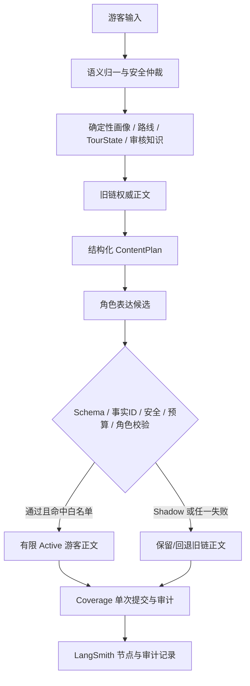

# 参赛版本完成度、功能实现范围与展示范围标杆

## 1. 文档目的与使用规则

本文是当前参赛版本的统一事实口径，供路演稿、PPT、演示视频、答辩材料和队友交接使用。凡涉及“已经实现”“比赛可展示”“仍在验证”“暂未开放”等表述，均以本文和对应提交中的实际代码、测试为准。

- 当前文档描述的是可复现的比赛演示版本，不等同于面向所有场馆、语言、角色和场景的生产级全面开放。
- 历史 handoff 只记录阶段过程；若与本文冲突，以本文所列基线提交为准。
- 不得把 Shadow 候选描述成游客已经看到的 Active 正文。
- 未保存 Thread ID、Run ID 或 Trace URL 时统一写 `trace_metadata: unavailable`，不得补造。

## 2. 一句话定位

这是一个以审核知识、确定性路线与可追踪游览状态为可信底座，并用“计划—生成—校验—回退”机制安全叠加角色化表达的陈家祠智能导游；比赛版已跑通 18 种风格在审核点位讲解场景的有限 Active 闭环，古风书生仍是路线主展示角色。

## 3. 当前参赛状态

```text
branch: experiment/agent-orchestration-v2
baseline_commit: pending_local_role_narration_18_style_expansion
competition_tag: not_created
remote_sync_status: pending_push_after_18_style_expansion
workspace_status: local_changes_uncommitted; 18_style_stop_guidance_expansion
full_regression: 1118/1118 passed_by_operator
latest_active_targeted_validation: 59/59 passed_by_operator
p0_matrix: 3/3 passed_by_operator (latest recorded P0 matrix)
automated_18_style_validation: 54/54 deterministic_matrix_passed; shadow_quality=eligible_for_limited_active
manual_risk_sample: 7/7 passed_by_operator
manual_full_18_style_matrix: pending_operator_studio_validation
active_takeover: stop_guidance_all_18_styles_only; route_planning_and_opening_ancient_scholar_only
```

已完成的自动化验收确认：18 种风格在建筑空间、工艺、纹样/构件三类审核点位上共 54 条确定性矩阵样本通过事实、风格、安全、预算与 Coverage 幂等校验，Shadow 质量报告为 `eligible_for_limited_active`。古风书生的路线规划与路线开场仍是唯一开放的路线类 Active。全量 18 风格 Studio 人工矩阵仍待操作者补验；未统一保存 Trace URL 的样本按 `trace_metadata: unavailable` 归档。

## 4. 完成度分层

### A. 已完成并直接服务游客的确定性能力

语义归一、安全仲裁、画像收集、时间与讲解深度解析、路线选择、到达与点位推进、受控重规划、知识问答、点位讲解、游览总结、称号祝福、周边推荐及 Coverage 审计均已进入现有游客链路。这些能力是系统的权威控制层，不依赖角色模型决定事实或状态。

### B. 比赛版有限 Active 能力

Active 必须同时通过总开关、能力开关、风格—场景白名单和候选校验，默认关闭。当前只开放：

| 风格 | 路线规划 | 路线开场 | 点位讲解 |
|---|---:|---:|---:|
| `ancient_scholar` 古风书生 | Active | Active | Active |
| 其余 17 种已审核风格 | 旧链 | 旧链 | Active |

### C. 已实现但仍处于 Shadow / 审计层的能力

- 18 种角色模式目录、角色选择与连续性审计；
- 五类 `presentation_content_plan`：路线规划、路线开场、点位讲解、引路、游览结束；
- 非白名单角色与场景的角色化正文候选；
- `tour_qa` 与 `qa_follow_up_detail` 的角色化问答计划、候选和校验；
- 路线 proposal、重规划 proposal、状态迁移等只读审计能力。

Shadow 能力会生成、校验和记录候选，但游客继续看到确定性旧链正文。

### D. 尚未开放或不属于本次比赛范围

问答 Active、navigation Active、tour_closing Active、自由规划器接管、重规划 Active、语音交互、多场馆泛化和生产级全量灰度均未开放。18 风格 Active 仅限审核点位讲解。

## 5. 功能实现范围总表

| 功能 | 当前状态 | 权威层/运行方式 | 比赛展示口径与边界 |
|---|---|---|---|
| 语义归一与意图仲裁 | 已完成 | 确定性控制层 | 识别路线、点位、问答与控制意图，不以自由模型直接写状态 |
| 安全语义与拒绝 | 已完成 | 确定性安全层 | 馆内规则、危险动作和边界请求可受控回答或拒绝 |
| VisitorProfile | 已完成 | 单一画像事实源 | 支持语言、时长、兴趣、深度和角色偏好；线程隔离 |
| 中文/英文时长解析 | 已完成 | 确定性解析 | 支持明确分钟、`one hour` 等；不猜测模糊时长 |
| 路线规划与选择 | 已完成 | 审核路线 + 确定性选择 | 角色不得生成或修改节点、顺序、时间和路径 |
| TourState | 已完成 | 确定性状态机 | 当前点、已访问、剩余点和路线进度受控更新 |
| 到达、完成、跳过、下一站 | 已完成 | Graph 控制节点 | 可演示完整游览推进，不由角色正文写状态 |
| 受控重规划 | 已完成 | proposal/确认机制 | 比赛主线不展示角色接管重规划 |
| 空间定位与引路 | 已完成 | 审核空间关系 | 游客可获得下一站与路径提示；角色化引路 Active 未开放 |
| 工艺、对象、术语问答 | 已完成 | 审核知识与受控检索 | 答案事实来自审核证据，不由角色层重新检索 |
| 研学、比较与观察 | 已完成 | 受控问答/展示策略 | 可引导观察，不能把推断写成历史事实 |
| 拍照建议 | 已完成 | 审核建议 + 安全边界 | 不允许攀坐、触摸、阻塞通道或进入非开放区 |
| 点位讲解 E5 | 已完成 | ContentPlan + 审核事实 | 控制事实、顺序、预算和必要提示 |
| Coverage | 已完成 | 原子提交与幂等审计 | Active 成功或回退均只提交一次，避免重复介绍 |
| 18 种角色目录 | 已完成并自动验证 | 角色策略层 | 18 种风格仅在审核点位讲解场景有限 Active；其他场景仍为 Shadow/旧链 |
| 古风书生 | 比赛有限 Active | 规划、开场、点位 | 主展示角色；事实、路线和状态仍由确定性系统提供 |
| 其余 17 种风格 | 比赛有限 Active | 点位讲解 | 通过风格合同、事实、安全、预算与 Coverage 校验后方可接管 |
| 专业讲解 | 比赛有限 Active / Shadow | 点位 Active；问答 Shadow | 点位术语准确；问答仍不宣称游客端 Active |
| 静听模式 | 比赛有限 Active / Shadow | 点位 Active；问答 Shadow | 点位不新增问题、任务、拍照或互动要求 |
| 角色化问答 | Shadow | `tour_qa`、`qa_follow_up_detail` | 角色候选保持上一问范围，游客仍看到旧安全答案 |
| 模型失败回退 | 已完成 | fail-closed | 超时、非法 JSON、事实漂移、预算超限、内部泄漏均回退旧正文 |
| LangSmith Studio 可观测性 | 已用于验收 | 节点、候选、校验、审计 | 可展示决策链；并非所有人工样本均保存 Trace URL |

## 6. 核心架构与数据责任



责任边界：确定性层决定“去哪、讲什么事实、当前状态是什么、什么行为安全”；角色层只决定“怎样更有角色感地表达”。模型不得生成路线 ID、对象 ID、来源 ID、状态补丁、原始知识 chunk 或工具执行指令。

## 7. 比赛推荐展示范围

### 主线：古风书生

建议完整演示：选择古风书生 → 30 分钟路线规划 → 角色化路线开场 → 到达前院中部 → 角色化灰塑与独角狮讲解 → 提问并展示角色问答 Shadow 审计 → 完成本点或前往下一站。

这一主线最能同时体现角色连续性、路线确定性、审核事实约束、Active 接管、问答审计和 Coverage 单次提交。

### 辅线：儿童友好

建议展示同一审核点位的儿童友好 Active 讲解，以及儿童角色问答 Shadow。强调表达更易理解，但事实数量、安全要求和路线状态不变。

### 稳定兜底：中性清晰

用于演示角色服务不可用或需要稳定说明时的点位 Active；所有候选失败仍可回退旧版权威讲解。

## 8. 比赛中不展示的范围

- 不将 18 种角色表述为全场景 Active；其 Active 仅限审核点位讲解；
- 不展示专业讲解、静听模式或粤派角色在路线、问答、引路、结束语等场景的 Active 接管；
- 不展示问答、引路、结束语和重规划的角色 Active；
- 不演示自由 Planner 修改路线或 TourState；
- 不把 Shadow 候选当作游客实际正文；
- 不承诺语音、多场馆或生产级全量并发能力。

## 9. 项目核心亮点与证据

1. **不是“换提示词”的角色聊天，而是受控角色导游。** ContentPlan 明确事实、预算和交互边界，候选必须通过 Schema、事实 ID、安全、角色和预算校验。
2. **智能表达与可信控制分层。** 路线、空间、状态、证据和 Coverage 由确定性系统掌握，模型只改写表达，因此角色感不会换来路线漂移或事实失控。
3. **失败仍可用。** 已覆盖超时、非法结构、事实 ID 缺失/新增、预算超限和内部字段泄漏等故障；失败自动保留完整旧正文，不向游客暴露异常栈。
4. **形成真实游览闭环。** 系统能够从画像与路线开始，完成到达、讲解、问答、完成/下一站和总结，而不是孤立的单轮问答 Demo。
5. **可审计、可复现。** LangSmith 中可查看 ContentPlan、候选、校验、Active/Shadow 判定、回退、状态写入和 Coverage 提交，支撑答辩时展示“为什么安全”。

## 10. 安全与可信边界

- 审核事实和证据边界不可由角色模型扩展；新增人物、年代、故事、价值判断或内部字段会失败关闭。
- Active 采用风格—场景固定白名单，配置不完整、角色冲突或未知角色均不能进入 Active。
- 游客输入不会授权模型直接写 TourState、VisitorProfile、路线、proposal 或 StopProgram。
- Active 成功与失败回退共享 Coverage 幂等约束，避免同一事实重复提交。
- 儿童模式不降低安全要求；静听模式不得增加互动任务；摄影与闯关表达不得引导危险行为。

## 11. 验证证据

| 验证项 | 结果 | 证据性质 |
|---|---|---|
| 完整回归 | `1118/1118 passed` | 操作者提供的本地完整回归结果 |
| 最新 Active 定向测试 | `59/59 passed` | 操作者提供的定向测试结果 |
| P0 安全/游客输出矩阵 | `3/3 passed` | 最近一次已记录 P0 结果 |
| 18 风格点位自动化矩阵 | `54/54 passed` | 18 风格 × 建筑空间/工艺/纹样构件；事实、风格、安全、预算与 Coverage 幂等 |
| 18 风格 Shadow 质量报告 | `eligible_for_limited_active` | 每种风格 3 条样本，无安全、状态写入、旧链正文保留违规 |
| 高风险角色人工抽样 | `7/7 passed` | 全新 Thread 的 Studio 人工验证 |
| 古风书生有限 Active | 规划、开场、点位均通过 | `validation_status=accepted`、`active_takeover=true` |
| 古风点位 Coverage | `committed` | narration_commit 审计；无重复提交证据 |
| 角色问答 Shadow | child / professional / listen_only 通过 | `active_takeover=false`、`same_fact_boundary=true` |
| 故障回退 | 自动化通过 | 超时、非法 JSON、事实漂移、预算、内部泄漏 |

尚待补充的验证不计入已完成口径：当前 Python 环境缺少 `langchain_core`，图工作流定向测试需在项目完整依赖环境中执行；全量 18 风格 Studio 人工矩阵亦待操作者完成。

人工样本未保存统一 Trace URL 时，事实口径为：

```text
trace_metadata: unavailable
manual_validation: passed_by_operator
```

## 12. 对外表述规范

### 可以使用

- “系统已实现 18 种角色表达策略；18 风格点位讲解自动化矩阵 54/54 通过，Shadow 质量报告达到有限 Active 门槛。”
- “比赛版已开放古风书生路线规划、开场和点位讲解的有限 Active。”
- “18 种已审核风格已在白名单审核点位开放有限 Active；问答、引路和结束语仍未角色化接管。”
- “角色化问答已完成计划、生成、校验和审计链路，目前以 Shadow 方式运行。”
- “所有事实、路线和游览状态由确定性系统控制，角色模型只改变表达。”
- “既有完整回归记录为 1118/1118；本次 18 风格扩展的可运行定向矩阵已通过，角色失败会自动回退旧版安全正文。”

### 禁止使用

- “18 种角色已在所有场景全部上线/全部 Active。”
- “所有路线、引路、问答、结束语都已角色化接管。”
- “模型可以自主修改路线或游览状态。”
- “系统已达到全场馆、全语言、生产级部署标准。”
- “问答角色正文已经直接展示给游客。”
- “所有人工样本都有完整 Trace URL。”
- “系统已经接入语音。”

## 13. 参赛材料引用规则

- PPT 的“完成度”页应同时写明 Active 白名单与 Shadow 范围。
- 架构图必须保留确定性控制层、角色候选校验和旧链回退三部分。
- 演示视频优先使用古风书生主线；可从三批点位风格中选择儿童友好、专业讲解、摄影引导或粤语讲古作为差异化补充；中性清晰作为稳定兜底。
- 展示 LangSmith 时应展开 `route_role_narration_evaluations`、`active_role_narration_audit`、`coverage_commit` 或 `active_qa_role_narration_audit`，并说明 Active 与 Shadow 的区别。
- 后续代码、测试或白名单发生变化时，应更新本文件的基线提交和能力矩阵后再制作新材料。
