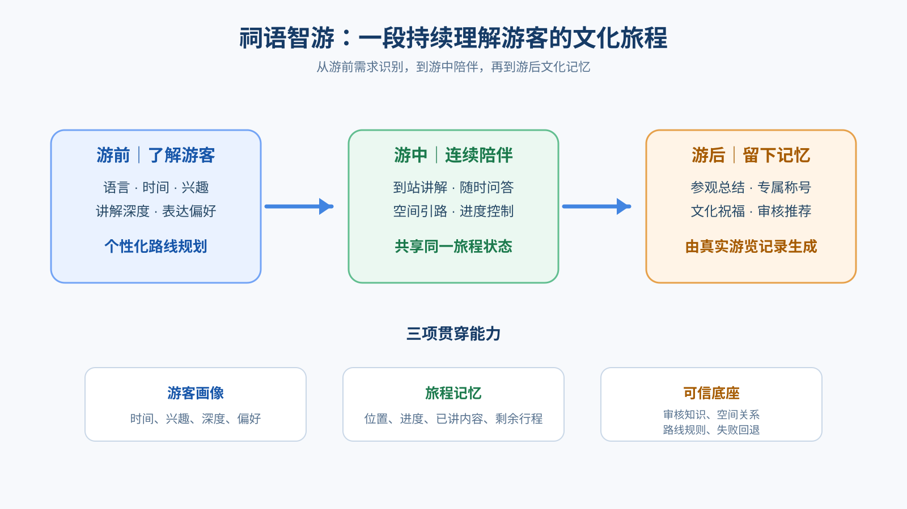
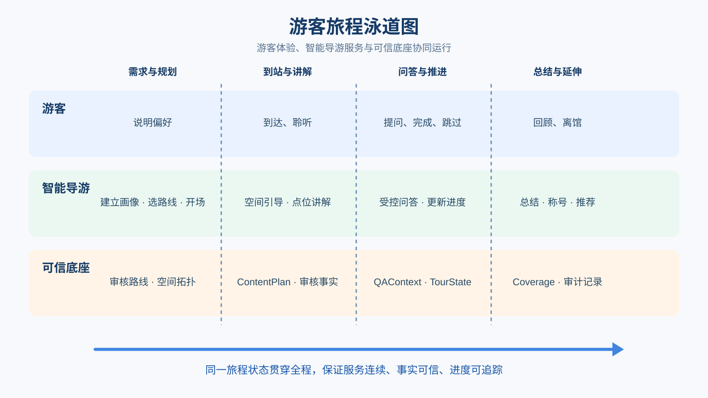
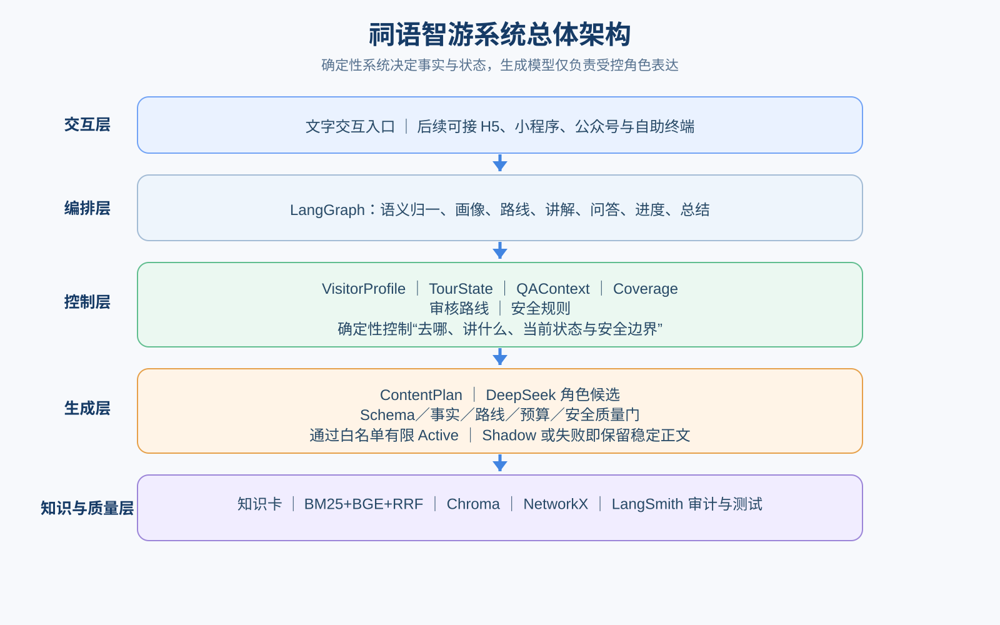
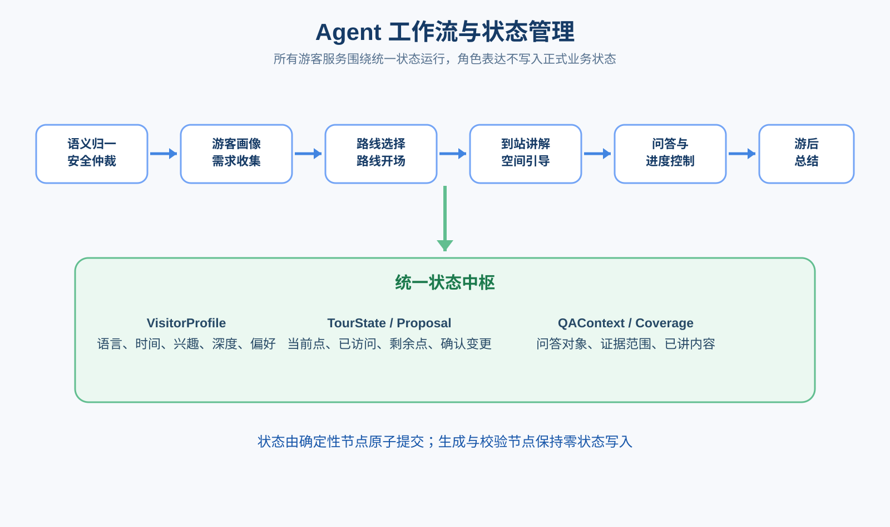
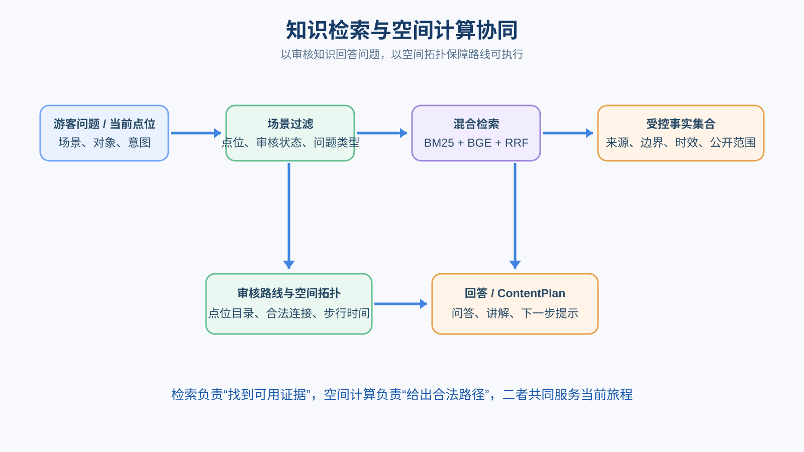
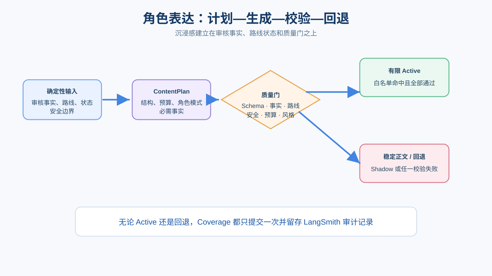

# 祠语智游——多角色沉浸式非遗智能导游

## “AI+旅游休闲”命题赛道解决方案书

**首届超级智能体大赛（2026 Super Agent）**  
**项目阶段：陈家祠场景原型 Demo**  
**版本：参赛提交稿｜2026 年 8 月**

> 让每一位游客，都拥有一名懂文化、懂路线、懂进度，也能随时回应问题的专属导游。

---

## 项目摘要

“祠语智游”是一个贯穿游前、游中、游后的多角色沉浸式非遗智能导游。项目以广州陈家祠为首个应用场景，将人工导游的“了解游客、规划路线、现场讲解、随时答疑、掌握进度、游后收束”拆解为可运行、可追踪的智能流程。

游客输入可用时间、文化兴趣、讲解深度和表达偏好后，系统从审核路线中生成个性化游览方案；进入场馆后，系统维护当前位置、已访问点位、剩余行程和已讲内容，提供讲解、问答、引路、进度控制与游后总结。古风书生为比赛主展示角色，儿童友好与中性清晰提供差异化点位讲解。

项目的核心不是让模型自由编写导览，而是采用“确定性决策＋生成式表达”双层架构：审核知识、空间关系、路线和游览状态由确定性系统控制；角色模型仅在内容计划和质量校验通过后调整语言表达。由此兼顾沉浸体验、文化事实、路线安全与系统可审计性。

---

## 问题洞察：现有导览的四类断点

优秀人工导游能够因人、因地、因时调整服务，但受人员数量、服务时段与语言能力限制；固定语音导览和通用问答虽可扩大供给，却难以形成连续旅程。

| 现有断点 | 典型表现 | 祠语智游的应对 |
|---|---|---|
| 路线与游客不匹配 | 同一固定路线难兼顾短时游览、亲子、研学与深度体验 | 根据时间、兴趣、深度，从审核路线中确定性选路 |
| 讲解与现场脱节 | 不知道游客在哪里、已听过什么 | TourState 维护当前位置、已访问点与剩余行程 |
| 问答与旅程脱节 | “这里”“这个”“再讲详细一点”缺少上下文 | QAContext 约束当前对象、证据范围与连续追问 |
| 服务在离馆前中断 | 最后一个点位即结束，缺少回顾与延伸 | Coverage 支撑游后总结、称号、祝福与审核推荐 |

项目不是替代场馆的专业内容审核，而是把场馆已审核的知识、空间与服务规则组织成可持续运行的智能导览能力。

---

## 目标用户与场景价值

| 目标对象 | 核心需求 | 项目价值 |
|---|---|---|
| 自由行游客 | 无需预约，快速获得可执行路线与重点讲解 | 根据可用时间和兴趣生成清晰游线 |
| 亲子家庭 | 更直观、短句化且安全的解释 | 儿童友好表达不降低知识与安全边界 |
| 研学与学生群体 | 可观察、比较、分析的学习体验 | 基于审核事实提供观察与比较引导 |
| 文化深度爱好者 | 更完整的建筑、工艺、装饰与历史语境 | 结构化点位讲解与受控术语问答 |
| 场馆管理者 | 扩展自助导览，沉淀可维护数字资产 | 将知识、路线、空间与规则模块化配置 |

首个场景聚焦陈家祠的岭南建筑装饰和非遗工艺。未来可将经验证的知识卡、空间图、路线模板与角色规则复用到博物馆、古建景区、非遗场馆和城市文化游线。

---

## 完整旅程：从游前到游后

旅程的三条贯穿能力：

- **游客画像**：时间、兴趣、讲解深度、语言与表达偏好；
- **旅程记忆**：当前位置、已访问点、剩余点位、已讲知识；
- **可信底座**：审核知识、空间关系、路线规则、安全边界与失败回退。

---

## 核心功能一：个性化路线与状态化游览

系统从审核路线模板、点位目录与空间关系中选择可行路线，而非让模型自由编造游线。路线输出包括主题、点位顺序、建议停留时间、兴趣覆盖、首站与下一步提示。

游览过程中，TourState 记录当前点、已访问点、剩余点和路线状态；系统支持到达、完成、跳过、下一站与受控重规划。任何路线调整先生成 Proposal，经确认后才由确定性节点写入状态，避免一句自然语言直接改变行程。

| 状态动作 | 游客体验 | 控制原则 |
|---|---|---|
| 到达点位 | 进入当前点讲解 | 仅确定性节点更新当前位置 |
| 完成本点 | 更新进度并给出下一步 | 已访问与 Coverage 幂等提交 |
| 跳过点位 | 保留剩余路线、调整节奏 | 不虚构已参观内容 |
| 重规划 | 先展示建议、确认后执行 | 模型不直接修改路线或状态 |

---

## 核心功能二：可信讲解、问答与游后服务

### 点位讲解

每一次讲解先生成结构化 ContentPlan，明确当前空间背景、审核工艺与对象、必讲事实、观察位置、时长预算、下一步提示和安全边界。中性清晰承担稳定主干；角色化表达仅改变称呼、句式、节奏与组织方式，不新增文化事实。

### 受控问答与连续追问

游客可询问当前点位的建筑、工艺、装饰、术语及场馆服务信息，也可追问“这个是什么”“再讲详细一点”。问答由审核知识和场景过滤生成，保持当前对象与上一问范围；问答不会自动推进路线或改写当前位置。

### 游后服务

系统依据实际游览记录生成内容回顾、纪念称号与祝福，并可衔接经审核的周边服务推荐。推荐与馆内路线严格分离，不影响路线、知识或游览状态。

---

## 比赛主线：古风书生沉浸式导览

古风书生是本次比赛的主展示角色。系统在既定审核事实、路线与状态边界内，以克制古雅的语言连接路线规划、开场和点位讲解，形成连续而可控的人设体验。

**推荐演示顺序：**

1. 输入“中文、定制模式、30 分钟、喜欢灰塑、古风书生”；
2. 展示个性化路线规划与路线顺序；
3. 确认路线，展示古风书生路线开场；
4. 到达前院中部，展示灰塑、独角狮等审核对象的点位讲解；
5. 提出当前点位知识问题，并追问“再讲详细一点”；
6. 完成本点，展示下一站与 TourState 推进；
7. 展开审计信息，说明事实边界、质量校验与 Coverage 单次提交；
8. 简要展示游后总结、称号祝福与周边推荐。

同一审核点位可辅以儿童友好讲解，展示“同一事实、多种理解方式”的差异化价值。

---

## 产品与技术总体架构

系统由五层组成：交互与应用层、Agent 编排层、确定性控制层、生成式表达层，以及知识与空间/可观测层。核心原则是：确定性系统决定“去哪、讲什么、当前状态是什么、什么行为安全”，角色模型只决定“怎样更具表达力地说”。

---

## Agent 工作流与核心状态

LangGraph 将复杂导游服务拆分为可组合、可观测的节点：语义归一与安全仲裁、画像收集、路线选择、路线开场、到站讲解、空间引导、受控问答、进度控制和游后总结。

| 状态对象 | 记录内容 | 业务作用 |
|---|---|---|
| VisitorProfile | 语言、时间、兴趣、深度、角色偏好 | 路线与表达策略的输入 |
| TourState | 当前点、已访问点、剩余点、路线状态 | 保证游览连续、正确推进 |
| QAContext | 问题对象、证据范围、追问许可 | 支持当前点问答与连续追问 |
| Coverage | 已介绍工艺、对象、主题与提交记录 | 减少重复并支撑游后总结 |
| Proposal | 路线变更候选及确认状态 | 防止未经确认的状态变更 |

状态写入由确定性节点原子提交；角色生成与校验节点不写入正式业务状态，从机制上保障叙事表达不会篡改路线与进度。

---

## 知识、检索与空间协同

知识资产采用 Markdown/JSON 知识卡组织场馆基本信息、建筑、装饰、工艺、对象、服务规则及审核信息。每条内容保留来源、审核状态、时效与公开边界。

BM25 适合对象名和专有术语，BGE 适合自然语言表达，RRF 融合二者排序。空间计算建立在审核拓扑上，输出合法路径、方向与步行时间；现场开放、客流与临时管控始终以场馆安排为准。

---

## 受控角色表达：计划、生成、校验、回退

角色化不是自由发挥。每次候选生成以前置 ContentPlan 固定事实集合、内容结构、讲解预算、交互权限和安全边界；模型仅可组织审核事实并生成有限连接语。

质量门覆盖：Schema 与版本、事实 ID 完整性、路线与时长一致性、角色风格、内容预算、公共输出安全以及角色硬边界。超时、非法 JSON、事实漂移、预算超限或内部字段泄漏时，系统 fail-closed，自动保留完整稳定正文。

---

## 比赛版能力与可信边界

比赛版以可复现、可验证的主线能力为展示重点。

| 能力类别 | 比赛版展示范围 |
|---|---|
| 确定性旅程主链 | 画像、路线、状态推进、空间引导、知识问答、讲解、总结、推荐与 Coverage 审计 |
| 古风书生 | 路线规划、路线开场、审核点位讲解的有限 Active |
| 儿童友好 / 中性清晰 | 白名单审核点位讲解的有限 Active |
| 角色能力验证 | 18 种角色策略目录、候选生成与自动化质量验证 |
| 角色化问答 | 已完成计划、候选、校验与审计链路，以 Shadow 方式运行 |

对外展示始终遵循三条边界：不将角色候选描述为游客已见正文；不让模型自主修改路线或状态；不承诺语音、多场馆全量泛化或生产级全面开放。清晰边界使项目的可信能力可被验证、可被持续扩展。

---

## 技术创新与差异化优势

### 1. 将人工导游服务工程化

以跨轮游览状态连接规划、讲解、问答、引路、进度与游后服务，形成“一次旅程、持续理解”的陪伴体验，而非彼此割裂的单轮问答。

### 2. 确定性决策与生成式表达双引擎

路线、空间、知识与状态先结构化，模型只负责受约束表达，兼顾可控性和沉浸感。

### 3. 同一事实，多人群表达

ContentPlan 与事实 ID 让中性、儿童友好、古风书生等表达策略共享同一审核事实边界，避免角色化改变知识内容。

### 4. Coverage 连接讲解与游后服务

以实际已讲内容减少重复、支持游后总结，并为场馆理解游客覆盖的文化主题提供基础。

### 5. 可审计、可回退、可渐进开放

候选、校验、接管、回退、状态写入与 Coverage 提交均可审计；角色能力通过白名单逐步开放，风险可控。

---

## 工程验证与质量保障

当前参赛版本围绕路线、状态、知识、讲解、角色、预算和安全输出建立自动化与人工验证。

| 验证项 | 当前结果 |
|---|---|
| 完整回归 | 1118/1118 passed |
| 最新 Active 定向验证 | 59/59 passed |
| P0 安全/游客输出矩阵 | 3/3 passed |
| 18 种角色策略自动化验证 | passed |
| 高风险角色人工抽样 | 7/7 passed |
| 古风书生有限 Active | 路线规划、开场、点位讲解均通过校验 |
| 故障回退 | 覆盖超时、非法 JSON、事实漂移、预算、内部泄漏等情形 |

LangSmith Studio 用于展示节点路径、ContentPlan、角色候选、质量校验、有限 Active/Shadow 判定、回退与 Coverage 提交。项目以“失败仍可完成游览”为质量底线，不向游客暴露异常栈或内部字段。

---

## 实施路径与场馆接入

**第一阶段：原型固化（当前）**：完成陈家祠审核知识、点位、空间拓扑、路线模板和比赛版 Demo，冻结展示范围。

**第二阶段：场馆共创校验**：邀请文博、导览与运营人员复核知识、路线和位置表达，现场走测开放区域、客流与交互节奏，建立审核发布与版本回滚流程。

**第三阶段：小范围试点**：通过 H5、小程序、公众号或二维码入口服务固定路线和重点点位，采集匿名化使用指标与游客反馈。

**第四阶段：模板化推广**：将知识卡、空间图、路线模板与角色规则沉淀为场馆接入规范，逐步推广至多类文化场景。

---

## 预期效果与评估指标

| 维度 | 重点指标 |
|---|---|
| 游客体验 | 路线建议采纳率、完成率、平均完成点位数、问答有效率、连续追问成功率、讲解易懂度、整体满意度 |
| 场馆运营 | 自助导览服务覆盖时段与人次、高峰期基础咨询分流、知识审核与更新耗时、路线及知识资产复用率 |
| 可信运行 | 异常回退率、事实重复率、无关回答率、状态错误数、内部字段泄漏数 |
| 文化传播 | 实际覆盖的工艺与对象数量、深度内容继续查看率、游后文化记忆与分享意愿 |

预期效果是：为游客提供符合时间、兴趣与理解方式的连续文化旅程；为场馆将分散资料沉淀为可维护数字资产；为广州文旅形成具有岭南文化辨识度、可复制的可信智能导游样板。

当前项目处于原型 Demo 阶段，尚未开展对外试点。后续所有效果数据将以真实试用与场馆校验结果为准。

---

## 风险控制与合规承诺

| 风险 | 控制方式 |
|---|---|
| 文化事实虚构 | 审核知识、事实 ID、不得声称清单与候选边界校验 |
| 路线与空间漂移 | 审核路线模板、空间拓扑与合法路径计算 |
| 模型直接改状态 | 正式状态仅由确定性节点原子写入，生成层零状态写入 |
| 角色掩盖知识 | 稳定正文、必需事实、内容预算与角色一致性校验 |
| 儿童、拍照与互动风险 | 专项安全边界与危险表达拦截，禁止触摸文物、阻塞通道等行为 |
| 模型异常输出 | fail-closed，保留或回退至完整稳定正文 |
| 数据与隐私 | 仅使用合法来源的场馆资料；试点阶段采集匿名化指标并遵循数据合规要求 |

项目承诺参赛成果为原创，遵守知识产权、数据安全、个人信息保护及生成式人工智能相关管理规定。场馆事实与服务信息的发布、更新和公开范围以授权及审核流程为准。

---

## 结语

祠语智游希望让 AI 不只是“回答一个问题”，而是在可信知识、明确路线和连续状态之上，成为能够理解游客、讲述文化、陪伴行程的智能导游。

从陈家祠出发，项目以岭南建筑装饰和非遗工艺为内容载体，以确定性控制保障准确与安全，以受控角色表达提升体验与记忆。比赛版已形成古风书生主线的有限 Active 闭环，并通过可审计、可回退的工程机制为持续扩展打下基础。

未来，项目将与场馆专家共创校验，在真实场景中优化路线、内容与交互节奏，逐步构建可维护、可复用、可推广的广州文化旅游智能导览能力。

> **祠语智游：让文化因人而讲，让旅程因程而变。**
