# 祠语智游——多角色沉浸式非遗智能导游

## “AI+旅游休闲”命题赛道解决方案书

**首届超级智能体大赛（2026 Super Agent）**

**项目阶段：陈家祠场景原型 Demo**

**提交版本：正式版｜2026 年 8 月**

> 让每一位游客，都拥有一名懂文化、懂路线、懂进度，也能随时回应问题的专属导游。

<!-- PAGEBREAK -->

## 一、项目摘要

“祠语智游”是一个贯穿游前、游中、游后的多角色沉浸式非遗智能导游。项目以广州陈家祠为首个应用场景，将人工导游的“了解游客、规划路线、现场讲解、随时答疑、掌握进度、游后收束”拆解为可运行、可追踪、可回退的智能流程。

游客输入可用时间、文化兴趣、讲解深度和表达偏好后，系统从审核路线中生成个性化游览方案；进入场馆后，系统维护当前位置、已访问点位、剩余行程和已讲内容，提供讲解、问答、引路、进度控制与游后总结。古风书生为比赛主展示角色，儿童友好与中性清晰提供差异化点位讲解。

项目采用“**确定性决策＋生成式表达**”双层架构：审核知识、空间关系、路线和游览状态由确定性系统控制；角色模型仅在内容计划和质量校验通过后调整语言表达。由此兼顾沉浸体验、文化事实、路线安全与系统可审计性。

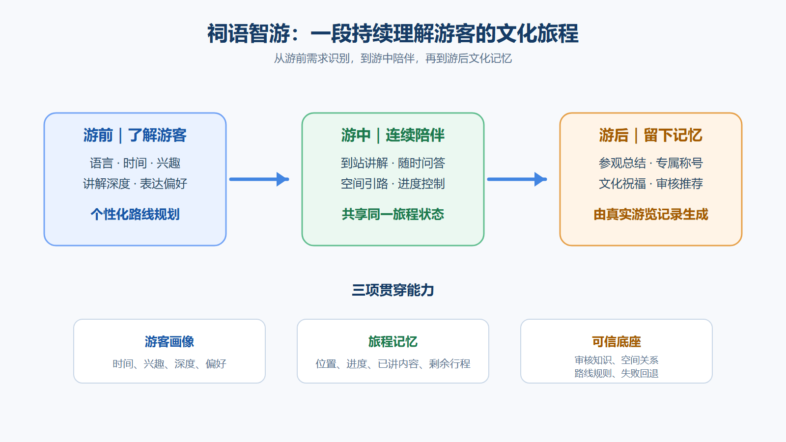

**图 1 说明。** 项目价值不是增加一个单轮聊天入口，而是以同一游客画像和旅程状态连接规划、讲解、问答、引路、进度与游后服务，形成连续的文化体验闭环。

<!-- PAGEBREAK -->

## 二、问题洞察与目标用户

### 2.1 现有导览的四类断点

| 现有断点 | 典型表现 | 祠语智游的应对 |
|---|---|---|
| 路线与游客不匹配 | 固定路线难兼顾短时游览、亲子、研学与深度体验 | 根据时间、兴趣和深度，从审核路线中确定性选路 |
| 讲解与现场脱节 | 系统不知道游客在哪里、已经听过什么 | TourState 维护当前位置、已访问点与剩余行程 |
| 问答与旅程脱节 | “这里”“这个”“再讲详细一点”缺少上下文 | QAContext 约束当前对象、证据范围与连续追问 |
| 服务在离馆前中断 | 最后一个点位即结束，缺少回顾与延伸 | Coverage 支撑游后总结、称号、祝福与审核推荐 |

项目不是替代场馆的专业审核，而是把场馆已审核的知识、空间与服务规则组织成可持续运行的智能导览能力。

### 2.2 目标用户与场景价值

| 目标对象 | 核心需求 | 项目价值 |
|---|---|---|
| 自由行游客 | 无需预约，快速获得可执行路线与重点讲解 | 依据可用时间和兴趣生成清晰游线 |
| 亲子家庭 | 更直观、短句化且安全的解释 | 儿童友好表达不降低知识与安全边界 |
| 研学与学生群体 | 可观察、比较、分析的学习体验 | 基于审核事实提供观察与比较引导 |
| 文化深度爱好者 | 更完整的建筑、工艺、装饰与历史语境 | 结构化点位讲解与受控术语问答 |
| 场馆管理者 | 扩展自助导览并沉淀可维护数字资产 | 将知识、路线、空间与规则模块化配置 |

首个场景聚焦陈家祠的岭南建筑装饰和非遗工艺。经场馆复核后，知识卡、空间图、路线模板与角色规则可复用于博物馆、古建景区、非遗场馆和城市文化游线。

<!-- PAGEBREAK -->

## 三、完整游客旅程

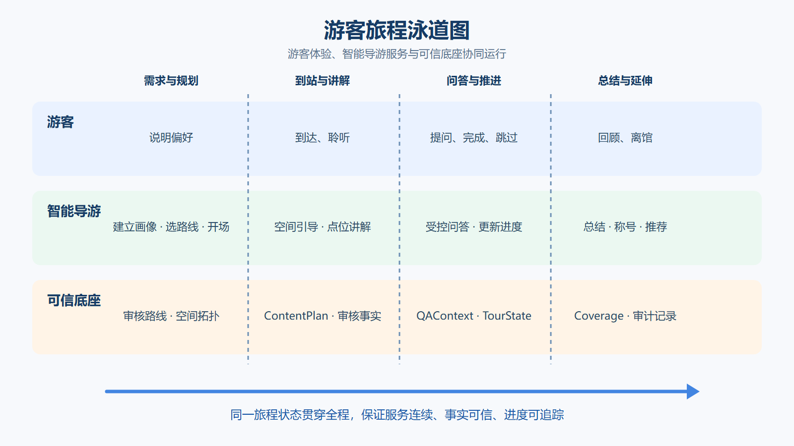

**图 2 说明。** 泳道图从游客行为、智能体响应与可信底座三个层面展示同一旅程如何推进：用户偏好驱动路线，TourState 驱动现场动作，审核知识与空间关系为每次响应提供边界。

三条能力贯穿全程：

- **游客画像**：时间、兴趣、讲解深度、语言与表达偏好；
- **旅程记忆**：当前位置、已访问点、剩余点位、已讲知识；
- **可信底座**：审核知识、空间关系、路线规则、安全边界与失败回退。

### 3.1 个性化路线与状态化游览

系统从审核路线模板、点位目录与空间关系中选择可行路线，而非让模型自由编造游线。输出包含主题、点位顺序、建议停留时间、兴趣覆盖、首站与下一步提示。

TourState 记录当前点、已访问点、剩余点和路线状态；系统支持到达、完成、跳过、下一站与受控重规划。路线调整先生成 Proposal，经确认后才由确定性节点写入状态，避免自然语言直接改变行程。

| 状态动作 | 游客体验 | 控制原则 |
|---|---|---|
| 到达点位 | 进入当前点讲解 | 仅确定性节点更新当前位置 |
| 完成本点 | 更新进度并给出下一步 | 已访问与 Coverage 幂等提交 |
| 跳过点位 | 保留剩余路线、调整节奏 | 不虚构已参观内容 |
| 重规划 | 先展示建议、确认后执行 | 模型不直接修改路线或状态 |

<!-- PAGEBREAK -->

## 四、核心产品能力

### 4.1 可信点位讲解

每一次讲解先形成结构化 ContentPlan，明确当前空间背景、审核工艺与对象、必讲事实、观察位置、时长预算、下一步提示和安全边界。中性清晰承担稳定主干；角色化表达只改变称呼、句式、节奏与组织方式，不新增文化事实。

### 4.2 受控问答与连续追问

游客可询问当前点位的建筑、工艺、装饰、术语和场馆服务信息，也可追问“这个是什么”“再讲详细一点”。问答由审核知识和场景过滤生成，保持当前对象与上一问范围；问答不会自动推进路线或改写当前位置。

### 4.3 游后总结与审核推荐

系统根据真实游览记录生成内容回顾、纪念称号与祝福，并可衔接经审核的周边服务推荐。推荐与馆内路线严格分离，不改变路线、知识或游览状态；营业、价格、排队和交通等动态信息提示以服务方最新发布为准。

### 4.4 同一事实，多种理解方式

古风书生、儿童友好和中性清晰共享同一事实 ID 与安全边界。角色差异发生在表达层，而不是事实层，因此既能形成沉浸感，也便于场馆审核、版本回滚和逐步开放。

<!-- PAGEBREAK -->

## 五、比赛主线 Demo：古风书生

古风书生是本次比赛的主展示角色。系统在既定审核事实、路线与状态边界内，以克制古雅的语言连接路线规划、开场和点位讲解，形成连续而可控的人设体验。

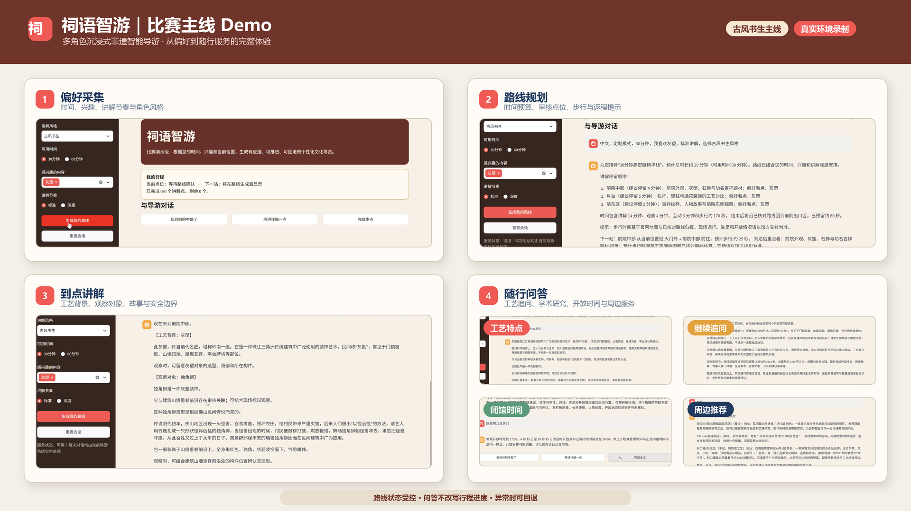

**图 3 说明。** 截图组按实际操作顺序呈现“偏好输入—路线生成—到达点位—角色讲解”。它证明的不是静态页面数量，而是同一游客画像、路线状态和审核知识在连续交互中协同工作。图中主线选择 30 分钟、灰塑兴趣与古风书生风格，随后生成三点路线并进入前院中部讲解。

**建议演示顺序：**

1. 输入“中文、30 分钟、喜欢灰塑、古风书生”；
2. 展示路线顺序、停留时间、步行估算和下一站；
3. 到达前院中部，展示灰塑、独角狮等审核对象讲解；
4. 提问灰塑特点并追问细节，展示学术研究与服务信息问答；
5. 完成本点，展示下一站和 TourState 推进；
6. 展示游后总结、称号祝福与审核周边推荐。

<!-- PAGEBREAK -->

## 六、问答能力与儿童友好扩展

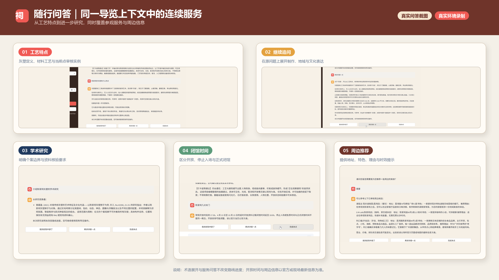

**图 4 说明。** 问答截图将能力按“当前点知识—继续展开—研究依据—场馆服务—周边推荐”排列。系统回答灰塑特点、详细工艺和学术研究时保持当前场景；回答闭馆时间和周边推荐时明确动态信息边界。问答只补充知识，不改变路线进度。

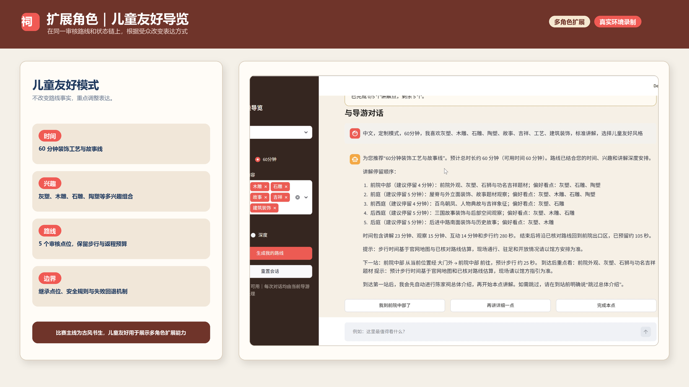

**图 5 说明。** 儿童友好示例复用同一审核路线与知识底座，通过更直观的观察提示和故事化组织降低理解门槛。它用于说明产品可面向不同人群调整表达，并不改变点位事实与安全规则。

<!-- PAGEBREAK -->

## 七、产品与技术总体架构

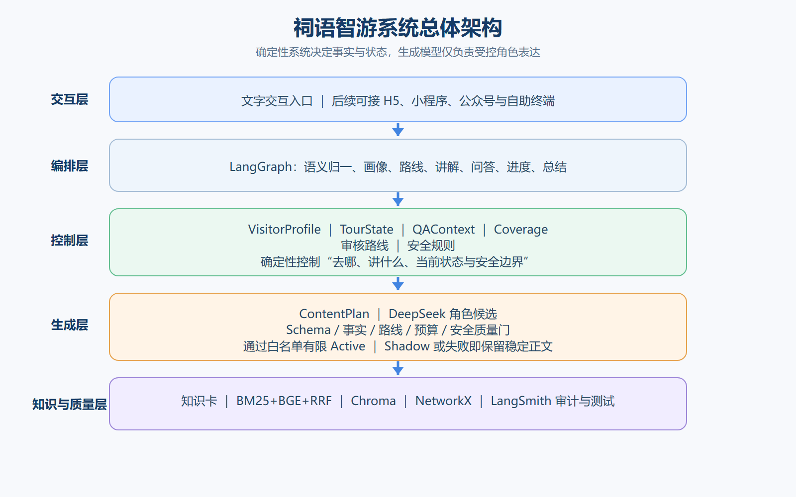

**图 6 说明。** 架构按责任边界分层：交互层接收偏好和现场动作；LangGraph 编排旅程节点；确定性层掌控画像、路线、状态与 Coverage；生成层只负责受约束表达；知识、空间和可观测能力为全链路提供依据。

| 层级 | 关键模块 | 主要职责 |
|---|---|---|
| 交互与应用层 | Streamlit 比赛 Demo、LangSmith Studio | 承载游客交互与运行观测 |
| Agent 编排层 | Python、LangGraph | 编排画像、路线、讲解、问答、进度与总结 |
| 确定性控制层 | VisitorProfile、TourState、QAContext、Coverage、Proposal | 管理业务状态和受控变更 |
| 知识与空间层 | Markdown/JSON、BM25、BGE、RRF、Chroma、NetworkX | 审核知识检索与合法路径计算 |
| 生成与质量层 | DeepSeek、ContentPlan、质量门、LangSmith | 生成候选、校验边界并记录审计 |

核心原则是：系统决定“去哪、讲什么、当前状态是什么、什么行为安全”，角色模型只决定“怎样更具表达力地说”。

<!-- PAGEBREAK -->

## 八、Agent 工作流与核心状态

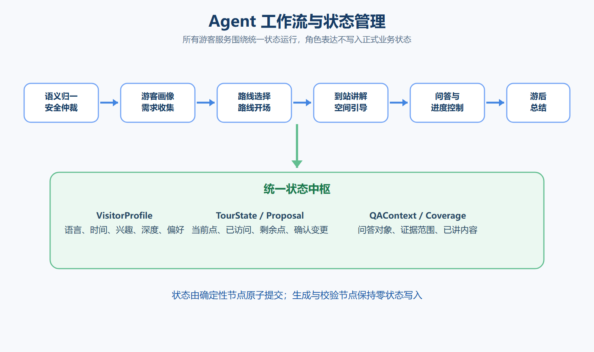

**图 7 说明。** 真实导游服务被拆分为语义归一、画像收集、路线选择、开场、到站讲解、受控问答、进度控制与总结等节点。正式业务状态只由确定性节点原子写入；角色生成和质量校验不能修改路线或游客进度。

| 状态对象 | 记录内容 | 业务作用 |
|---|---|---|
| VisitorProfile | 语言、时间、兴趣、深度、角色偏好 | 路线与表达策略输入 |
| TourState | 当前点、已访问点、剩余点、路线状态 | 保证游览连续和正确推进 |
| QAContext | 问题对象、证据范围、追问许可 | 支持当前点问答与连续追问 |
| Coverage | 已介绍工艺、对象、主题与提交记录 | 减少重复并支撑游后总结 |
| Proposal | 路线变更候选及确认状态 | 防止未经确认的状态变更 |

<!-- PAGEBREAK -->

## 九、知识检索与空间协同

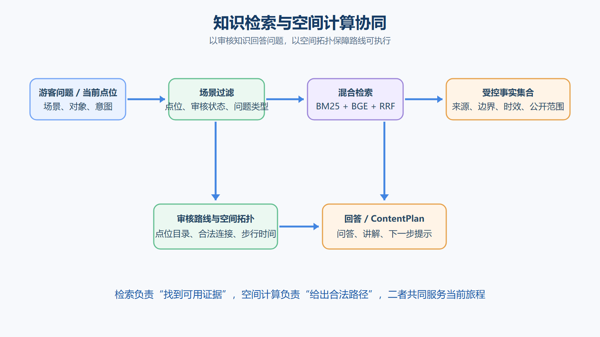

**图 8 说明。** 知识检索与空间计算是两条独立但协同的可信链：检索回答“讲什么”，空间拓扑回答“怎么走”。二者均在审核数据上运行，避免模型把相似内容误当作当前位置，或生成不存在的路线。

知识资产采用 Markdown/JSON 知识卡组织场馆基本信息、建筑、装饰、工艺、对象和服务规则；每条内容保留来源、审核状态、时效与公开边界。BM25 负责对象名和专有术语召回，BGE 负责语义召回，RRF 融合排序。NetworkX 在审核拓扑上计算合法路径、方向与步行时间；现场开放、客流和临时管控始终以场馆安排为准。

<!-- PAGEBREAK -->

## 十、受控角色表达与质量门

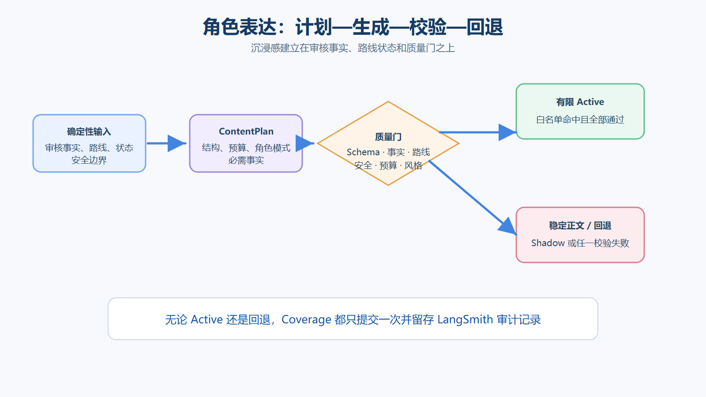

**图 9 说明。** 每次角色表达依次经历“计划—生成—校验—接管或回退”。质量门审核 Schema、事实 ID、路线、时长、安全和风格；只有白名单命中且全部通过的候选才可接管。任一检查失败即保留稳定正文，确保沉浸感建立在事实与安全边界之上。

质量门覆盖 Schema 与版本、事实 ID 完整性、路线与时长一致性、角色风格、内容预算、公共输出安全和角色硬边界。超时、非法 JSON、事实漂移、预算超限或内部字段泄漏时，系统 fail-closed，自动保留完整稳定正文。无论接管或回退，Coverage 只提交一次。

<!-- PAGEBREAK -->

## 十一、比赛版能力边界与差异化优势

### 11.1 可对外展示的能力

| 能力类别 | 比赛版展示范围 |
|---|---|
| 确定性旅程主链 | 画像、路线、状态推进、空间引导、知识问答、讲解、总结、推荐与 Coverage 审计 |
| 古风书生 | 路线规划、路线开场、审核点位讲解的有限 Active |
| 儿童友好 / 中性清晰 | 白名单审核点位讲解的有限 Active |
| 角色策略底座 | 18 种角色策略目录、候选生成与自动化质量验证 |
| 可信运行机制 | ContentPlan、质量门、审计、失败回退、状态隔离与幂等提交 |

对外展示遵循三条边界：不让模型自主修改路线或业务状态；不把单次候选或实验结果描述为全量生产能力；不承诺尚未完成场馆现场验收的语音、多场馆全面开放或实时客流能力。

### 11.2 五项差异化优势

1. **将人工导游服务工程化**：以跨轮状态连接规划、讲解、问答、引路、进度与游后服务。
2. **确定性与生成式双引擎**：路线、知识、空间和状态先结构化，模型仅负责受约束表达。
3. **同一事实，多人群表达**：角色策略共享事实 ID 和审核边界。
4. **Coverage 连接讲解与总结**：依据真实已讲内容减少重复并生成游后回顾。
5. **可审计、可回退、可渐进开放**：候选、校验、接管、回退和状态提交均可追踪。

<!-- PAGEBREAK -->

## 十二、验证与可信运行证据

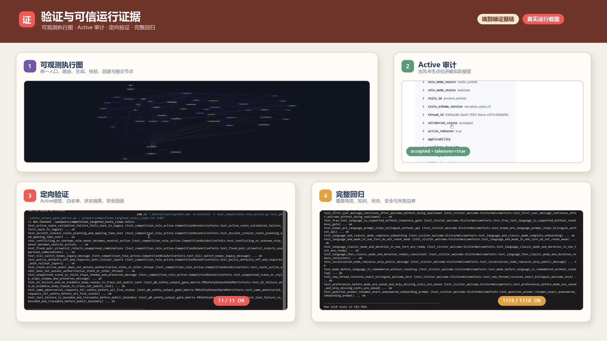

**图 10 说明。** 证据按“系统图可见—单次运行可审计—定向行为可验证—完整版本不回退”排列。LangGraph 图说明节点与路径可观察；LangSmith 运行记录说明古风书生候选通过校验并完成有限接管；定向测试覆盖白名单、状态隔离、安全回退等关键行为；完整回归检查此次比赛改动没有破坏既有能力。

| 验证项 | 当前记录 | 结论范围 |
|---|---|---|
| 比赛聚焦定向测试 | 11/11，OK | 古风书生接管、白名单、状态隔离与安全回退等关键路径通过 |
| 完整回归 | 1118/1118，OK | 当前代码库自动化回归全部通过 |
| Active 扩展定向基线 | 59/59 passed | 更广的有限 Active 行为基线通过 |
| 角色策略验证 | 18 种策略自动化验证通过 | 角色规则目录可被一致校验 |
| 高风险角色人工抽样 | 7/7 passed | 抽样范围内的人工边界复核通过 |

上述结果是当前版本与当前测试集的工程证据，不替代场馆专家审核、现场走测和生产环境压力验证。

<!-- PAGEBREAK -->

## 十三、证据细节：真实运行审计

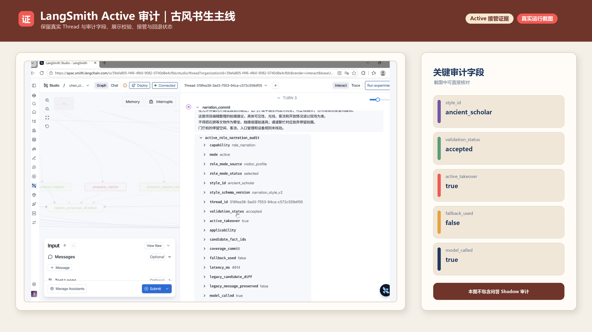

**图 11 说明。** 真实运行记录显示 `style_id=ancient_scholar`、`validation_status=accepted`、`active_takeover=true`、`fallback_used=false`。这说明本次古风书生点位讲解候选通过质量门并完成接管；该记录只证明这一次运行，不外推为所有角色、所有场景均已开放。

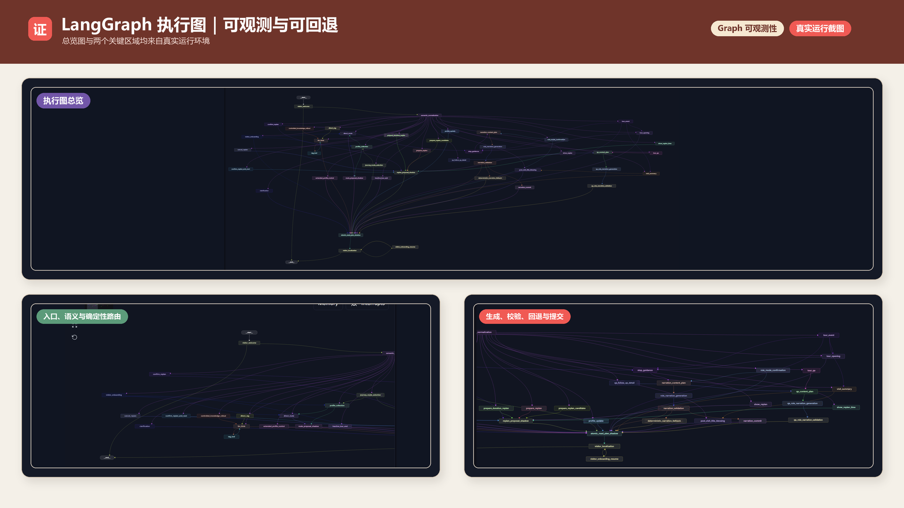

**图 12 说明。** 运行图展示画像、路线、讲解、问答、重规划、回退、总结等节点之间的有向关系。它用于证明工作流可观察和可定位，不单独证明每条业务分支均已通过测试，业务正确性还需结合定向测试与完整回归判断。

<!-- PAGEBREAK -->

## 十四、证据细节：自动化测试

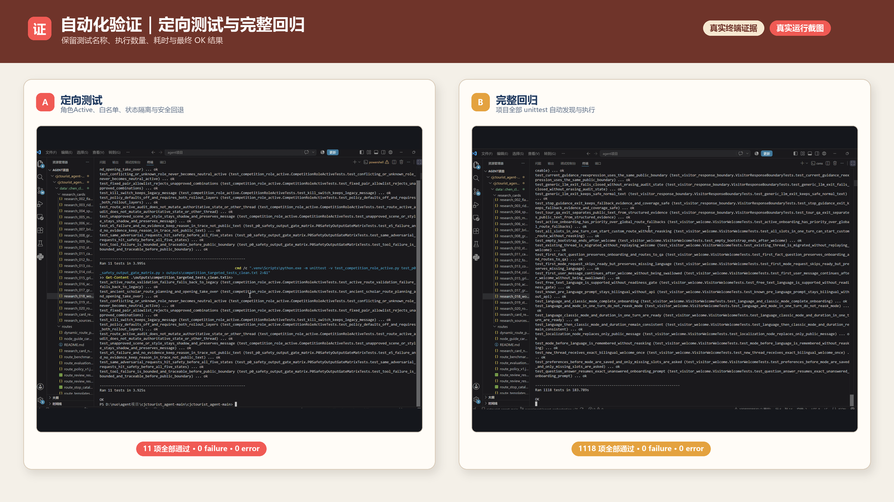

**图 13 说明。** 左侧记录比赛聚焦的 11 项测试全部通过，覆盖接管失败回退、古风书生主线、未知角色不误接管、固定白名单、状态隔离与公共输出安全；右侧记录完整回归 1118 项全部通过。两组结果分别回答“关键能力是否按预期工作”和“新增能力是否破坏既有系统”。

项目以“失败仍可完成游览”为质量底线：异常时不向游客暴露堆栈、内部字段或不完整候选，而是回到完整稳定正文，并保留可供研发定位的结构化审计信息。

<!-- PAGEBREAK -->

## 十五、实施路径、评估指标与商业价值

### 15.1 实施路径

1. **原型固化（当前）**：完成陈家祠知识、点位、空间拓扑、路线模板和比赛 Demo，冻结展示范围。
2. **场馆共创校验**：由文博、导览与运营人员复核知识、路线和位置表达，现场走测开放区域、客流和交互节奏。
3. **小范围试点**：通过 H5、小程序、公众号或二维码入口服务固定路线与重点点位，采集匿名化指标与反馈。
4. **模板化推广**：将知识卡、空间图、路线模板与角色规则沉淀为接入规范，逐步推广至多类文化场景。

### 15.2 评估指标

| 维度 | 重点指标 |
|---|---|
| 游客体验 | 路线采纳率、完成率、平均完成点位数、问答有效率、连续追问成功率、讲解易懂度、满意度 |
| 场馆运营 | 自助导览覆盖时段与人次、基础咨询分流、知识更新耗时、路线及知识资产复用率 |
| 可信运行 | 异常回退率、事实重复率、无关回答率、状态错误数、内部字段泄漏数 |
| 文化传播 | 实际覆盖工艺与对象数量、深度内容继续查看率、游后文化记忆与分享意愿 |

当前项目处于原型 Demo 阶段，尚未开展对外试点。效果数据将以真实试用与场馆校验结果为准。未来价值主要来自场馆数字导览建设、审核知识资产维护、主题路线与研学内容服务，以及跨场馆模板化接入。

<!-- PAGEBREAK -->

## 十六、风险控制、合规承诺与结语

| 风险 | 控制方式 |
|---|---|
| 文化事实虚构 | 审核知识、事实 ID、不得声称清单与候选边界校验 |
| 路线与空间漂移 | 审核路线模板、空间拓扑与合法路径计算 |
| 模型直接改状态 | 正式状态仅由确定性节点原子写入，生成层零状态写入 |
| 角色掩盖知识 | 稳定正文、必需事实、内容预算与角色一致性校验 |
| 儿童、拍照与互动风险 | 专项安全边界，禁止触摸文物、阻塞通道等行为 |
| 模型异常输出 | fail-closed，保留或回退至完整稳定正文 |
| 数据与隐私 | 使用合法来源资料；试点采集匿名化指标并遵循数据合规要求 |

项目承诺参赛成果为原创，遵守知识产权、数据安全、个人信息保护及生成式人工智能相关管理规定。场馆事实与服务信息的发布、更新和公开范围以授权与审核流程为准。

祠语智游希望让 AI 不只是“回答一个问题”，而是在可信知识、明确路线和连续状态之上，成为能够理解游客、讲述文化、陪伴行程的智能导游。从陈家祠出发，项目以岭南建筑装饰和非遗工艺为内容载体，以确定性控制保障准确与安全，以受控角色表达提升体验与记忆。

> **祠语智游：让文化因人而讲，让旅程因程而变。**
